# 3DS Fingerprint

Submit fingerprint data after the browser has loaded the 3DS fingerprint URL.

## Path Parameters

<ParamField path="paymentId" type="string" required>
  The payment ID from the initial payment request
</ParamField>

## Request Body

<ParamField body="processingEntityId" type="string" required>
  Your merchant processing entity ID
</ParamField>

## Example Request

<CodeGroup>
```bash cURL
curl -X POST https://api-sandbox.nuvei.com/payment-api/payments/375011/fingerprint \
  -H "Content-Type: application/json" \
  -H "x-api-key: YOUR_API_KEY" \
  -d '{
    "processingEntityId": "1234567890"
  }'
```

```javascript JavaScript
const response = await fetch(
  'https://api-sandbox.nuvei.com/payment-api/payments/375011/fingerprint',
  {
    method: 'POST',
    headers: {
      'Content-Type': 'application/json',
      'x-api-key': 'YOUR_API_KEY'
    },
    body: JSON.stringify({
      processingEntityId: '1234567890'
    })
  }
);
```
</CodeGroup>

## Response

<ResponseField name="paymentId" type="string">
  Payment identifier
</ResponseField>

<ResponseField name="result" type="object">
  Transaction result
  
  <Expandable title="result properties">
    <ResponseField name="status" type="string">
      `approved` (frictionless), `pending` (challenge required), `declined`
    </ResponseField>
  </Expandable>
</ResponseField>

<ResponseField name="threeD" type="object">
  3DS information
  
  <Expandable title="threeD properties">
    <ResponseField name="authenticationStatus" type="string">
      3DS status: `Y`, `A`, `N`, `U`, `R`
    </ResponseField>
    <ResponseField name="flow" type="string">
      `frictionless` or `challenge`
    </ResponseField>
    <ResponseField name="challengeUrl" type="string">
      URL for challenge (if required)
    </ResponseField>
    <ResponseField name="acsUrl" type="string">
      ACS URL
    </ResponseField>
    <ResponseField name="cReq" type="string">
      Challenge request data
    </ResponseField>
  </Expandable>
</ResponseField>

## Example Responses

<CodeGroup>
```json Frictionless (Approved)
{
  "paymentId": "375011",
  "transactionId": "2110000000010964089",
  "amount": 100,
  "currency": "USD",
  "transactionType": "Sale",
  "result": {
    "status": "approved"
  },
  "authCode": "300250",
  "threeD": {
    "authenticationStatus": "Y",
    "flow": "frictionless"
  }
}
```

```json Challenge Required
{
  "paymentId": "375011",
  "result": {
    "status": "pending"
  },
  "threeD": {
    "challengeUrl": "https://issuer.com/challenge?id=xyz",
    "acsUrl": "https://issuer.com/acs",
    "cReq": "eyJhY3NUcmFuc0lEIjoiYWJj...",
    "flow": "challenge"
  }
}
```
</CodeGroup>

## Flow

```mermaid
flowchart TD
    A[Call fingerprint endpoint] --> B{Response}
    B -->|Frictionless| C[Payment Approved ✓]
    B -->|Challenge| D[Redirect to challengeUrl]
    D --> E[Customer completes challenge]
    E --> F[Call challenge endpoint]
```


