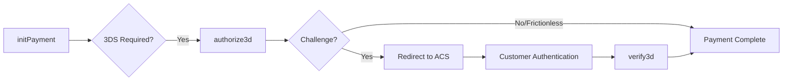

<Info>
  Initiates 3D Secure authentication for a card payment. Call this after [initPayment](/api-reference/rest-1/payments/init-payment) when 3DS is required.
</Info>

## 3DS Flow



## When to Use

- After `initPayment` returns `threeD.v2supported = "true"`
- For PSD2/SCA compliance in European transactions
- When the card issuer requires authentication

## Checksum Calculation

```
SHA256(merchantId + merchantSiteId + clientRequestId + amount + currency + timeStamp + merchantSecretKey)
```

## Example Request

```json
{
  "sessionToken": "9610a8f6-44cf-4c4f-976a-005da69a2a3b",
  "merchantId": "427583496191624621",
  "merchantSiteId": "142033",
  "clientUniqueId": "ORDER-12345",
  "clientRequestId": "1C6CT7V1L",
  "amount": "200.00",
  "currency": "USD",
  "relatedTransactionId": "2110000000001208909",
  "paymentOption": {
    "card": {
      "cardNumber": "4000020951595032",
      "cardHolderName": "John Smith",
      "expirationMonth": "12",
      "expirationYear": "2030",
      "CVV": "217",
      "threeD": {
        "methodCompletionInd": "Y",
        "notificationURL": "https://example.com/3ds-callback",
        "merchantURL": "https://example.com",
        "platformType": "02",
        "browserDetails": {
          "acceptHeader": "text/html,application/xhtml+xml",
          "ip": "192.168.1.1",
          "javaEnabled": "false",
          "javaScriptEnabled": "true",
          "language": "en-US",
          "colorDepth": "24",
          "screenHeight": "1080",
          "screenWidth": "1920",
          "timeZone": "300",
          "userAgent": "Mozilla/5.0..."
        }
      }
    }
  },
  "billingAddress": {
    "firstName": "John",
    "lastName": "Smith",
    "email": "john.smith@email.com",
    "country": "US"
  },
  "deviceDetails": {
    "ipAddress": "192.168.1.1"
  },
  "urlDetails": {
    "notificationUrl": "https://example.com/webhook"
  },
  "timeStamp": "20260129143045",
  "checksum": "..."
}
```

## Example Response (Challenge Required)

```json
{
  "transactionId": "2110000000001208910",
  "orderId": "39272123",
  "transactionStatus": "REDIRECT",
  "authCode": "",
  "paymentOption": {
    "card": {
      "ccCardNumber": "4****5032",
      "bin": "400002",
      "last4Digits": "5032",
      "cardBrand": "VISA",
      "threeD": {
        "threeDFlow": "challenge",
        "acsUrl": "https://acs.issuer.com/3ds/challenge",
        "cReq": "eyJtZXNzYWdlVHlwZSI6IkNSZXEiLCJtZXNzYWdlVmVyc2lvbiI6IjIuMi4wIiwidGhyZWVEU1NlcnZlclRyYW5zSUQiOiI...",
        "version": "2.2.0",
        "serverTransId": "d4e5f6a7-b8c9-0d1e-2f3a-4b5c6d7e8f9a"
      }
    }
  },
  "internalRequestId": 12345678,
  "status": "SUCCESS",
  "errCode": 0
}
```

## Example Response (Frictionless - No Challenge)

```json
{
  "transactionId": "2110000000001208911",
  "orderId": "39272124",
  "transactionStatus": "APPROVED",
  "authCode": "111344",
  "paymentOption": {
    "card": {
      "ccCardNumber": "4****0961",
      "bin": "400002",
      "last4Digits": "0961",
      "cardBrand": "VISA",
      "threeD": {
        "threeDFlow": "frictionless",
        "eci": "05",
        "cavv": "AAABAWFlmQAAAABjRWWZEEFgFz0=",
        "version": "2.2.0",
        "result": "Y",
        "authenticationStatus": "Y"
      }
    }
  },
  "internalRequestId": 12345679,
  "status": "SUCCESS",
  "errCode": 0
}
```

## Browser Details Collection

Collect browser details using JavaScript:

```javascript
function getBrowserDetails() {
  return {
    acceptHeader: 'text/html,application/xhtml+xml,application/xml;q=0.9,image/webp,*/*;q=0.8',
    ip: '', // Set from server
    javaEnabled: String(navigator.javaEnabled()),
    javaScriptEnabled: 'true',
    language: navigator.language || navigator.userLanguage,
    colorDepth: String(screen.colorDepth),
    screenHeight: String(screen.height),
    screenWidth: String(screen.width),
    timeZone: String(new Date().getTimezoneOffset()),
    userAgent: navigator.userAgent
  };
}
```

## Handling the Challenge

When `transactionStatus` is `REDIRECT`:

```html
<!-- Create a form to POST to ACS -->
<form id="challengeForm" method="POST" action="${acsUrl}">
  <input type="hidden" name="creq" value="${cReq}" />
</form>

<script>
  // Auto-submit to redirect user to challenge
  document.getElementById('challengeForm').submit();
</script>
```

Or use an iframe for in-page challenge:

```javascript
function displayChallenge(acsUrl, cReq) {
  // Create challenge iframe
  const iframe = document.createElement('iframe');
  iframe.id = 'challengeFrame';
  iframe.name = 'challengeFrame';
  iframe.style.width = '400px';
  iframe.style.height = '600px';
  iframe.style.border = 'none';
  
  document.getElementById('challengeContainer').appendChild(iframe);
  
  // Create and submit form to iframe
  const form = document.createElement('form');
  form.method = 'POST';
  form.action = acsUrl;
  form.target = 'challengeFrame';
  
  const input = document.createElement('input');
  input.type = 'hidden';
  input.name = 'creq';
  input.value = cReq;
  form.appendChild(input);
  
  document.body.appendChild(form);
  form.submit();
  form.remove();
}
```

## 3DS Result Codes

| ECI | Meaning | Liability Shift |
|-----|---------|-----------------|
| 05 | Fully authenticated | Yes |
| 06 | Attempted authentication | Yes |
| 07 | Not authenticated | No |

| Authentication Status | Meaning |
|-----------------------|---------|
| Y | Successfully authenticated |
| A | Attempted (proof generated) |
| N | Not authenticated (failed) |
| U | Unable to authenticate |
| R | Rejected by issuer |

## Code Example

```javascript
async function process3DSAuthentication(initPaymentResult, browserDetails) {
  const timeStamp = new Date().toISOString()
    .replace(/[-:T.Z]/g, '').slice(0, 14);
  const clientRequestId = `3ds_${Date.now()}`;
  
  const response = await axios.post(
    'https://ppp-test.nuvei.com/ppp/api/v1/authorize3d',
    {
      sessionToken: initPaymentResult.sessionToken,
      merchantId: MERCHANT_ID,
      merchantSiteId: SITE_ID,
      clientUniqueId: initPaymentResult.clientUniqueId,
      clientRequestId,
      amount: initPaymentResult.amount,
      currency: initPaymentResult.currency,
      relatedTransactionId: initPaymentResult.transactionId,
      paymentOption: {
        card: {
          ...initPaymentResult.cardDetails,
          threeD: {
            methodCompletionInd: 'Y',
            notificationURL: 'https://example.com/3ds-callback',
            merchantURL: 'https://example.com',
            platformType: '02',
            browserDetails
          }
        }
      },
      billingAddress: initPaymentResult.billingAddress,
      deviceDetails: { ipAddress: browserDetails.ip },
      timeStamp,
      checksum: generateChecksum(/* ... */)
    }
  );

  const result = response.data;
  
  if (result.transactionStatus === 'APPROVED') {
    // Frictionless - payment complete
    return { complete: true, result };
  } else if (result.transactionStatus === 'REDIRECT') {
    // Challenge required
    return {
      complete: false,
      challengeRequired: true,
      acsUrl: result.paymentOption.card.threeD.acsUrl,
      cReq: result.paymentOption.card.threeD.cReq,
      transactionId: result.transactionId
    };
  } else {
    // Authentication failed
    return { complete: true, failed: true, result };
  }
}
```

## Next Steps

<CardGroup cols={2}>
  <Card title="Verify 3D" icon="shield-check" href="/api-reference/rest-1/3ds/verify3d">
    Complete challenge verification
  </Card>
  <Card title="Payment" icon="credit-card" href="/api-reference/rest-1/payments/payment">
    Frictionless payment
  </Card>
</CardGroup>
