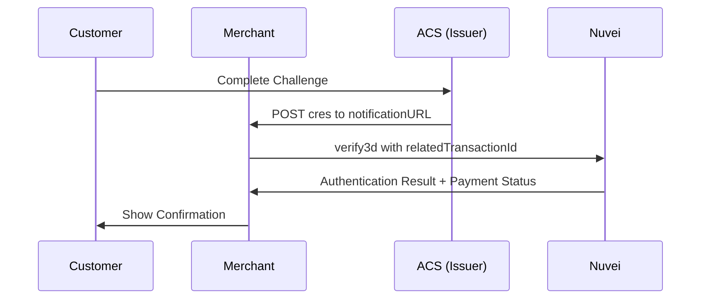

<Info>
  Verifies the 3D Secure authentication result after the cardholder completes the challenge. Call this after receiving the callback from the ACS (Access Control Server).
</Info>

## When to Use

- After the customer completes the 3DS challenge
- When receiving the `cres` (Challenge Response) callback
- To finalize the authentication and complete the payment

## 3DS Callback Flow



## Checksum Calculation

```
SHA256(merchantId + merchantSiteId + clientRequestId + amount + currency + relatedTransactionId + timeStamp + merchantSecretKey)
```

## Example Request

```json
{
  "sessionToken": "9610a8f6-44cf-4c4f-976a-005da69a2a3b",
  "merchantId": "427583496191624621",
  "merchantSiteId": "142033",
  "clientUniqueId": "ORDER-12345",
  "clientRequestId": "1C6CT7V1L",
  "amount": "200.00",
  "currency": "USD",
  "relatedTransactionId": "2110000000001208910",
  "userTokenId": "user_123",
  "timeStamp": "20260129143045",
  "checksum": "..."
}
```

## Example Response (Success)

```json
{
  "transactionId": "2110000000001208911",
  "orderId": "39272123",
  "transactionStatus": "APPROVED",
  "authCode": "111344",
  "gwErrorCode": 0,
  "gwExtendedErrorCode": 0,
  "transactionType": "Sale",
  "paymentOption": {
    "card": {
      "ccCardNumber": "4****5032",
      "bin": "400002",
      "last4Digits": "5032",
      "cardBrand": "VISA",
      "threeD": {
        "eci": "05",
        "cavv": "AAABAWFlmQAAAABjRWWZEEFgFz0=",
        "version": "2.2.0",
        "result": "Y",
        "authenticationStatus": "Y",
        "whiteListStatus": "",
        "dsTransID": "d4e5f6a7-b8c9-0d1e-2f3a-4b5c6d7e8f9a"
      }
    }
  },
  "internalRequestId": 12345678,
  "status": "SUCCESS",
  "errCode": 0
}
```

## Example Response (Authentication Failed)

```json
{
  "transactionId": "2110000000001208912",
  "orderId": "39272124",
  "transactionStatus": "DECLINED",
  "gwErrorCode": -1,
  "gwErrorReason": "3DS authentication failed",
  "paymentOption": {
    "card": {
      "threeD": {
        "eci": "07",
        "result": "N",
        "authenticationStatus": "N"
      }
    }
  },
  "internalRequestId": 12345679,
  "status": "SUCCESS",
  "errCode": 0
}
```

## Handling the ACS Callback

Set up an endpoint to receive the challenge result:

```javascript
// Express.js example
app.post('/3ds-callback', async (req, res) => {
  const { cres, threeDSSessionData } = req.body;
  
  // The ACS sends back the challenge result
  // Nuvei automatically processes this - you can also manually verify
  
  // Option 1: Parse the cres to get transactionId
  const decodedCres = JSON.parse(
    Buffer.from(cres, 'base64').toString()
  );
  const transactionId = decodedCres.threeDSServerTransID;
  
  // Option 2: Use threeDSSessionData if you stored it
  
  // Call verify3d
  const result = await verify3d(
    sessionToken,
    transactionId,
    orderDetails
  );
  
  if (result.transactionStatus === 'APPROVED') {
    // Redirect to success page
    res.redirect(`/checkout/success?orderId=${result.orderId}`);
  } else {
    // Redirect to failure page
    res.redirect(`/checkout/failure?reason=${result.gwErrorReason}`);
  }
});
```

## For Iframe Challenges

If you displayed the challenge in an iframe:

```javascript
// Listen for postMessage from ACS
window.addEventListener('message', async (event) => {
  // Validate origin
  if (!trustedOrigins.includes(event.origin)) return;
  
  const { cres, transactionId } = event.data;
  
  if (cres) {
    // Remove challenge iframe
    document.getElementById('challengeFrame').remove();
    
    // Show loading state
    showLoadingSpinner();
    
    // Verify the result
    const result = await verify3d(sessionToken, transactionId, orderDetails);
    
    if (result.transactionStatus === 'APPROVED') {
      showSuccessMessage(result);
    } else {
      showErrorMessage(result);
    }
  }
});
```

## Complete 3DS Flow Code Example

```javascript
class ThreeDSHandler {
  constructor(sessionToken, orderDetails) {
    this.sessionToken = sessionToken;
    this.orderDetails = orderDetails;
  }
  
  async initiate(cardDetails) {
    // Step 1: Initialize payment
    const initResult = await initPayment(this.sessionToken, this.orderDetails, cardDetails);
    
    if (!initResult.paymentOption?.card?.threeD?.v2supported) {
      // 3DS not required - proceed directly to payment
      return this.processPayment(cardDetails);
    }
    
    // Step 2: Perform 3DS method (fingerprinting)
    if (initResult.paymentOption.card.threeD.methodUrl) {
      await this.performThreeDSMethod(initResult.paymentOption.card.threeD);
    }
    
    // Step 3: Authorize 3D
    const authResult = await authorize3d(
      this.sessionToken,
      initResult.transactionId,
      this.orderDetails,
      cardDetails,
      this.getBrowserDetails()
    );
    
    if (authResult.transactionStatus === 'APPROVED') {
      // Frictionless - payment complete!
      return authResult;
    }
    
    if (authResult.transactionStatus === 'REDIRECT') {
      // Challenge required
      this.transactionId = authResult.transactionId;
      this.displayChallenge(authResult.paymentOption.card.threeD);
      
      // Wait for callback (handled by event listener)
      return new Promise((resolve, reject) => {
        this.challengeResolver = resolve;
        this.challengeRejecter = reject;
      });
    }
    
    // Authentication failed
    throw new Error(authResult.gwErrorReason || 'Authentication failed');
  }
  
  displayChallenge(threeD) {
    const iframe = document.createElement('iframe');
    iframe.id = 'threeDSChallenge';
    iframe.style.cssText = 'width:100%;height:600px;border:none;';
    
    document.getElementById('challengeContainer').innerHTML = '';
    document.getElementById('challengeContainer').appendChild(iframe);
    document.getElementById('challengeModal').style.display = 'block';
    
    // POST to ACS
    const form = document.createElement('form');
    form.method = 'POST';
    form.action = threeD.acsUrl;
    form.target = 'threeDSChallenge';
    
    const input = document.createElement('input');
    input.type = 'hidden';
    input.name = 'creq';
    input.value = threeD.cReq;
    form.appendChild(input);
    
    document.body.appendChild(form);
    form.submit();
    form.remove();
  }
  
  async handleChallengeComplete() {
    // Called when ACS redirects back
    document.getElementById('challengeModal').style.display = 'none';
    
    const result = await verify3d(
      this.sessionToken,
      this.transactionId,
      this.orderDetails
    );
    
    if (this.challengeResolver) {
      this.challengeResolver(result);
    }
    
    return result;
  }
  
  getBrowserDetails() {
    return {
      acceptHeader: 'text/html,application/xhtml+xml',
      javaEnabled: String(navigator.javaEnabled()),
      javaScriptEnabled: 'true',
      language: navigator.language,
      colorDepth: String(screen.colorDepth),
      screenHeight: String(screen.height),
      screenWidth: String(screen.width),
      timeZone: String(new Date().getTimezoneOffset()),
      userAgent: navigator.userAgent
    };
  }
}

// Usage
const handler = new ThreeDSHandler(sessionToken, orderDetails);
const result = await handler.initiate(cardDetails);

if (result.transactionStatus === 'APPROVED') {
  console.log('Payment successful!', result.transactionId);
}
```

## Next Steps

<CardGroup cols={2}>
  <Card title="Payment API" icon="credit-card" href="/api-reference/rest-1/payments/payment">
    Complete payments
  </Card>
  <Card title="Get Status" icon="magnifying-glass" href="/api-reference/rest-1/payments/get-payment-status">
    Check transaction
  </Card>
</CardGroup>
