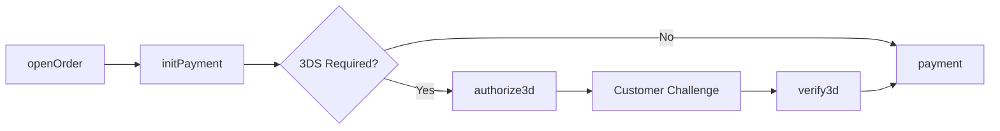

<Info>
  Initializes a payment and performs initial validation, including 3DS fingerprinting. This should be called **before /payment** for card transactions to determine if 3DS authentication is required.
</Info>

## When to Use

- Before processing card payments to check 3DS requirements
- To perform BIN-level validations
- To get card details (brand, type, issuing country)
- For PSD2/SCA compliance in European transactions

## 3DS Flow Overview



## Checksum Calculation

```
SHA256(merchantId + merchantSiteId + clientRequestId + amount + currency + timeStamp + merchantSecretKey)
```

## Example Request

```json
{
  "sessionToken": "9610a8f6-44cf-4c4f-976a-005da69a2a3b",
  "merchantId": "427583496191624621",
  "merchantSiteId": "142033",
  "clientUniqueId": "ORDER-12345",
  "clientRequestId": "1C6CT7V1L",
  "amount": "200.00",
  "currency": "USD",
  "paymentOption": {
    "card": {
      "cardNumber": "4000020951595032",
      "cardHolderName": "John Smith",
      "expirationMonth": "12",
      "expirationYear": "2030",
      "CVV": "217"
    }
  },
  "billingAddress": {
    "firstName": "John",
    "lastName": "Smith",
    "email": "john.smith@email.com",
    "country": "US"
  },
  "deviceDetails": {
    "ipAddress": "192.168.1.1"
  },
  "userTokenId": "user_123",
  "timeStamp": "20260129143045",
  "checksum": "..."
}
```

## Example Response (3DS Required)

```json
{
  "transactionId": "2110000000001208909",
  "orderId": "39272123",
  "transactionStatus": "APPROVED",
  "userPaymentOptionId": "87654321",
  "paymentOption": {
    "card": {
      "ccCardNumber": "4****5032",
      "bin": "400002",
      "last4Digits": "5032",
      "ccExpMonth": "12",
      "ccExpYear": "2030",
      "cardType": "Credit",
      "cardBrand": "VISA",
      "threeD": {
        "v2supported": "true",
        "methodUrl": "https://acs.bank.com/3ds-method",
        "methodPayload": "eyJ0aHJlZURTU2VydmVyVHJhbnNJRCI6...",
        "version": "2.2.0",
        "serverTransId": "d4e5f6a7-b8c9-0d1e-2f3a-4b5c6d7e8f9a"
      }
    }
  },
  "internalRequestId": 12345678,
  "status": "SUCCESS",
  "errCode": 0,
  "reason": ""
}
```

## Example Response (3DS Not Required)

```json
{
  "transactionId": "2110000000001208909",
  "orderId": "39272123",
  "transactionStatus": "APPROVED",
  "paymentOption": {
    "card": {
      "ccCardNumber": "4****1111",
      "bin": "411111",
      "last4Digits": "1111",
      "cardType": "Credit",
      "cardBrand": "VISA",
      "threeD": {
        "v2supported": "false"
      }
    }
  },
  "internalRequestId": 12345679,
  "status": "SUCCESS",
  "errCode": 0
}
```

## Handling 3DS Method (Fingerprinting)

When the response includes `methodUrl`, you must perform 3DS method fingerprinting:

```javascript
// 1. Check if 3DS method is required
if (response.paymentOption.card.threeD.methodUrl) {
  // 2. Create hidden iframe and POST to methodUrl
  const iframe = document.createElement('iframe');
  iframe.id = 'threeDSMethodIframe';
  iframe.name = 'threeDSMethodIframe';
  iframe.style.display = 'none';
  document.body.appendChild(iframe);

  const form = document.createElement('form');
  form.method = 'POST';
  form.action = response.paymentOption.card.threeD.methodUrl;
  form.target = 'threeDSMethodIframe';

  const input = document.createElement('input');
  input.name = 'threeDSMethodData';
  input.value = response.paymentOption.card.threeD.methodPayload;
  form.appendChild(input);

  document.body.appendChild(form);
  form.submit();

  // 3. Wait for completion (typically 3-5 seconds) or timeout
  setTimeout(() => {
    // Proceed to authorize3d or payment
  }, 3000);
}
```

## What Happens Next?

| Scenario | Next Step |
|----------|-----------|
| `threeD.v2supported = "true"` | Call [authorize3d](/api-reference/rest-1/3ds/authorize3d) |
| `threeD.v2supported = "false"` | Call [payment](/api-reference/rest-1/payments/payment) directly |
| Card not 3DS enrolled | Call [payment](/api-reference/rest-1/payments/payment) directly |

## Code Example

```javascript
async function initPaymentFlow(sessionToken, orderDetails, cardDetails) {
  // 1. Call initPayment
  const initResponse = await initPayment(sessionToken, orderDetails, cardDetails);
  
  const threeD = initResponse.paymentOption?.card?.threeD;
  
  // 2. Check if 3DS is required
  if (threeD?.v2supported === 'true') {
    // 3DS required - perform method if URL provided
    if (threeD.methodUrl) {
      await performThreeDSMethod(threeD.methodUrl, threeD.methodPayload);
    }
    
    // Continue to authorize3d
    return {
      requires3DS: true,
      transactionId: initResponse.transactionId,
      threeD: threeD
    };
  }
  
  // 3DS not required - can proceed to payment
  return {
    requires3DS: false,
    transactionId: initResponse.transactionId
  };
}
```

## Next Steps

<CardGroup cols={2}>
  <Card title="Authorize 3D" icon="shield-check" href="/api-reference/rest-1/3ds/authorize3d">
    Continue 3DS flow
  </Card>
  <Card title="Payment" icon="credit-card" href="/api-reference/rest-1/payments/payment">
    Process without 3DS
  </Card>
</CardGroup>
