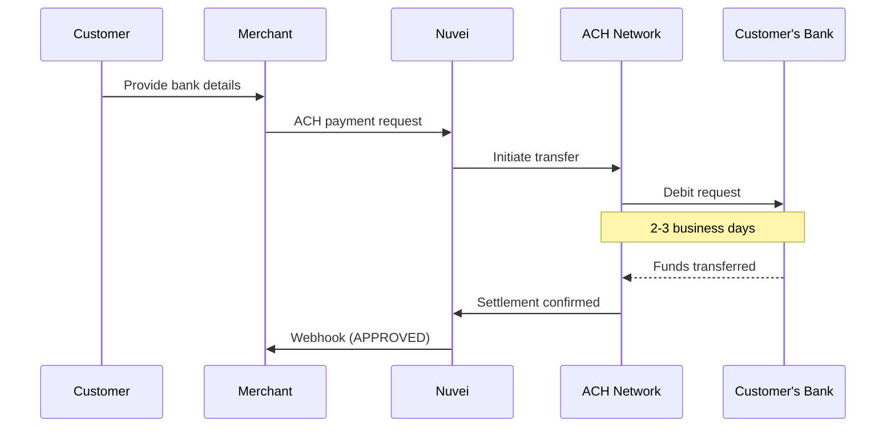

# ACH

<Info>
  **Payment Method ID:** `apmgw_ACH`  
  **Type:** Bank Transfer / Direct Debit  
  **Countries:** United States 🇺🇸  
  **Currencies:** USD  
  **Use Case:** Subscriptions, B2B, large payments
</Info>

ACH (Automated Clearing House) is the US bank transfer network. It's ideal for recurring payments, subscriptions, and B2B transactions where lower fees justify longer settlement times.

## How ACH Works



## Quick Start

### Payment Request

```json
POST /ppp/api/v1/payment.do

{
  "sessionToken": "<sessionToken>",
  "merchantId": "<merchantId>",
  "merchantSiteId": "<merchantSiteId>",
  "clientRequestId": "<unique_request_id>",
  "clientUniqueId": "order_US_123",
  "amount": "250.00",
  "currency": "USD",
  "userTokenId": "customer_US_456",
  
  "paymentOption": {
    "alternativePaymentMethod": {
      "paymentMethod": "apmgw_ACH",
      "routingNumber": "021000021",
      "accountNumber": "123456789",
      "accountType": "checking",
      "accountHolderName": "John Smith"
    }
  },
  
  "billingAddress": {
    "firstName": "John",
    "lastName": "Smith",
    "email": "john@example.com",
    "address": "123 Main Street",
    "city": "New York",
    "state": "NY",
    "zip": "10001",
    "country": "US"
  },
  
  "urlDetails": {
    "notificationUrl": "https://shop.example.com/webhooks"
  },
  
  "timeStamp": "<YYYYMMDDHHmmss>",
  "checksum": "<checksum>"
}
```

## Parameters

### Required

| Parameter | Type | Description |
|-----------|------|-------------|
| `paymentMethod` | string | `apmgw_ACH` |
| `routingNumber` | string | 9-digit ABA routing number |
| `accountNumber` | string | Bank account number |
| `accountType` | string | `checking` or `savings` |
| `accountHolderName` | string | Account holder name |

### Account Types

| Type | Description |
|------|-------------|
| `checking` | Checking account (most common) |
| `savings` | Savings account |
| `businessChecking` | Business checking account |

## ACH Transaction Types

| Type | Code | Description |
|------|------|-------------|
| **Debit** | PPD | Consumer account debit |
| **Debit** | CCD | Corporate account debit |
| **Credit** | PPD | Consumer payout |
| **Credit** | CCD | Corporate payout |

## Settlement Timeline

| Type | Timeline |
|------|----------|
| Standard ACH | 3-5 business days |
| Same-Day ACH | 1 business day |
| Next-Day ACH | 2 business days |

## Recurring ACH Payments

### Create Token

```json
POST /ppp/api/v1/payment.do

{
  "sessionToken": "<sessionToken>",
  "merchantId": "<merchantId>",
  "merchantSiteId": "<merchantSiteId>",
  "clientRequestId": "<unique_request_id>",
  "clientUniqueId": "ach_mandate_123",
  "amount": "0.00",
  "currency": "USD",
  "userTokenId": "customer_789",
  
  "paymentOption": {
    "alternativePaymentMethod": {
      "paymentMethod": "apmgw_ACH",
      "routingNumber": "021000021",
      "accountNumber": "123456789",
      "accountType": "checking",
      "accountHolderName": "John Smith"
    }
  },
  
  "timeStamp": "<YYYYMMDDHHmmss>",
  "checksum": "<checksum>"
}
```

### Charge Recurring

```json
POST /ppp/api/v1/payment.do

{
  "sessionToken": "<sessionToken>",
  "merchantId": "<merchantId>",
  "merchantSiteId": "<merchantSiteId>",
  "clientRequestId": "<unique_request_id>",
  "clientUniqueId": "subscription_renewal_456",
  "amount": "49.99",
  "currency": "USD",
  "userTokenId": "customer_789",
  "isRebilling": "1",
  
  "paymentOption": {
    "userPaymentOptionId": "<saved_ach_upo_id>"
  },
  
  "timeStamp": "<YYYYMMDDHHmmss>",
  "checksum": "<checksum>"
}
```

## ACH Payouts

Send funds to US bank accounts:

```json
POST /ppp/api/v1/payout.do

{
  "merchantId": "<merchantId>",
  "merchantSiteId": "<merchantSiteId>",
  "sessionToken": "<sessionToken>",
  "clientRequestId": "<unique_request_id>",
  "userTokenId": "customer_789",
  "clientUniqueId": "payout_123",
  "amount": "500.00",
  "currency": "USD",
  
  "paymentOption": {
    "alternativePaymentMethod": {
      "paymentMethod": "apmgw_ACH",
      "routingNumber": "021000021",
      "accountNumber": "123456789",
      "accountType": "checking",
      "accountHolderName": "John Smith"
    }
  },
  
  "timeStamp": "<YYYYMMDDHHmmss>",
  "checksum": "<checksum>"
}
```

## Feature Support

| Feature | Supported |
|---------|-----------|
| Refunds | ✅ |
| Recurring | ✅ |
| Payouts | ✅ |
| Tokenization | ✅ |
| Same-day ACH | ⚠️ Additional fees |

## Return Codes

ACH payments can be returned (similar to chargebacks):

| Code | Reason | Action |
|------|--------|--------|
| R01 | Insufficient funds | Retry later |
| R02 | Account closed | Get new details |
| R03 | No account found | Verify routing/account |
| R04 | Invalid account | Get new details |
| R10 | Customer unauthorized | Contact customer |
| R29 | Corporate customer refused | Contact customer |

<Warning>
  ACH returns can occur up to 60 days after transaction. Build this into your risk model.
</Warning>

## Bank Validation

Validate routing numbers before submission:

```javascript
function validateRoutingNumber(routing) {
  if (routing.length !== 9) return false;
  
  // ABA routing number checksum
  const digits = routing.split('').map(Number);
  const sum = 
    3 * (digits[0] + digits[3] + digits[6]) +
    7 * (digits[1] + digits[4] + digits[7]) +
    1 * (digits[2] + digits[5] + digits[8]);
  
  return sum % 10 === 0;
}
```

## Testing

### Test Routing Numbers

| Routing Number | Bank |
|----------------|------|
| 021000021 | JP Morgan Chase |
| 011401533 | Bank of America |
| 091000019 | Wells Fargo |

### Test Account Numbers

Use any valid-format account number in sandbox.

## Best Practices

<AccordionGroup>
  <Accordion title="Get authorization" icon="file-signature">
    ACH requires customer authorization (NACHA rules). Store signed authorization for disputes.
  </Accordion>
  
  <Accordion title="Verify accounts" icon="check">
    Use micro-deposits to verify bank account ownership before large debits.
  </Accordion>
  
  <Accordion title="Plan for returns" icon="rotate-left">
    ACH has a 60-day return window. Reserve funds accordingly.
  </Accordion>
  
  <Accordion title="Use for subscriptions" icon="repeat">
    ACH's lower fees (vs cards) make it ideal for recurring SaaS payments.
  </Accordion>
</AccordionGroup>

## Related

<CardGroup cols={2}>
  <Card title="Recurring Payments" icon="repeat" href="/integrations/features/recurring">
    Subscription setup
  </Card>
  <Card title="Americas APMs" icon="map" href="/apms/americas/overview">
    All Americas methods
  </Card>
</CardGroup>
