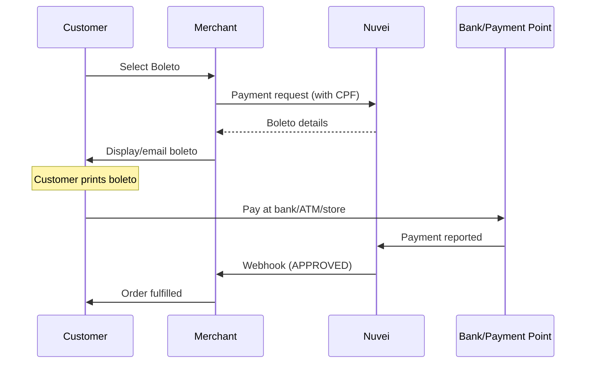

# Boleto Bancário

<Info>
  **Payment Method ID:** `apmgw_Boleto_Bancario`  
  **Type:** Bank Slip / Cash  
  **Countries:** Brazil 🇧🇷  
  **Currencies:** BRL  
  **Settlement:** T+1 to T+3 days after payment
</Info>

Boleto Bancário is a Brazilian payment slip that customers can pay at any bank, ATM, or authorized payment location. It's essential for reaching unbanked Brazilian consumers.

## How Boleto Works



## Quick Start

### Payment Request

```json
POST /ppp/api/v1/payment.do

{
  "sessionToken": "<sessionToken>",
  "merchantId": "<merchantId>",
  "merchantSiteId": "<merchantSiteId>",
  "clientRequestId": "<unique_request_id>",
  "clientUniqueId": "order_BR_boleto_123",
  "amount": "199.90",
  "currency": "BRL",
  
  "paymentOption": {
    "alternativePaymentMethod": {
      "paymentMethod": "apmgw_Boleto_Bancario"
    }
  },
  
  "billingAddress": {
    "firstName": "Carlos",
    "lastName": "Oliveira",
    "email": "carlos@example.com.br",
    "address": "Rua das Flores, 123",
    "city": "São Paulo",
    "zip": "01310-100",
    "country": "BR"
  },
  
  "userDetails": {
    "firstName": "Carlos",
    "lastName": "Oliveira",
    "email": "carlos@example.com.br",
    "identification": "123.456.789-00",
    "identificationType": "CPF"
  },
  
  "urlDetails": {
    "notificationUrl": "https://shop.example.com/webhooks/nuvei"
  },
  
  "timeStamp": "<YYYYMMDDHHmmss>",
  "checksum": "<checksum>"
}
```

### Response with Boleto

```json
{
  "orderId": "350728617",
  "paymentOption": {
    "alternativePaymentMethod": {
      "boletoNumber": "23793.38128 60800.000003 00000.000402 1 84340000019990",
      "boletoBarcode": "23791843400000199903381286080000000000000040",
      "boletoPdfUrl": "https://boletos.nuvei.com/pdf/ABC123...",
      "expirationDate": "2024-02-05"
    }
  },
  "transactionStatus": "PENDING",
  "status": "SUCCESS"
}
```

### Display Boleto

```html
<div class="boleto-container">
  <div class="header">
    
    <h2>Boleto Bancário</h2>
  </div>
  
  <div class="amount">
    <strong>Valor:</strong> R$ 199,90
  </div>
  
  <div class="barcode">
    <svg><!-- Barcode --></svg>
    <code class="linha-digitavel">
      23793.38128 60800.000003 00000.000402 1 84340000019990
    </code>
  </div>
  
  <div class="expiration">
    <strong>Vencimento:</strong> 05/02/2024
  </div>
  
  <div class="instructions">
    <h3>Instruções:</h3>
    <ul>
      <li>Pague em qualquer banco, lotérica ou internet banking</li>
      <li>Após o pagamento, a confirmação pode levar até 3 dias úteis</li>
      <li>Não recebemos após o vencimento</li>
    </ul>
  </div>
  
  <div class="actions">
    <a href="${boletoPdfUrl}" class="btn" target="_blank">
      Imprimir Boleto
    </a>
    <button onclick="copyCode()">Copiar código</button>
  </div>
</div>
```

## Parameters

### Required

| Parameter | Type | Description |
|-----------|------|-------------|
| `paymentMethod` | string | `apmgw_Boleto_Bancario` |
| `amount` | string | Payment amount in BRL |
| `currency` | string | Must be `BRL` |
| `userDetails.identification` | string | CPF or CNPJ |
| `userDetails.identificationType` | string | `CPF` or `CNPJ` |

### Optional

| Parameter | Type | Description |
|-----------|------|-------------|
| `expirationDays` | integer | Days until expiration (default: 3-7) |

## Boleto Components

| Component | Description |
|-----------|-------------|
| **Linha Digitável** | 47-digit readable code |
| **Código de Barras** | Scannable barcode |
| **PDF** | Printable bank slip |
| **Expiration Date** | Payment deadline |

## Payment Locations

Customers can pay boletos at:

- ✅ Any bank branch
- ✅ ATMs (24/7)
- ✅ Lottery houses (Lotéricas)
- ✅ Internet banking
- ✅ Banking apps
- ✅ Authorized stores (Casas Bahia, etc.)

## Settlement Timeline

| Event | Timeline |
|-------|----------|
| Boleto generated | Immediate |
| Customer pays | 1-7 days typically |
| Payment confirmation | T+1 to T+3 after payment |
| Funds settlement | T+2 to T+5 |

<Warning>
  Boleto is a "pay later" method. Customers have days to pay, and many don't. Expect 40-60% conversion rate on generated boletos.
</Warning>

## Feature Support

| Feature | Supported |
|---------|-----------|
| Refunds | ❌ |
| Recurring | ❌ |
| Payouts | ❌ |
| Partial payment | ❌ |

<Note>
  Boleto does not support refunds. For returns, use bank transfer or store credit.
</Note>

## Testing

### Sandbox

In sandbox, boletos are simulated. Use the sandbox dashboard to simulate customer payment.

### Test Data

| Field | Value |
|-------|-------|
| CPF | `123.456.789-00` |
| CNPJ | `12.345.678/0001-90` |

## Error Handling

| Error Code | Reason | Solution |
|------------|--------|----------|
| `1400` | Invalid CPF/CNPJ | Validate tax ID format |
| `1025` | Invalid currency | Must use BRL |

## Backend Example

```javascript
async function createBoletoPayment(order) {
  const response = await nuveiRequest('/payment.do', {
    sessionToken: await getSessionToken(),
    merchantId: process.env.NUVEI_MERCHANT_ID,
    merchantSiteId: process.env.NUVEI_SITE_ID,
    clientRequestId: generateUUID(),
    clientUniqueId: order.id,
    amount: order.amount.toString(),
    currency: "BRL",
    paymentOption: {
      alternativePaymentMethod: {
        paymentMethod: "apmgw_Boleto_Bancario"
      }
    },
    billingAddress: {
      firstName: order.customer.firstName,
      lastName: order.customer.lastName,
      email: order.customer.email,
      country: "BR"
    },
    userDetails: {
      firstName: order.customer.firstName,
      lastName: order.customer.lastName,
      email: order.customer.email,
      identification: order.customer.cpf,
      identificationType: "CPF"
    },
    urlDetails: {
      notificationUrl: `${process.env.BASE_URL}/webhooks/nuvei`
    },
    timeStamp: getTimestamp(),
    checksum: calculateChecksum(...)
  });

  if (response.status === 'SUCCESS') {
    const boleto = response.paymentOption.alternativePaymentMethod;
    
    // Store pending order
    await storeOrder({
      id: order.id,
      status: 'pending_boleto',
      boletoNumber: boleto.boletoNumber,
      expiration: boleto.expirationDate
    });
    
    // Email boleto to customer
    await sendBoletoEmail(order.customer.email, {
      linhaDigitavel: boleto.boletoNumber,
      pdfUrl: boleto.boletoPdfUrl,
      expiration: boleto.expirationDate,
      amount: order.amount
    });
    
    return {
      status: 'pending',
      boleto: boleto
    };
  }
  
  throw new Error(response.gwErrorReason);
}
```

## Best Practices

<AccordionGroup>
  <Accordion title="Email the boleto" icon="envelope">
    Always send boleto details via email. Customers may not print immediately.
  </Accordion>
  
  <Accordion title="Set realistic expectations" icon="clock">
    Tell customers that order processing begins after payment confirmation (1-3 days).
  </Accordion>
  
  <Accordion title="Handle expiration" icon="calendar">
    Expired boletos cannot be paid. Offer to generate a new one.
  </Accordion>
  
  <Accordion title="Consider PIX instead" icon="bolt">
    PIX is faster and has higher conversion. Offer both, but promote PIX.
  </Accordion>
</AccordionGroup>

## PIX vs Boleto

| Aspect | PIX | Boleto |
|--------|-----|--------|
| Settlement | Instant | 1-3 days |
| Conversion | ~80% | ~50% |
| Refunds | ✅ | ❌ |
| Unbanked | ❌ Needs account | ✅ Cash option |

## Related

<CardGroup cols={2}>
  <Card title="PIX" icon="bolt" href="/apms/americas/pix">
    Brazilian instant payments
  </Card>
  <Card title="Americas APMs" icon="map" href="/apms/americas/overview">
    All Americas methods
  </Card>
</CardGroup>
