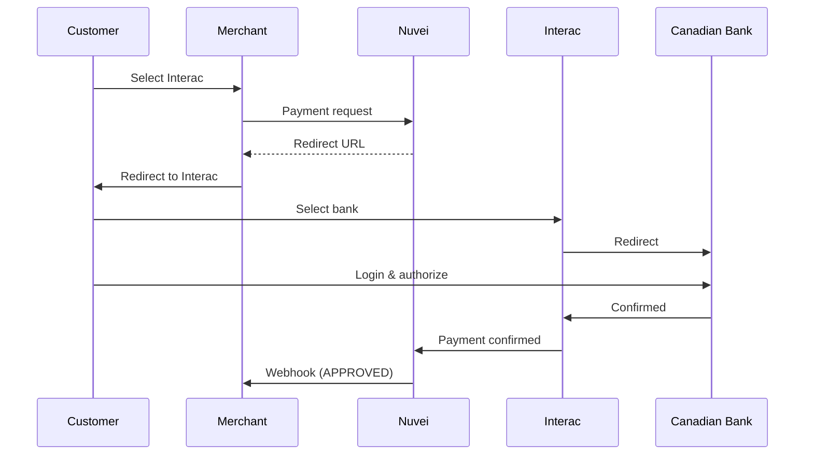

# Interac

<Info>
  **Payment Method ID:** `apmgw_Interac`  
  **Type:** Debit / E-Transfer  
  **Countries:** Canada 🇨🇦  
  **Currencies:** CAD  
  **Market Share:** ~30% of Canadian e-commerce
</Info>

Interac is Canada's national debit network. Online, Interac e-Transfer allows customers to send payments directly from their bank accounts.

## How Interac Works



## Quick Start

### Payment Request

```json
POST /ppp/api/v1/payment.do

{
  "sessionToken": "<sessionToken>",
  "merchantId": "<merchantId>",
  "merchantSiteId": "<merchantSiteId>",
  "clientRequestId": "<unique_request_id>",
  "clientUniqueId": "order_CA_123",
  "amount": "89.99",
  "currency": "CAD",
  
  "paymentOption": {
    "alternativePaymentMethod": {
      "paymentMethod": "apmgw_Interac"
    }
  },
  
  "billingAddress": {
    "firstName": "John",
    "lastName": "Smith",
    "email": "john@example.ca",
    "address": "123 Maple Street",
    "city": "Toronto",
    "state": "ON",
    "zip": "M5V 1A1",
    "country": "CA"
  },
  
  "urlDetails": {
    "successUrl": "https://shop.example.com/success",
    "failureUrl": "https://shop.example.com/failure",
    "notificationUrl": "https://shop.example.com/webhooks"
  },
  
  "timeStamp": "<YYYYMMDDHHmmss>",
  "checksum": "<checksum>"
}
```

## Supported Banks

All major Canadian banks support Interac:

| Bank | Support |
|------|---------|
| TD Canada Trust | ✅ |
| RBC Royal Bank | ✅ |
| BMO Bank of Montreal | ✅ |
| Scotiabank | ✅ |
| CIBC | ✅ |
| National Bank | ✅ |
| Desjardins | ✅ |
| HSBC Canada | ✅ |

## Interac Products

| Product | Description | Use Case |
|---------|-------------|----------|
| **Interac Online** | Direct bank login | E-commerce payments |
| **Interac e-Transfer** | Email money transfer | P2P, B2C refunds |
| **Interac Debit** | Card payments | In-store, online |

## Interac Payouts

Send funds to Canadian bank accounts:

```json
POST /ppp/api/v1/payout.do

{
  "merchantId": "<merchantId>",
  "merchantSiteId": "<merchantSiteId>",
  "sessionToken": "<sessionToken>",
  "clientRequestId": "<unique_request_id>",
  "userTokenId": "customer_CA_123",
  "clientUniqueId": "payout_456",
  "amount": "50.00",
  "currency": "CAD",
  
  "paymentOption": {
    "alternativePaymentMethod": {
      "paymentMethod": "apmgw_Interac",
      "recipientEmail": "customer@example.ca"
    }
  },
  
  "timeStamp": "<YYYYMMDDHHmmss>",
  "checksum": "<checksum>"
}
```

## Feature Support

| Feature | Supported |
|---------|-----------|
| Refunds | ✅ Full & Partial |
| Recurring | ❌ |
| Payouts | ✅ Via e-Transfer |
| Real-time | ✅ |

## Testing

### Sandbox

Use Interac's test environment with simulated bank login.

| Field | Value |
|-------|-------|
| Currency | CAD |
| Country | CA |

## Best Practices

<AccordionGroup>
  <Accordion title="Canadian customers only" icon="maple-leaf">
    Interac is only for Canadian bank accounts. Verify billing country.
  </Accordion>
  
  <Accordion title="Trust factor" icon="shield">
    Interac is highly trusted in Canada. Display prominently for Canadian traffic.
  </Accordion>
  
  <Accordion title="Mobile banking" icon="mobile">
    Most Canadians use mobile banking apps that support Interac.
  </Accordion>
</AccordionGroup>

## Related

<CardGroup cols={2}>
  <Card title="Americas APMs" icon="map" href="/apms/americas/overview">
    All Americas methods
  </Card>
  <Card title="Payouts" icon="money-bill-transfer" href="/integrations/features/payouts">
    Payout guide
  </Card>
</CardGroup>
