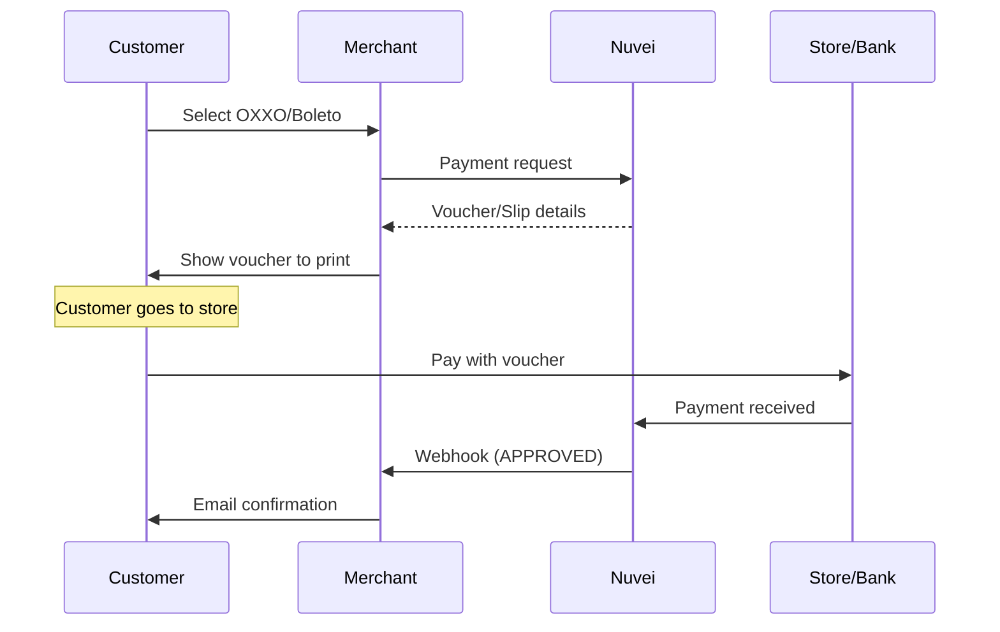

# Americas APMs

The Americas have distinct payment landscapes - North America relies heavily on cards while Latin America has unique local payment methods that dominate e-commerce.

## Popular Americas APMs

<CardGroup cols={3}>
  <Card title="PIX" icon="bolt" href="/apms/americas/pix">
    🇧🇷 Brazil's instant payments
  </Card>
  <Card title="Boleto" icon="barcode" href="/apms/americas/boleto">
    🇧🇷 Brazilian bank slip
  </Card>
  <Card title="OXXO" icon="store" href="/apms/americas/oxxo">
    🇲🇽 Mexico cash voucher
  </Card>
  <Card title="PSE" icon="bank" href="/apms/americas/pse">
    🇨🇴 Colombia bank transfer
  </Card>
  <Card title="Interac" icon="building" href="/apms/americas/interac">
    🇨🇦 Canadian banking
  </Card>
  <Card title="ACH" icon="university" href="/apms/americas/ach">
    🇺🇸 US bank transfers
  </Card>
</CardGroup>

## APMs by Country

### Brazil 🇧🇷

| APM | Type | Market Share | Currencies |
|-----|------|--------------|------------|
| [PIX](/apms/americas/pix) | Instant Payment | ~30% | BRL |
| [Boleto](/apms/americas/boleto) | Cash/Bank Slip | ~15% | BRL |
| Cards | Credit/Debit | ~40% | BRL |

Brazil has a unique payments ecosystem. PIX has rapidly become the preferred method due to instant settlement, while Boleto remains popular for the unbanked population.

### Mexico 🇲🇽

| APM | Type | Market Share | Currencies |
|-----|------|--------------|------------|
| [OXXO](/apms/americas/oxxo) | Cash Voucher | ~20% | MXN |
| SPEI | Bank Transfer | ~15% | MXN |
| Cards | Credit/Debit | ~45% | MXN |

Many Mexicans prefer paying with cash at OXXO convenience stores (17,000+ locations).

### Colombia 🇨🇴

| APM | Type | Market Share | Currencies |
|-----|------|--------------|------------|
| [PSE](/apms/americas/pse) | Bank Transfer | ~35% | COP |
| Efecty | Cash Voucher | ~15% | COP |
| Cards | Credit/Debit | ~40% | COP |

### Canada 🇨🇦

| APM | Type | Market Share | Currencies |
|-----|------|--------------|------------|
| [Interac](/apms/americas/interac) | Debit/E-Transfer | ~30% | CAD |
| Cards | Credit | ~55% | CAD |

### United States 🇺🇸

| APM | Type | Market Share | Currencies |
|-----|------|--------------|------------|
| [ACH](/apms/americas/ach) | Bank Transfer | ~10% | USD |
| [PayPal](/apms/wallets/paypal) | E-Wallet | ~25% | USD |
| Cards | Credit/Debit | ~50% | USD |

## Integration Example

### REST API - PIX Payment

```json
POST /ppp/api/v1/payment.do

{
  "sessionToken": "<sessionToken>",
  "merchantId": "<merchantId>",
  "merchantSiteId": "<merchantSiteId>",
  "clientRequestId": "<unique_request_id>",
  "clientUniqueId": "order_BR_123",
  "amount": "150.00",
  "currency": "BRL",
  
  "paymentOption": {
    "alternativePaymentMethod": {
      "paymentMethod": "apmgw_PIX"
    }
  },
  
  "billingAddress": {
    "firstName": "João",
    "lastName": "Silva",
    "email": "joao@example.com.br",
    "country": "BR"
  },
  
  "userDetails": {
    "firstName": "João",
    "lastName": "Silva",
    "email": "joao@example.com.br",
    "identification": "123.456.789-00",
    "identificationType": "CPF"
  },
  
  "urlDetails": {
    "successUrl": "https://yoursite.com/success",
    "failureUrl": "https://yoursite.com/failure",
    "notificationUrl": "https://yoursite.com/webhooks"
  },
  
  "timeStamp": "<YYYYMMDDHHmmss>",
  "checksum": "<checksum>"
}
```

### Response with QR Code

```json
{
  "orderId": "350728611",
  "paymentOption": {
    "alternativePaymentMethod": {
      "PIX_qrCode": "00020126580014br.gov.bcb.pix...",
      "PIX_qrImage": "data:image/png;base64,iVBORw0KGgo..."
    },
    "redirectUrl": "https://gw-apm.nuvei.com/Home?PaymentToken=ABC..."
  },
  "transactionStatus": "PENDING",
  "status": "SUCCESS"
}
```

## Feature Support

| APM | Refunds | Partial Refunds | Recurring | Payouts |
|-----|---------|-----------------|-----------|---------|
| PIX | ✅ | ✅ | ❌ | ✅ |
| Boleto | ❌ | ❌ | ❌ | ❌ |
| OXXO | ❌ | ❌ | ❌ | ❌ |
| PSE | ✅ | ❌ | ❌ | ❌ |
| Interac | ✅ | ✅ | ❌ | ✅ |
| ACH | ✅ | ✅ | ✅ | ✅ |

## Latin America Requirements

### CPF/CNPJ (Brazil)

Brazilian payments require tax ID:

```json
"userDetails": {
  "identification": "123.456.789-00",
  "identificationType": "CPF"  // or "CNPJ" for businesses
}
```

### CURP/RFC (Mexico)

Mexican payments may require:

```json
"userDetails": {
  "identification": "XXXX000000XXXXXX00",
  "identificationType": "CURP"  // or "RFC"
}
```

## Cash Payment Flow

OXXO and Boleto are "pay later at location" methods:



<Warning>
  Cash payments (OXXO, Boleto) typically expire in 3-7 days. You'll receive a webhook when (if) the customer pays.
</Warning>

## Settlement Times

| APM | Payment Type | Settlement |
|-----|--------------|------------|
| PIX | Real-time | Instant |
| Boleto | Cash | T+1 to T+3 |
| OXXO | Cash | T+1 to T+3 |
| PSE | Bank Transfer | T+1 |
| Interac | E-Transfer | T+1 |
| ACH | Bank Transfer | T+3 to T+5 |

## Best Practices for Latin America

<AccordionGroup>
  <Accordion title="Always collect tax ID" icon="id-card">
    Brazilian payments require CPF (individuals) or CNPJ (businesses). Validate format before submission.
  </Accordion>
  
  <Accordion title="Support installments" icon="calendar">
    Latin American customers expect installment options. Many cards support 3-12 month installments.
  </Accordion>
  
  <Accordion title="Handle cash payments" icon="money-bill">
    For OXXO/Boleto, generate a printable voucher and send via email. Set clear expiration dates.
  </Accordion>
  
  <Accordion title="Local currency pricing" icon="dollar">
    Show prices in local currency (BRL, MXN, COP). Currency conversion at checkout causes cart abandonment.
  </Accordion>
</AccordionGroup>

## Quick Links

<CardGroup cols={2}>
  <Card title="APM Integration Guide" icon="code" href="/apms/integration">
    How to integrate APMs
  </Card>
  <Card title="Wallets" icon="wallet" href="/apms/wallets/overview">
    PayPal, Apple Pay, Google Pay
  </Card>
  <Card title="Europe APMs" icon="globe" href="/apms/europe/overview">
    European payment methods
  </Card>
  <Card title="All APMs" icon="globe" href="/apms/overview">
    Complete APM list
  </Card>
</CardGroup>
