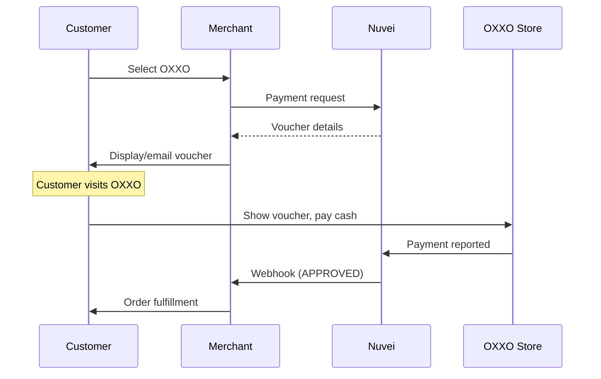

# OXXO

<Info>
  **Payment Method ID:** `apmgw_OXXO`  
  **Type:** Cash Voucher  
  **Countries:** Mexico 🇲🇽  
  **Currencies:** MXN  
  **Locations:** 17,000+ stores
</Info>

OXXO is Mexico's largest convenience store chain. Customers can pay for online purchases by receiving a voucher (ficha de pago) and paying cash at any OXXO store.

## How OXXO Works



## Quick Start

### Payment Request

```json
POST /ppp/api/v1/payment.do

{
  "sessionToken": "<sessionToken>",
  "merchantId": "<merchantId>",
  "merchantSiteId": "<merchantSiteId>",
  "clientRequestId": "<unique_request_id>",
  "clientUniqueId": "order_MX_123",
  "amount": "499.00",
  "currency": "MXN",
  
  "paymentOption": {
    "alternativePaymentMethod": {
      "paymentMethod": "apmgw_OXXO"
    }
  },
  
  "billingAddress": {
    "firstName": "Carlos",
    "lastName": "García",
    "email": "carlos@example.com.mx",
    "country": "MX"
  },
  
  "urlDetails": {
    "successUrl": "https://shop.example.com/success",
    "failureUrl": "https://shop.example.com/failure",
    "notificationUrl": "https://shop.example.com/webhooks/nuvei"
  },
  
  "timeStamp": "<YYYYMMDDHHmmss>",
  "checksum": "<checksum>"
}
```

### Response with Voucher

```json
{
  "orderId": "350728613",
  "paymentOption": {
    "alternativePaymentMethod": {
      "referenceNumber": "1234567890123456",
      "expirationDate": "2024-01-20",
      "voucherUrl": "https://vouchers.nuvei.com/oxxo/ABC123..."
    },
    "userPaymentOptionId": "86068563"
  },
  "transactionStatus": "PENDING",
  "clientUniqueId": "order_MX_123",
  "status": "SUCCESS"
}
```

### Display Voucher

```html
<div class="oxxo-voucher">
  <div class="header">
    
    <h2>Ficha de Pago OXXO</h2>
  </div>
  
  <div class="amount">
    <span class="label">Monto a pagar:</span>
    <span class="value">$499.00 MXN</span>
  </div>
  
  <div class="reference">
    <span class="label">Número de referencia:</span>
    <div class="barcode">
      <svg><!-- Barcode SVG --></svg>
      <span class="number">1234 5678 9012 3456</span>
    </div>
  </div>
  
  <div class="expiration">
    <span class="warning">⚠️ Expira: 20 de enero, 2024</span>
  </div>
  
  <div class="instructions">
    <h3>Instrucciones:</h3>
    <ol>
      <li>Acude a cualquier tienda OXXO</li>
      <li>Indica que deseas realizar un pago de servicio</li>
      <li>Proporciona el número de referencia</li>
      <li>Realiza el pago en efectivo</li>
      <li>Conserva tu ticket como comprobante</li>
    </ol>
  </div>
  
  <div class="actions">
    <button onclick="window.print()">Imprimir</button>
    <button onclick="downloadVoucher()">Descargar PDF</button>
  </div>
</div>
```

## Parameters

### Required

| Parameter | Type | Description |
|-----------|------|-------------|
| `paymentMethod` | string | Must be `apmgw_OXXO` |
| `amount` | string | Payment amount (10-10,000 MXN) |
| `currency` | string | Must be `MXN` |
| `billingAddress.email` | string | For voucher delivery |
| `billingAddress.country` | string | Must be `MX` |

### Amount Limits

| Limit | Amount |
|-------|--------|
| Minimum | 10 MXN |
| Maximum | 10,000 MXN |

<Warning>
  OXXO has a maximum payment limit of 10,000 MXN per transaction due to Mexican financial regulations.
</Warning>

## Voucher Lifecycle

### States

| State | Description |
|-------|-------------|
| `PENDING` | Voucher generated, awaiting payment |
| `APPROVED` | Customer paid at OXXO |
| `EXPIRED` | Voucher expired without payment |
| `CANCELLED` | Voucher cancelled by merchant |

### Expiration

By default, OXXO vouchers expire in **3-7 days**. Check the `expirationDate` in the response.

## Feature Support

| Feature | Supported |
|---------|-----------|
| Refunds | ❌ |
| Partial Payments | ❌ |
| Recurring | ❌ |
| Payouts | ❌ |

<Note>
  OXXO payments cannot be refunded automatically. For refunds, you must arrange alternative methods (bank transfer, store credit, etc.).
</Note>

## Testing

### Sandbox

In sandbox mode, OXXO generates test vouchers. To simulate payment:

1. Generate a voucher
2. Wait for automatic approval (sandbox auto-approves after a few minutes)
3. Or manually trigger via sandbox dashboard

### Test Data

| Field | Value |
|-------|-------|
| Amount | 10.00 - 10,000.00 MXN |
| Any valid email | For voucher delivery |

## Error Handling

### Common Errors

| Error Code | Reason | Solution |
|------------|--------|----------|
| `1025` | Invalid currency | Must use MXN |
| `1026` | Invalid country | Must use MX |
| `1030` | Amount too low | Minimum 10 MXN |
| `1031` | Amount too high | Maximum 10,000 MXN |

### Backend Example

```javascript
async function createOxxoPayment(order) {
  // Validate amount limits
  if (order.amount < 10 || order.amount > 10000) {
    throw new Error('OXXO amount must be between 10 and 10,000 MXN');
  }
  
  const payload = {
    sessionToken: await getSessionToken(),
    merchantId: process.env.NUVEI_MERCHANT_ID,
    merchantSiteId: process.env.NUVEI_SITE_ID,
    clientRequestId: generateUUID(),
    clientUniqueId: order.id,
    amount: order.amount.toString(),
    currency: "MXN",
    paymentOption: {
      alternativePaymentMethod: {
        paymentMethod: "apmgw_OXXO"
      }
    },
    billingAddress: {
      firstName: order.customer.firstName,
      lastName: order.customer.lastName,
      email: order.customer.email,
      country: "MX"
    },
    urlDetails: {
      notificationUrl: `${process.env.BASE_URL}/webhooks/nuvei`
    },
    timeStamp: getTimestamp(),
    checksum: calculateChecksum(...)
  };

  const response = await nuveiRequest('/payment.do', payload);
  
  if (response.status === 'SUCCESS') {
    // Store pending order
    await storeOrder({
      id: order.id,
      nuveiOrderId: response.orderId,
      status: 'pending_oxxo',
      voucherReference: response.paymentOption.alternativePaymentMethod.referenceNumber,
      expirationDate: response.paymentOption.alternativePaymentMethod.expirationDate
    });
    
    // Send voucher email
    await sendOxxoVoucherEmail(order.customer.email, {
      reference: response.paymentOption.alternativePaymentMethod.referenceNumber,
      amount: order.amount,
      expiration: response.paymentOption.alternativePaymentMethod.expirationDate,
      voucherUrl: response.paymentOption.alternativePaymentMethod.voucherUrl
    });
    
    return {
      status: 'pending',
      voucherUrl: response.paymentOption.alternativePaymentMethod.voucherUrl
    };
  }
  
  throw new Error(response.gwErrorReason || 'Failed to create OXXO voucher');
}
```

## Webhook Handling

```javascript
app.post('/webhooks/nuvei', async (req, res) => {
  const { 
    payment_method, 
    Status, 
    PPP_TransactionID,
    customData 
  } = req.body;
  
  if (payment_method === 'apmgw_OXXO') {
    const orderId = customData;
    
    if (Status === 'APPROVED') {
      // Customer paid at OXXO!
      await updateOrderStatus(orderId, 'paid');
      await fulfillOrder(orderId);
      await sendOrderConfirmation(orderId);
    } else if (Status === 'DECLINED') {
      // Voucher expired or other issue
      await updateOrderStatus(orderId, 'cancelled');
      await notifyCustomerVoucherExpired(orderId);
    }
  }
  
  res.status(200).send('OK');
});
```

## Best Practices

<AccordionGroup>
  <Accordion title="Send voucher via email" icon="envelope">
    Always email the voucher details. Customers may not print immediately and need access later.
  </Accordion>
  
  <Accordion title="Clear expiration display" icon="clock">
    Show the expiration date prominently. Mexican customers are familiar with voucher expiration.
  </Accordion>
  
  <Accordion title="Spanish language" icon="language">
    Display voucher instructions in Spanish. Use terms like "ficha de pago" that customers recognize.
  </Accordion>
  
  <Accordion title="Don't ship until paid" icon="box">
    OXXO is a "pay later" method. Wait for the webhook confirmation before fulfilling physical orders.
  </Accordion>
  
  <Accordion title="Handle expiration gracefully" icon="calendar-xmark">
    If a voucher expires, offer to generate a new one or suggest alternative payment methods.
  </Accordion>
</AccordionGroup>

## OXXO Store Finder

Direct customers to nearby stores:

```html
<a href="https://www.oxxo.com/ubicador-de-tiendas" target="_blank">
  Encuentra tu OXXO más cercano
</a>
```

## Related

<CardGroup cols={2}>
  <Card title="Americas APMs" icon="map" href="/apms/americas/overview">
    All Americas payment methods
  </Card>
  <Card title="Boleto" icon="barcode" href="/apms/americas/boleto">
    Similar Brazilian method
  </Card>
  <Card title="PIX" icon="bolt" href="/apms/americas/pix">
    Brazilian instant payment
  </Card>
  <Card title="Webhooks" icon="bell" href="/integrations/features/webhooks">
    Handle payment notifications
  </Card>
</CardGroup>
