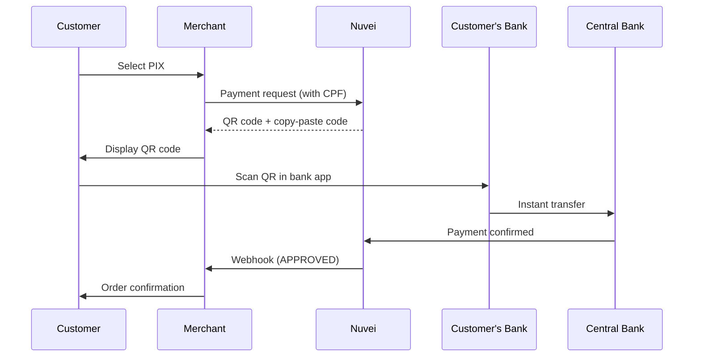

# PIX

<Info>
  **Payment Method ID:** `apmgw_PIX`  
  **Type:** Instant Payment  
  **Countries:** Brazil 🇧🇷  
  **Currencies:** BRL  
  **Settlement:** Instant (24/7/365)
</Info>

PIX is Brazil's instant payment system launched by the Central Bank of Brazil in 2020. It enables 24/7 instant transfers between bank accounts and has rapidly become one of Brazil's most popular payment methods.

## How PIX Works



## Quick Start

### Payment Request

```json
POST /ppp/api/v1/payment.do

{
  "sessionToken": "<sessionToken>",
  "merchantId": "<merchantId>",
  "merchantSiteId": "<merchantSiteId>",
  "clientRequestId": "<unique_request_id>",
  "clientUniqueId": "order_BR_456",
  "amount": "299.90",
  "currency": "BRL",
  
  "paymentOption": {
    "alternativePaymentMethod": {
      "paymentMethod": "apmgw_PIX"
    }
  },
  
  "billingAddress": {
    "firstName": "Maria",
    "lastName": "Santos",
    "email": "maria@example.com.br",
    "country": "BR"
  },
  
  "userDetails": {
    "firstName": "Maria",
    "lastName": "Santos",
    "email": "maria@example.com.br",
    "identification": "123.456.789-00",
    "identificationType": "CPF"
  },
  
  "urlDetails": {
    "successUrl": "https://shop.example.com/success",
    "failureUrl": "https://shop.example.com/failure",
    "notificationUrl": "https://shop.example.com/webhooks/nuvei"
  },
  
  "timeStamp": "<YYYYMMDDHHmmss>",
  "checksum": "<checksum>"
}
```

### Response with QR Code

```json
{
  "orderId": "350728612",
  "paymentOption": {
    "alternativePaymentMethod": {
      "PIX_qrCode": "00020126580014br.gov.bcb.pix0136a629532e-7693-4846-b8a9-ef3b42c40ff85204000053039865802BR5925NUVEI TECNOLOGIA6009SAO PAULO62070503***6304B14F",
      "PIX_qrImage": "data:image/png;base64,iVBORw0KGgoAAAANSUhEUgAA...",
      "expirationTime": "2024-01-15T15:30:00Z"
    },
    "userPaymentOptionId": "86068562"
  },
  "transactionStatus": "PENDING",
  "clientUniqueId": "order_BR_456",
  "status": "SUCCESS"
}
```

### Display QR Code

```html
<div class="pix-payment">
  <h3>Pay with PIX</h3>
  
  <!-- QR Code Image -->
  
  
  <!-- Copy-paste code -->
  <p>Or copy the PIX code:</p>
  <div class="pix-code">
    <code id="pixCode">${response.paymentOption.alternativePaymentMethod.PIX_qrCode}</code>
    <button onclick="copyPixCode()">Copy</button>
  </div>
  
  <!-- Expiration warning -->
  <p class="expiration">
    This code expires in <span id="countdown">15:00</span>
  </p>
</div>

<script>
function copyPixCode() {
  const code = document.getElementById('pixCode').textContent;
  navigator.clipboard.writeText(code);
  alert('PIX code copied!');
}
</script>
```

## Parameters

### Required

| Parameter | Type | Description |
|-----------|------|-------------|
| `paymentMethod` | string | Must be `apmgw_PIX` |
| `amount` | string | Payment amount |
| `currency` | string | Must be `BRL` |
| `billingAddress.country` | string | Must be `BR` |
| `userDetails.identification` | string | Customer CPF or CNPJ |
| `userDetails.identificationType` | string | `CPF` or `CNPJ` |

### CPF/CNPJ Format

| Type | Format | Example |
|------|--------|---------|
| CPF (Individual) | XXX.XXX.XXX-XX | 123.456.789-00 |
| CNPJ (Business) | XX.XXX.XXX/XXXX-XX | 12.345.678/0001-90 |

<Note>
  CPF validation: 11 digits with check digits. CNPJ validation: 14 digits with check digits.
</Note>

## Refunds

PIX supports full and partial refunds (instant):

```json
POST /ppp/api/v1/refundTransaction.do

{
  "merchantId": "<merchantId>",
  "merchantSiteId": "<merchantSiteId>",
  "clientRequestId": "<unique_request_id>",
  "relatedTransactionId": "7110000000011234570",
  "amount": "299.90",
  "currency": "BRL",
  "authCode": "<original_auth_code>",
  "timeStamp": "<YYYYMMDDHHmmss>",
  "checksum": "<checksum>"
}
```

<Info>
  PIX refunds are also instant! The customer receives the refund immediately in their bank account.
</Info>

## PIX Payouts

Send instant payments to Brazilian bank accounts:

```json
POST /ppp/api/v1/payout.do

{
  "merchantId": "<merchantId>",
  "merchantSiteId": "<merchantSiteId>",
  "sessionToken": "<sessionToken>",
  "clientRequestId": "<unique_request_id>",
  "userTokenId": "customer_BR_123",
  "clientUniqueId": "payout_789",
  "amount": "500.00",
  "currency": "BRL",
  
  "paymentOption": {
    "alternativePaymentMethod": {
      "paymentMethod": "apmgw_PIX",
      "pix_key": "maria@example.com.br",
      "pix_key_type": "EMAIL"
    }
  },
  
  "userDetails": {
    "firstName": "Maria",
    "lastName": "Santos",
    "identification": "123.456.789-00",
    "identificationType": "CPF"
  },
  
  "timeStamp": "<YYYYMMDDHHmmss>",
  "checksum": "<checksum>"
}
```

### PIX Key Types

| Type | Description | Example |
|------|-------------|---------|
| `CPF` | Tax ID | 12345678900 |
| `CNPJ` | Business tax ID | 12345678000190 |
| `EMAIL` | Email address | user@example.com |
| `PHONE` | Mobile phone | +5511999999999 |
| `EVP` | Random key | a1b2c3d4-e5f6-7890-abcd-ef1234567890 |

## Feature Support

| Feature | Supported |
|---------|-----------|
| Refunds | ✅ Instant |
| Partial Refunds | ✅ |
| Recurring | ❌ |
| Payouts | ✅ Instant |
| QR Code | ✅ |
| Copy-Paste Code | ✅ |

## Testing

### Sandbox Test Data

| Field | Test Value |
|-------|------------|
| CPF | `123.456.789-00` |
| CNPJ | `12.345.678/0001-90` |
| Amount | Any |

### Test Flow

1. Submit payment request
2. Receive QR code in response
3. In sandbox, payment auto-approves after a few seconds
4. Receive webhook notification

## Error Handling

### Common Errors

| Error Code | Reason | Solution |
|------------|--------|----------|
| `1400` | Invalid CPF | Validate CPF format and check digits |
| `1401` | PIX expired | QR code expired (typically 15-30 min) |
| `1025` | Invalid currency | Must use BRL |

### Frontend Example

```javascript
async function initiatePixPayment(orderData) {
  // Validate CPF first
  if (!validateCPF(orderData.cpf)) {
    throw new Error('Invalid CPF');
  }
  
  const response = await fetch('/api/pix-payment', {
    method: 'POST',
    headers: { 'Content-Type': 'application/json' },
    body: JSON.stringify(orderData)
  });
  
  const data = await response.json();
  
  if (data.status === 'SUCCESS') {
    // Show QR code
    showPixQRCode({
      qrImage: data.paymentOption.alternativePaymentMethod.PIX_qrImage,
      qrCode: data.paymentOption.alternativePaymentMethod.PIX_qrCode,
      expiration: data.paymentOption.alternativePaymentMethod.expirationTime
    });
    
    // Start polling for payment status
    startPaymentPolling(data.orderId);
  }
}

function validateCPF(cpf) {
  const cleaned = cpf.replace(/\D/g, '');
  if (cleaned.length !== 11) return false;
  
  // CPF validation algorithm
  let sum = 0;
  for (let i = 0; i < 9; i++) {
    sum += parseInt(cleaned[i]) * (10 - i);
  }
  let digit1 = (sum * 10) % 11;
  if (digit1 === 10) digit1 = 0;
  if (digit1 !== parseInt(cleaned[9])) return false;
  
  sum = 0;
  for (let i = 0; i < 10; i++) {
    sum += parseInt(cleaned[i]) * (11 - i);
  }
  let digit2 = (sum * 10) % 11;
  if (digit2 === 10) digit2 = 0;
  
  return digit2 === parseInt(cleaned[10]);
}
```

## Best Practices

<AccordionGroup>
  <Accordion title="Show QR code prominently" icon="qrcode">
    Display a large, scannable QR code. Brazilian customers are used to scanning with their bank app.
  </Accordion>
  
  <Accordion title="Offer copy-paste option" icon="copy">
    Some customers prefer copying the PIX code manually into their app. Always provide both options.
  </Accordion>
  
  <Accordion title="Show countdown timer" icon="clock">
    PIX codes expire (typically 15-30 minutes). Show a clear countdown to create urgency.
  </Accordion>
  
  <Accordion title="Validate CPF upfront" icon="check">
    Validate CPF format and check digits before submitting to avoid failed payments.
  </Accordion>
  
  <Accordion title="Real-time status updates" icon="bell">
    PIX is instant - poll for status or use webhooks to update the customer immediately when payment is confirmed.
  </Accordion>
</AccordionGroup>

## Related

<CardGroup cols={2}>
  <Card title="Americas APMs" icon="map" href="/apms/americas/overview">
    All Americas payment methods
  </Card>
  <Card title="Boleto" icon="barcode" href="/apms/americas/boleto">
    Brazilian bank slip
  </Card>
  <Card title="Payouts" icon="money-bill-transfer" href="/integrations/features/payouts">
    Send payments
  </Card>
  <Card title="Webhooks" icon="bell" href="/integrations/features/webhooks">
    Handle notifications
  </Card>
</CardGroup>
