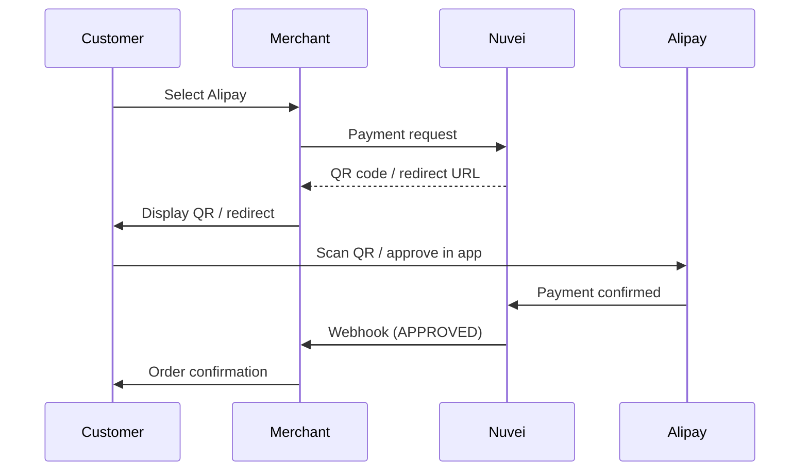

# Alipay

<Info>
  **Payment Method ID:** `apmgw_Alipay`  
  **Type:** Super App / E-Wallet  
  **Countries:** China 🇨🇳 + Chinese tourists worldwide  
  **Currencies:** CNY (domestic), Multi-currency (cross-border)  
  **Users:** 1.3+ billion
</Info>

Alipay is China's dominant payment platform with over 1.3 billion users. Essential for reaching Chinese consumers both domestically and as tourists abroad.

## How Alipay Works



## Quick Start

### Payment Request

```json
POST /ppp/api/v1/payment.do

{
  "sessionToken": "<sessionToken>",
  "merchantId": "<merchantId>",
  "merchantSiteId": "<merchantSiteId>",
  "clientRequestId": "<unique_request_id>",
  "clientUniqueId": "order_CN_123",
  "amount": "688.00",
  "currency": "CNY",
  
  "paymentOption": {
    "alternativePaymentMethod": {
      "paymentMethod": "apmgw_Alipay"
    }
  },
  
  "billingAddress": {
    "firstName": "Wei",
    "lastName": "Zhang",
    "email": "wei.zhang@example.cn",
    "country": "CN"
  },
  
  "urlDetails": {
    "successUrl": "https://shop.example.com/success",
    "failureUrl": "https://shop.example.com/failure",
    "notificationUrl": "https://shop.example.com/webhooks"
  },
  
  "timeStamp": "<YYYYMMDDHHmmss>",
  "checksum": "<checksum>"
}
```

### Response with QR Code

```json
{
  "orderId": "350728618",
  "paymentOption": {
    "alternativePaymentMethod": {
      "qrCode": "https://qr.alipay.com/bax12345...",
      "qrCodeImage": "data:image/png;base64,iVBORw0KGgo..."
    },
    "redirectUrl": "https://gw-apm.nuvei.com/Home?PaymentToken=ABC..."
  },
  "transactionStatus": "PENDING",
  "status": "SUCCESS"
}
```

## Cross-Border Payments

Accept payments from Chinese tourists in your local currency:

```json
{
  "amount": "99.00",
  "currency": "USD",  // Your currency
  
  "paymentOption": {
    "alternativePaymentMethod": {
      "paymentMethod": "apmgw_Alipay"
    }
  },
  
  "billingAddress": {
    "country": "US"  // Your country
  }
}
```

Alipay handles the currency conversion for the customer.

## Integration Methods

### QR Code (Desktop)

Display QR code for customers to scan:

```html
<div class="alipay-qr">
  
  <p>Open Alipay app and scan to pay</p>
</div>
```

### Mobile Web (WAP)

For mobile browsers, redirect directly:

```json
{
  "paymentOption": {
    "alternativePaymentMethod": {
      "paymentMethod": "apmgw_Alipay",
      "channel": "WAP"
    }
  }
}
```

### In-App (SDK)

For apps, use Alipay's native SDK with Nuvei tokens.

## Feature Support

| Feature | Supported |
|---------|-----------|
| Refunds | ✅ Full & Partial |
| Recurring | ❌ |
| Payouts | ❌ |
| QR Code | ✅ |
| Mobile redirect | ✅ |

## Refunds

```json
POST /ppp/api/v1/refundTransaction.do

{
  "merchantId": "<merchantId>",
  "merchantSiteId": "<merchantSiteId>",
  "clientRequestId": "<unique_request_id>",
  "relatedTransactionId": "<original_transaction_id>",
  "amount": "688.00",
  "currency": "CNY",
  "authCode": "<original_auth_code>",
  "timeStamp": "<YYYYMMDDHHmmss>",
  "checksum": "<checksum>"
}
```

## Testing

### Sandbox

Use Alipay's sandbox environment:

| Field | Test Value |
|-------|------------|
| Account | Sandbox account from Alipay |
| Password | Sandbox password |

## Best Practices

<AccordionGroup>
  <Accordion title="QR code size" icon="qrcode">
    Display QR code at least 200x200 pixels for easy scanning.
  </Accordion>
  
  <Accordion title="Mobile detection" icon="mobile">
    On mobile, redirect directly to Alipay app instead of showing QR.
  </Accordion>
  
  <Accordion title="Chinese language" icon="language">
    Show payment page in Chinese for better conversion.
  </Accordion>
  
  <Accordion title="Popular with tourists" icon="plane">
    Alipay is essential for Chinese tourist spending abroad.
  </Accordion>
</AccordionGroup>

## Related

<CardGroup cols={2}>
  <Card title="WeChat Pay" icon="comment-dollar" href="/apms/apac/wechat-pay">
    China's other super-app
  </Card>
  <Card title="APAC APMs" icon="map" href="/apms/apac/overview">
    All Asia-Pacific methods
  </Card>
</CardGroup>
