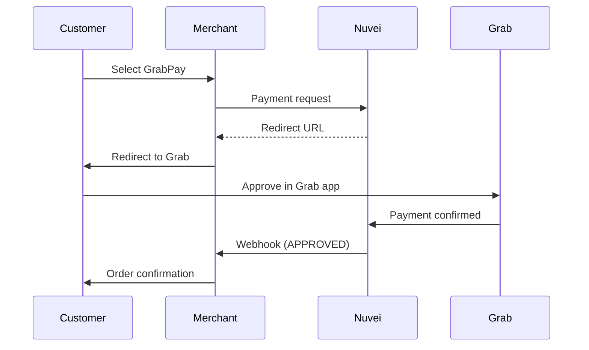

# GrabPay

<Info>
  **Payment Method ID:** `apmgw_GrabPay`  
  **Type:** E-Wallet / Super App  
  **Countries:** Singapore 🇸🇬, Malaysia 🇲🇾, Philippines 🇵🇭, Thailand 🇹🇭, Vietnam 🇻🇳, Indonesia 🇮🇩  
  **Currencies:** SGD, MYR, PHP, THB, VND, IDR
</Info>

GrabPay is Southeast Asia's leading super-app payment wallet, integrated into the Grab ride-hailing and delivery ecosystem with over 200 million users.

## How GrabPay Works



## Quick Start

### Payment Request

```json
POST /ppp/api/v1/payment.do

{
  "sessionToken": "<sessionToken>",
  "merchantId": "<merchantId>",
  "merchantSiteId": "<merchantSiteId>",
  "clientRequestId": "<unique_request_id>",
  "clientUniqueId": "order_SG_123",
  "amount": "59.90",
  "currency": "SGD",
  
  "paymentOption": {
    "alternativePaymentMethod": {
      "paymentMethod": "apmgw_GrabPay"
    }
  },
  
  "billingAddress": {
    "firstName": "Wei Ling",
    "lastName": "Tan",
    "email": "weiling@example.sg",
    "phone": "+6591234567",
    "country": "SG"
  },
  
  "urlDetails": {
    "successUrl": "https://shop.example.com/success",
    "failureUrl": "https://shop.example.com/failure",
    "notificationUrl": "https://shop.example.com/webhooks"
  },
  
  "timeStamp": "<YYYYMMDDHHmmss>",
  "checksum": "<checksum>"
}
```

## Supported Markets

| Country | Currency | Status |
|---------|----------|--------|
| Singapore 🇸🇬 | SGD | ✅ |
| Malaysia 🇲🇾 | MYR | ✅ |
| Philippines 🇵🇭 | PHP | ✅ |
| Thailand 🇹🇭 | THB | ✅ |
| Vietnam 🇻🇳 | VND | ✅ |
| Indonesia 🇮🇩 | IDR | ✅ |

## Feature Support

| Feature | Supported |
|---------|-----------|
| Refunds | ✅ Full & Partial |
| Recurring | ❌ |
| Payouts | ❌ |
| GrabRewards | ✅ Points earning |

## Testing

| Field | Value |
|-------|-------|
| Country | Any supported |
| Currency | Match country |

## Best Practices

<AccordionGroup>
  <Accordion title="Mobile optimization" icon="mobile">
    GrabPay users are mobile-first. Optimize checkout for mobile devices.
  </Accordion>
  
  <Accordion title="GrabRewards" icon="gift">
    Highlight that customers earn GrabRewards points when paying with GrabPay.
  </Accordion>
  
  <Accordion title="Currency matching" icon="coins">
    GrabPay wallet currency must match transaction currency. SGD wallet can't pay MYR.
  </Accordion>
</AccordionGroup>

## Related

<CardGroup cols={2}>
  <Card title="PayNow" icon="bolt" href="/apms/apac/paynow">
    Singapore instant payment
  </Card>
  <Card title="APAC APMs" icon="map" href="/apms/apac/overview">
    All Asia-Pacific methods
  </Card>
</CardGroup>
