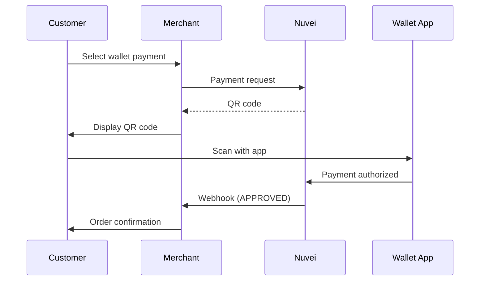

# APAC APMs

Asia-Pacific has the world's most innovative and diverse payment landscape, with mobile wallets and super-apps dominating many markets.

## Popular APAC APMs

<CardGroup cols={3}>
  <Card title="Alipay" icon="mobile" href="/apms/apac/alipay">
    🇨🇳 China's super-app
  </Card>
  <Card title="WeChat Pay" icon="comment-dollar" href="/apms/apac/wechat-pay">
    🇨🇳 WeChat wallet
  </Card>
  <Card title="UPI" icon="mobile" href="/apms/apac/upi">
    🇮🇳 India unified payments
  </Card>
  <Card title="GrabPay" icon="car" href="/apms/apac/grabpay">
    🇸🇬 Southeast Asia wallet
  </Card>
  <Card title="POLi" icon="bank" href="/apms/apac/poli">
    🇦🇺 Australia/NZ banking
  </Card>
  <Card title="PayNow" icon="bolt" href="/apms/apac/paynow">
    🇸🇬 Singapore instant
  </Card>
</CardGroup>

## APMs by Country/Region

### China 🇨🇳

| APM | Type | Market Share | Currencies |
|-----|------|--------------|------------|
| [Alipay](/apms/apac/alipay) | Super App | ~55% | CNY |
| [WeChat Pay](/apms/apac/wechat-pay) | Super App | ~40% | CNY |
| UnionPay | Card Network | ~30% | CNY |

China is dominated by mobile super-apps. Alipay and WeChat Pay together handle over 90% of mobile payments.

### India 🇮🇳

| APM | Type | Market Share | Currencies |
|-----|------|--------------|------------|
| [UPI](/apms/apac/upi) | Instant Payment | ~65% | INR |
| Paytm | Mobile Wallet | ~25% | INR |
| PhonePe | UPI App | ~40% | INR |
| Google Pay | UPI App | ~35% | INR |

UPI has transformed Indian payments with instant, free bank-to-bank transfers.

### Southeast Asia 🇸🇬🇲🇾🇹🇭🇮🇩🇵🇭🇻🇳

| APM | Countries | Type | Currencies |
|-----|-----------|------|------------|
| [GrabPay](/apms/apac/grabpay) | SG, MY, TH, PH, VN | Super App | SGD, MYR, THB, PHP, VND |
| [PayNow](/apms/apac/paynow) | Singapore | Instant | SGD |
| TouchnGo | Malaysia | E-Wallet | MYR |
| PromptPay | Thailand | Instant | THB |
| GCash | Philippines | E-Wallet | PHP |
| DANA | Indonesia | E-Wallet | IDR |
| MoMo | Vietnam | E-Wallet | VND |

### Australia & New Zealand 🇦🇺🇳🇿

| APM | Type | Countries | Currencies |
|-----|------|-----------|------------|
| [POLi](/apms/apac/poli) | Bank Transfer | AU, NZ | AUD, NZD |
| BPAY | Bill Payment | AU | AUD |
| PayID | Instant | AU | AUD |

### Japan 🇯🇵

| APM | Type | Market Share | Currencies |
|-----|------|--------------|------------|
| PayPay | QR Payment | ~45% | JPY |
| LINE Pay | Mobile Wallet | ~20% | JPY |
| Rakuten Pay | E-Wallet | ~15% | JPY |
| Konbini | Cash @ Store | ~10% | JPY |

### South Korea 🇰🇷

| APM | Type | Market Share | Currencies |
|-----|------|--------------|------------|
| Kakao Pay | Super App | ~40% | KRW |
| Naver Pay | E-Wallet | ~25% | KRW |
| Samsung Pay | Mobile Wallet | ~20% | KRW |

## Integration Example

### REST API - Alipay Payment

```json
POST /ppp/api/v1/payment.do

{
  "sessionToken": "<sessionToken>",
  "merchantId": "<merchantId>",
  "merchantSiteId": "<merchantSiteId>",
  "clientRequestId": "<unique_request_id>",
  "clientUniqueId": "order_CN_123",
  "amount": "688.00",
  "currency": "CNY",
  
  "paymentOption": {
    "alternativePaymentMethod": {
      "paymentMethod": "apmgw_Alipay"
    }
  },
  
  "billingAddress": {
    "firstName": "Wei",
    "lastName": "Zhang",
    "email": "wei.zhang@example.cn",
    "country": "CN"
  },
  
  "urlDetails": {
    "successUrl": "https://yoursite.com/success",
    "failureUrl": "https://yoursite.com/failure",
    "notificationUrl": "https://yoursite.com/webhooks"
  },
  
  "timeStamp": "<YYYYMMDDHHmmss>",
  "checksum": "<checksum>"
}
```

### Response with QR Code

```json
{
  "orderId": "350728614",
  "paymentOption": {
    "alternativePaymentMethod": {
      "qrCode": "https://qr.alipay.com/bax12345...",
      "qrCodeImage": "data:image/png;base64,iVBORw0KGgo..."
    },
    "redirectUrl": "https://gw-apm.nuvei.com/Home?PaymentToken=ABC..."
  },
  "transactionStatus": "PENDING",
  "status": "SUCCESS"
}
```

## Feature Support

| APM | Refunds | Partial Refunds | Recurring | Payouts |
|-----|---------|-----------------|-----------|---------|
| Alipay | ✅ | ✅ | ❌ | ❌ |
| WeChat Pay | ✅ | ✅ | ❌ | ❌ |
| UPI | ✅ | ✅ | ❌ | ✅ |
| GrabPay | ✅ | ✅ | ❌ | ❌ |
| POLi | ✅ | ❌ | ❌ | ❌ |
| PayNow | ✅ | ✅ | ❌ | ✅ |

## Chinese Tourist Payments

For accepting payments from Chinese tourists abroad:

```json
{
  "paymentOption": {
    "alternativePaymentMethod": {
      "paymentMethod": "apmgw_Alipay",
      "channel": "WAP"  // For mobile web
    }
  },
  "billingAddress": {
    "country": "US"  // Merchant's country
  },
  "currency": "USD"  // Merchant's currency
}
```

<Note>
  Alipay and WeChat Pay support cross-border payments. Chinese tourists can pay in local currency while you receive settlement in your currency.
</Note>

## QR Code Payment Flow

Most APAC wallets use QR codes:



## Settlement Times

| APM | Settlement |
|-----|------------|
| Alipay | T+1 |
| WeChat Pay | T+1 |
| UPI | Real-time to T+1 |
| GrabPay | T+1 to T+2 |
| POLi | T+2 to T+3 |
| PayNow | Real-time |

## Best Practices for APAC

<AccordionGroup>
  <Accordion title="Mobile-first design" icon="mobile">
    Most APAC payments happen on mobile. Optimize checkout for smartphone screens.
  </Accordion>
  
  <Accordion title="Support QR code scanning" icon="qrcode">
    Many wallets require QR scanning. Display clear, large QR codes with good contrast.
  </Accordion>
  
  <Accordion title="Local currency pricing" icon="yen">
    Show prices in local currency. APAC customers expect to see CNY, INR, SGD, etc.
  </Accordion>
  
  <Accordion title="In-app payments" icon="window-maximize">
    Alipay and WeChat work best when opened within their own apps. Use their SDKs for native integration.
  </Accordion>
  
  <Accordion title="Time zone handling" icon="clock">
    APAC spans many time zones. Handle expiration times appropriately.
  </Accordion>
</AccordionGroup>

## Quick Links

<CardGroup cols={2}>
  <Card title="APM Integration Guide" icon="code" href="/apms/integration">
    How to integrate APMs
  </Card>
  <Card title="Wallets" icon="wallet" href="/apms/wallets/overview">
    PayPal, Apple Pay, Google Pay
  </Card>
  <Card title="Europe APMs" icon="globe" href="/apms/europe/overview">
    European payment methods
  </Card>
  <Card title="All APMs" icon="globe" href="/apms/overview">
    Complete APM list
  </Card>
</CardGroup>
