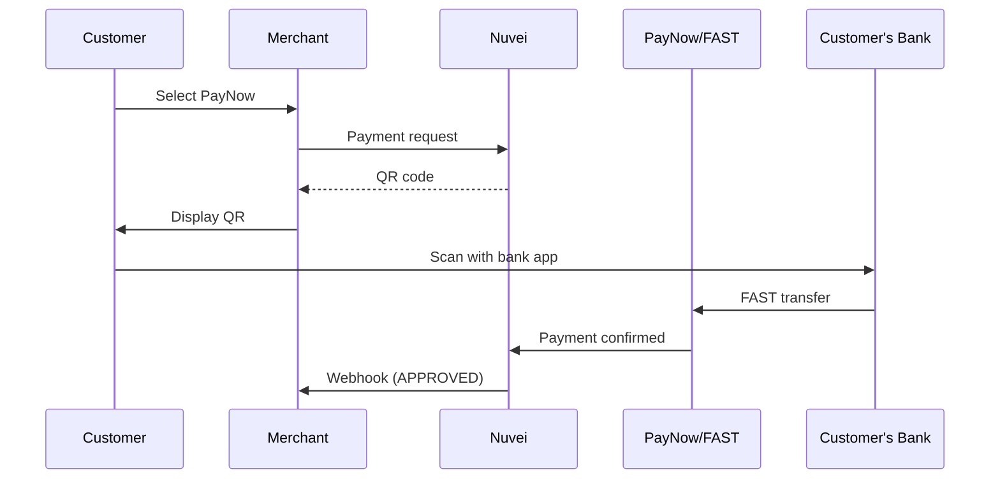

# PayNow

<Info>
  **Payment Method ID:** `apmgw_PayNow`  
  **Type:** Instant Payment  
  **Countries:** Singapore 🇸🇬  
  **Currencies:** SGD  
  **Settlement:** Real-time
</Info>

PayNow is Singapore's national instant payment system, enabling immediate transfers between bank accounts and e-wallets using mobile number or NRIC/UEN.

## How PayNow Works



## Quick Start

### Payment Request

```json
POST /ppp/api/v1/payment.do

{
  "sessionToken": "<sessionToken>",
  "merchantId": "<merchantId>",
  "merchantSiteId": "<merchantSiteId>",
  "clientRequestId": "<unique_request_id>",
  "clientUniqueId": "order_SG_456",
  "amount": "88.00",
  "currency": "SGD",
  
  "paymentOption": {
    "alternativePaymentMethod": {
      "paymentMethod": "apmgw_PayNow"
    }
  },
  
  "billingAddress": {
    "firstName": "Mei Ling",
    "lastName": "Wong",
    "email": "meiling@example.sg",
    "phone": "+6598765432",
    "country": "SG"
  },
  
  "urlDetails": {
    "successUrl": "https://shop.example.com/success",
    "failureUrl": "https://shop.example.com/failure",
    "notificationUrl": "https://shop.example.com/webhooks"
  },
  
  "timeStamp": "<YYYYMMDDHHmmss>",
  "checksum": "<checksum>"
}
```

### Response with QR

```json
{
  "orderId": "350728622",
  "paymentOption": {
    "alternativePaymentMethod": {
      "paynowQrCode": "00020101021226...",
      "paynowQrImage": "data:image/png;base64,iVBORw0KGgo..."
    }
  },
  "transactionStatus": "PENDING",
  "status": "SUCCESS"
}
```

## Participating Banks

All major Singapore banks support PayNow:

| Bank | Status |
|------|--------|
| DBS/POSB | ✅ |
| OCBC | ✅ |
| UOB | ✅ |
| Standard Chartered | ✅ |
| HSBC | ✅ |
| Citibank | ✅ |
| Maybank | ✅ |
| Bank of China | ✅ |

## E-Wallets

PayNow also works with Singapore e-wallets:

| Wallet | Status |
|--------|--------|
| GrabPay | ✅ |
| Singtel Dash | ✅ |

## Feature Support

| Feature | Supported |
|---------|-----------|
| Refunds | ✅ Via PayNow |
| Recurring | ❌ |
| Payouts | ✅ |
| QR payments | ✅ |
| Real-time | ✅ |

## PayNow QR Display

```html
<div class="paynow-payment">
  
  <p>Scan with your bank app or e-wallet</p>
  <div class="supported-apps">
    
    
    
  </div>
</div>
```

## Best Practices

<AccordionGroup>
  <Accordion title="Show supported apps" icon="grid">
    Display logos of DBS, OCBC, UOB, etc. to reassure customers.
  </Accordion>
  
  <Accordion title="Real-time confirmation" icon="bolt">
    PayNow settles instantly. Show confirmation immediately upon receiving webhook.
  </Accordion>
  
  <Accordion title="QR size" icon="qrcode">
    Display QR code at least 200x200px for easy scanning.
  </Accordion>
</AccordionGroup>

## Related

<CardGroup cols={2}>
  <Card title="GrabPay" icon="car" href="/apms/apac/grabpay">
    Singapore e-wallet
  </Card>
  <Card title="APAC APMs" icon="map" href="/apms/apac/overview">
    All Asia-Pacific methods
  </Card>
</CardGroup>
