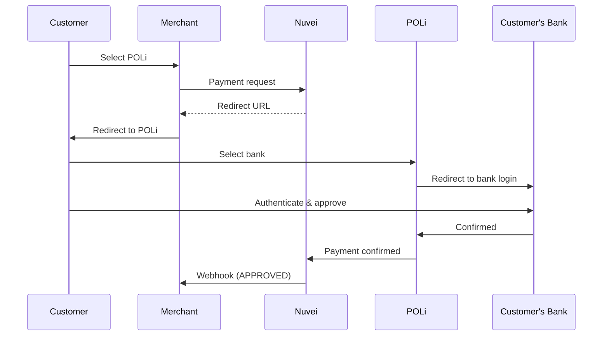

# POLi

<Info>
  **Payment Method ID:** `apmgw_POLi`  
  **Type:** Online Banking  
  **Countries:** Australia 🇦🇺, New Zealand 🇳🇿  
  **Currencies:** AUD, NZD  
  **Settlement:** Instant confirmation
</Info>

POLi is the leading online banking payment method for Australia and New Zealand, enabling real-time bank transfers directly from customer accounts.

## How POLi Works



## Quick Start

### Payment Request

```json
POST /ppp/api/v1/payment.do

{
  "sessionToken": "<sessionToken>",
  "merchantId": "<merchantId>",
  "merchantSiteId": "<merchantSiteId>",
  "clientRequestId": "<unique_request_id>",
  "clientUniqueId": "order_AU_123",
  "amount": "149.95",
  "currency": "AUD",
  
  "paymentOption": {
    "alternativePaymentMethod": {
      "paymentMethod": "apmgw_POLi"
    }
  },
  
  "billingAddress": {
    "firstName": "James",
    "lastName": "Wilson",
    "email": "james@example.com.au",
    "country": "AU"
  },
  
  "urlDetails": {
    "successUrl": "https://shop.example.com/success",
    "failureUrl": "https://shop.example.com/failure",
    "notificationUrl": "https://shop.example.com/webhooks"
  },
  
  "timeStamp": "<YYYYMMDDHHmmss>",
  "checksum": "<checksum>"
}
```

## Supported Banks

### Australia 🇦🇺

| Bank | Status |
|------|--------|
| Commonwealth Bank | ✅ |
| Westpac | ✅ |
| NAB | ✅ |
| ANZ | ✅ |
| Bank of Queensland | ✅ |
| Bendigo Bank | ✅ |
| Suncorp | ✅ |
| ING | ✅ |

### New Zealand 🇳🇿

| Bank | Status |
|------|--------|
| ANZ NZ | ✅ |
| ASB | ✅ |
| BNZ | ✅ |
| Kiwibank | ✅ |
| Westpac NZ | ✅ |

## Feature Support

| Feature | Supported |
|---------|-----------|
| Refunds | ❌ |
| Recurring | ❌ |
| Payouts | ❌ |
| Instant confirmation | ✅ |

<Warning>
  POLi does not support refunds. Process refunds via bank transfer.
</Warning>

## Testing

| Field | Value |
|-------|-------|
| Country | AU or NZ |
| Currency | AUD or NZD |
| Bank | Select test bank |

## Best Practices

<AccordionGroup>
  <Accordion title="No refunds" icon="ban">
    POLi doesn't support refunds. Have alternative refund process ready.
  </Accordion>
  
  <Accordion title="Bank hours" icon="clock">
    Some banks have maintenance windows. Handle gracefully.
  </Accordion>
  
  <Accordion title="Desktop preferred" icon="desktop">
    Bank authentication is often easier on desktop devices.
  </Accordion>
</AccordionGroup>

## Related

<CardGroup cols={2}>
  <Card title="APAC APMs" icon="map" href="/apms/apac/overview">
    All Asia-Pacific methods
  </Card>
  <Card title="Bank Transfers" icon="building-columns" href="/apms/overview">
    All bank transfer methods
  </Card>
</CardGroup>
