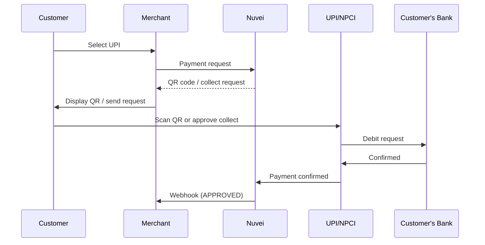

# UPI

<Info>
  **Payment Method ID:** `apmgw_UPI`  
  **Type:** Instant Payment  
  **Countries:** India 🇮🇳  
  **Currencies:** INR  
  **Transactions:** 10+ billion/month
</Info>

UPI (Unified Payments Interface) is India's revolutionary instant payment system. With over 10 billion monthly transactions, it's the backbone of digital payments in India.

## How UPI Works



## Quick Start

### Payment Request

```json
POST /ppp/api/v1/payment.do

{
  "sessionToken": "<sessionToken>",
  "merchantId": "<merchantId>",
  "merchantSiteId": "<merchantSiteId>",
  "clientRequestId": "<unique_request_id>",
  "clientUniqueId": "order_IN_123",
  "amount": "1999.00",
  "currency": "INR",
  
  "paymentOption": {
    "alternativePaymentMethod": {
      "paymentMethod": "apmgw_UPI"
    }
  },
  
  "billingAddress": {
    "firstName": "Priya",
    "lastName": "Sharma",
    "email": "priya@example.in",
    "phone": "+919876543210",
    "country": "IN"
  },
  
  "urlDetails": {
    "successUrl": "https://shop.example.com/success",
    "failureUrl": "https://shop.example.com/failure",
    "notificationUrl": "https://shop.example.com/webhooks"
  },
  
  "timeStamp": "<YYYYMMDDHHmmss>",
  "checksum": "<checksum>"
}
```

### Response with QR

```json
{
  "orderId": "350728620",
  "paymentOption": {
    "alternativePaymentMethod": {
      "upiQrCode": "upi://pay?pa=merchant@upi&pn=MerchantName&am=1999&cu=INR&tn=Order123",
      "upiQrImage": "data:image/png;base64,iVBORw0KGgo..."
    }
  },
  "transactionStatus": "PENDING",
  "status": "SUCCESS"
}
```

## UPI Payment Methods

### QR Code (Scan & Pay)

Customer scans QR with any UPI app:

```html
<div class="upi-qr">
  
  <p>Scan with Google Pay, PhonePe, Paytm, or any UPI app</p>
</div>
```

### Collect Request (Intent)

Send payment request to customer's UPI ID:

```json
{
  "paymentOption": {
    "alternativePaymentMethod": {
      "paymentMethod": "apmgw_UPI",
      "upiId": "customer@upi"
    }
  }
}
```

### Intent (Mobile)

Deep link to UPI apps on mobile:

```html
<a href="upi://pay?pa=merchant@upi&pn=Store&am=1999&cu=INR">
  Pay with UPI
</a>
```

## Popular UPI Apps

| App | Market Share |
|-----|-------------|
| PhonePe | ~45% |
| Google Pay | ~35% |
| Paytm | ~15% |
| Amazon Pay | ~3% |
| Others | ~2% |

All apps are interoperable - customer can use any UPI app.

## UPI ID Format

UPI IDs (Virtual Payment Addresses):

| Format | Example |
|--------|---------|
| Mobile@bank | 9876543210@ybl |
| Name@bank | priya@okaxis |
| Custom@app | priya@paytm |

## Feature Support

| Feature | Supported |
|---------|-----------|
| Refunds | ✅ Instant |
| Recurring | ⚠️ UPI Autopay |
| Payouts | ✅ |
| QR Code | ✅ |
| Collect | ✅ |
| Intent | ✅ |

## UPI Payouts

Send instant payments to UPI IDs:

```json
POST /ppp/api/v1/payout.do

{
  "merchantId": "<merchantId>",
  "merchantSiteId": "<merchantSiteId>",
  "sessionToken": "<sessionToken>",
  "clientRequestId": "<unique_request_id>",
  "userTokenId": "customer_IN_123",
  "clientUniqueId": "payout_456",
  "amount": "500.00",
  "currency": "INR",
  
  "paymentOption": {
    "alternativePaymentMethod": {
      "paymentMethod": "apmgw_UPI",
      "upiId": "customer@upi"
    }
  },
  
  "timeStamp": "<YYYYMMDDHHmmss>",
  "checksum": "<checksum>"
}
```

## UPI Transaction Limits

| Type | Limit |
|------|-------|
| Per transaction | ₹1,00,000 |
| Daily limit | ₹2,00,000 (varies by bank) |
| Number of transactions | 10-20/day |

## Testing

### Sandbox

Use UPI sandbox with test credentials:

| Field | Value |
|-------|-------|
| UPI ID | test@upi |
| Amount | Any |

## Error Codes

| Code | Reason | Action |
|------|--------|--------|
| `U16` | Transaction declined by customer | Request retry |
| `U30` | Debit timeout | Request retry |
| `U28` | Invalid VPA | Verify UPI ID format |
| `U66` | Device fingerprint mismatch | Customer retry |

## Best Practices

<AccordionGroup>
  <Accordion title="Show all UPI apps" icon="grid">
    Don't limit to specific apps. UPI is interoperable - show "Pay with any UPI app".
  </Accordion>
  
  <Accordion title="Mobile-first" icon="mobile">
    90%+ of UPI transactions are on mobile. Optimize for mobile UX.
  </Accordion>
  
  <Accordion title="Real-time status" icon="bolt">
    UPI is instant. Poll for status or use WebSocket for real-time confirmation.
  </Accordion>
  
  <Accordion title="QR timeout" icon="clock">
    UPI QR codes expire after ~5-15 minutes. Show countdown.
  </Accordion>
</AccordionGroup>

## Related

<CardGroup cols={2}>
  <Card title="APAC APMs" icon="map" href="/apms/apac/overview">
    All Asia-Pacific methods
  </Card>
  <Card title="Payouts" icon="money-bill-transfer" href="/integrations/features/payouts">
    Payout guide
  </Card>
</CardGroup>
