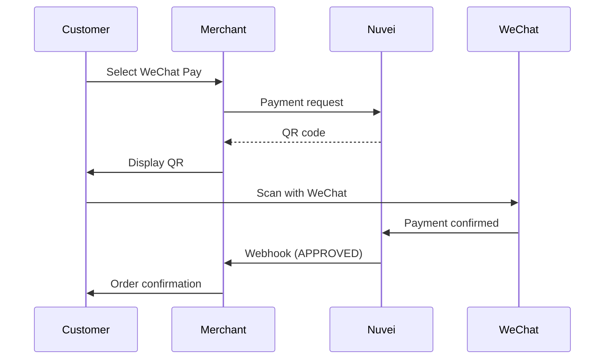

# WeChat Pay

<Info>
  **Payment Method ID:** `apmgw_WeChatPay`  
  **Type:** Super App / E-Wallet  
  **Countries:** China 🇨🇳 + Chinese tourists worldwide  
  **Currencies:** CNY (domestic), Multi-currency (cross-border)  
  **Users:** 1.2+ billion
</Info>

WeChat Pay is integrated into WeChat, China's dominant social and messaging platform. With over 1.2 billion users, it's essential for reaching Chinese consumers.

## How WeChat Pay Works



## Quick Start

### Payment Request

```json
POST /ppp/api/v1/payment.do

{
  "sessionToken": "<sessionToken>",
  "merchantId": "<merchantId>",
  "merchantSiteId": "<merchantSiteId>",
  "clientRequestId": "<unique_request_id>",
  "clientUniqueId": "order_CN_456",
  "amount": "888.00",
  "currency": "CNY",
  
  "paymentOption": {
    "alternativePaymentMethod": {
      "paymentMethod": "apmgw_WeChatPay"
    }
  },
  
  "billingAddress": {
    "firstName": "Ming",
    "lastName": "Li",
    "email": "ming.li@example.cn",
    "country": "CN"
  },
  
  "urlDetails": {
    "successUrl": "https://shop.example.com/success",
    "failureUrl": "https://shop.example.com/failure",
    "notificationUrl": "https://shop.example.com/webhooks"
  },
  
  "timeStamp": "<YYYYMMDDHHmmss>",
  "checksum": "<checksum>"
}
```

### Response

```json
{
  "orderId": "350728619",
  "paymentOption": {
    "alternativePaymentMethod": {
      "qrCode": "weixin://wxpay/bizpayurl?pr=ABC123...",
      "qrCodeImage": "data:image/png;base64,iVBORw0KGgo..."
    }
  },
  "transactionStatus": "PENDING",
  "status": "SUCCESS"
}
```

## Cross-Border Payments

For Chinese tourists abroad:

```json
{
  "amount": "50.00",
  "currency": "EUR",
  
  "paymentOption": {
    "alternativePaymentMethod": {
      "paymentMethod": "apmgw_WeChatPay"
    }
  },
  
  "billingAddress": {
    "country": "DE"
  }
}
```

## WeChat Mini Programs

For integration within WeChat Mini Programs, use the JSAPI method:

```json
{
  "paymentOption": {
    "alternativePaymentMethod": {
      "paymentMethod": "apmgw_WeChatPay",
      "channel": "JSAPI",
      "openId": "<user_wechat_openid>"
    }
  }
}
```

## Display QR Code

```html
<div class="wechat-payment">
  <div class="qr-container">
    
  </div>
  <div class="instructions">
    <p>打开微信扫一扫完成支付</p>
    <p class="english">Open WeChat and scan to pay</p>
  </div>
  <div class="amount">
    ¥${amount}
  </div>
</div>
```

## Feature Support

| Feature | Supported |
|---------|-----------|
| Refunds | ✅ Full & Partial |
| Recurring | ❌ |
| Payouts | ❌ |
| QR Code | ✅ |
| Mini Program | ✅ |
| H5 (Mobile Web) | ✅ |

## Integration Types

| Type | Description | Use Case |
|------|-------------|----------|
| **Native** | QR code payment | Desktop web |
| **JSAPI** | In-WeChat payment | Mini Programs |
| **H5** | Mobile browser redirect | Mobile web |
| **APP** | Native app SDK | Mobile apps |

## Refunds

```json
POST /ppp/api/v1/refundTransaction.do

{
  "merchantId": "<merchantId>",
  "merchantSiteId": "<merchantSiteId>",
  "clientRequestId": "<unique_request_id>",
  "relatedTransactionId": "<original_transaction_id>",
  "amount": "888.00",
  "currency": "CNY",
  "authCode": "<original_auth_code>",
  "timeStamp": "<YYYYMMDDHHmmss>",
  "checksum": "<checksum>"
}
```

## Best Practices

<AccordionGroup>
  <Accordion title="Optimize for WeChat" icon="comment">
    If traffic comes from WeChat, use JSAPI for seamless in-app payment.
  </Accordion>
  
  <Accordion title="QR expiration" icon="clock">
    WeChat Pay QR codes expire after ~2 hours. Show countdown.
  </Accordion>
  
  <Accordion title="Social commerce" icon="users">
    WeChat users expect integrated social features. Consider WeChat Mini Program.
  </Accordion>
  
  <Accordion title="Red packet promotions" icon="gift">
    WeChat Pay "hongbao" (red packets) are popular for promotions.
  </Accordion>
</AccordionGroup>

## Alipay vs WeChat Pay

| Aspect | Alipay | WeChat Pay |
|--------|--------|------------|
| Users | 1.3B | 1.2B |
| Primary Use | Payments, finance | Social, messaging |
| Age Skew | Slightly older | Slightly younger |
| Urban/Rural | Both | Strong in urban |

<Note>
  For maximum China coverage, offer both Alipay and WeChat Pay.
</Note>

## Related

<CardGroup cols={2}>
  <Card title="Alipay" icon="mobile" href="/apms/apac/alipay">
    China's other super-app
  </Card>
  <Card title="APAC APMs" icon="map" href="/apms/apac/overview">
    All Asia-Pacific methods
  </Card>
</CardGroup>
