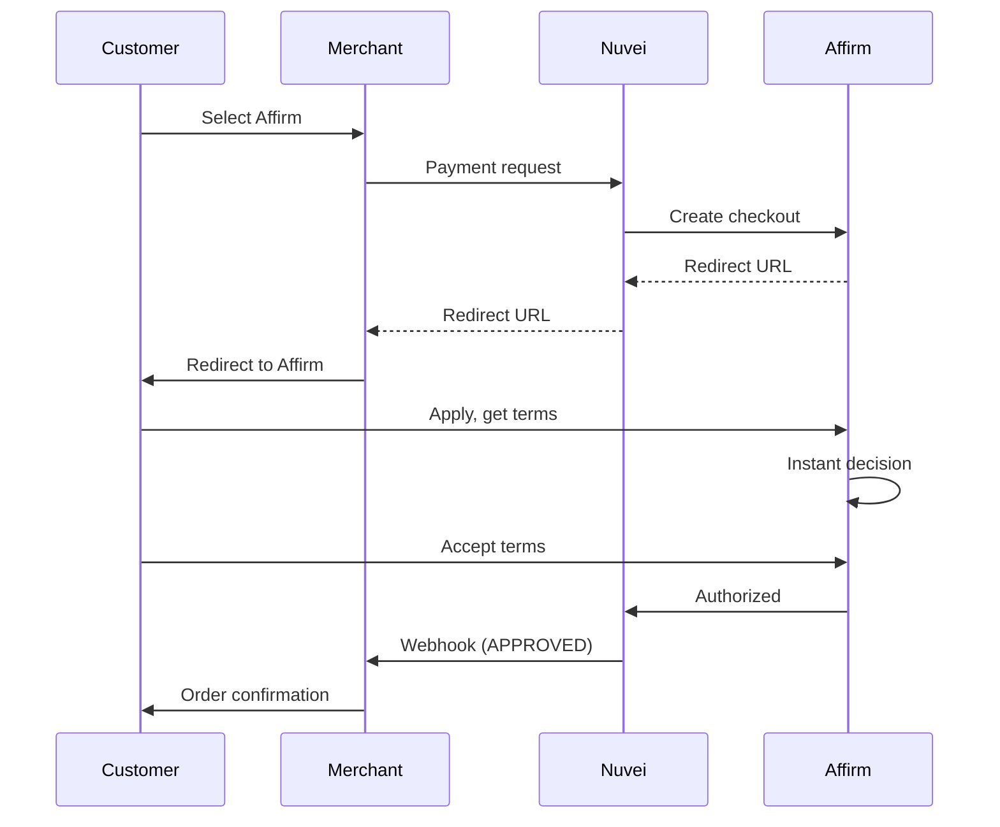

# Affirm

<Info>
  **Payment Method ID:** `apmgw_Affirm`  
  **Type:** BNPL (Buy Now, Pay Later)  
  **Countries:** US, Canada  
  **Currencies:** USD, CAD  
  **Financing:** 3-48 months
</Info>

Affirm offers transparent, long-term financing with no hidden fees. Customers see their total cost upfront, with APRs from 0% to 36% based on creditworthiness.

## Affirm Products

| Product | Duration | Interest | Best For |
|---------|----------|----------|----------|
| **Pay in 4** | 4 payments | 0% APR | $50-$1,000 |
| **Monthly Payments** | 3-48 months | 0-36% APR | $50-$30,000+ |

## How Affirm Works



## Quick Start

### Payment Request

```json
POST /ppp/api/v1/payment.do

{
  "sessionToken": "<sessionToken>",
  "merchantId": "<merchantId>",
  "merchantSiteId": "<merchantSiteId>",
  "clientRequestId": "<unique_request_id>",
  "clientUniqueId": "order_AF_123",
  "amount": "1299.00",
  "currency": "USD",
  
  "paymentOption": {
    "alternativePaymentMethod": {
      "paymentMethod": "apmgw_Affirm"
    }
  },
  
  "billingAddress": {
    "firstName": "Michael",
    "lastName": "Brown",
    "address": "789 Pine Street",
    "city": "New York",
    "state": "NY",
    "zip": "10001",
    "email": "michael@example.com",
    "phone": "+12125551234",
    "country": "US"
  },
  
  "shippingAddress": {
    "firstName": "Michael",
    "lastName": "Brown",
    "address": "789 Pine Street",
    "city": "New York",
    "state": "NY",
    "zip": "10001",
    "country": "US"
  },
  
  "urlDetails": {
    "successUrl": "https://shop.example.com/success",
    "failureUrl": "https://shop.example.com/failure",
    "notificationUrl": "https://shop.example.com/webhooks"
  },
  
  "timeStamp": "<YYYYMMDDHHmmss>",
  "checksum": "<checksum>"
}
```

## Pre-qualification

Let customers check eligibility without affecting credit score:

```javascript
affirm.ui.ready(function() {
  affirm.checkout.open_vcn({
    merchant: {
      user_confirmation_url: 'https://example.com/confirm',
      user_cancel_url: 'https://example.com/cancel'
    },
    order_id: 'order_123',
    total: 129900  // cents
  });
});
```

## Promotional Messaging

### Monthly Payment Messaging

Display financing options on product pages:

```html
<affirm-monthly-payment-messaging
  data-page-type="product"
  data-amount="129900">
</affirm-monthly-payment-messaging>

<script src="https://cdn1.affirm.com/js/v2/affirm.js"></script>
```

### Example Messages

**$1,299 product:**
```
Starting at $109/mo with Affirm. Prequalify now.
```

**$299 product:**
```
4 interest-free payments of $74.75 with Affirm.
```

## 0% APR Financing

Merchants can subsidize 0% APR offers:

```json
{
  "additionalParams": {
    "affirm_financing_program": "0_apr_24_month"
  }
}
```

<Note>
  0% APR promotions require merchant agreement with Affirm.
</Note>

## Feature Support

| Feature | Supported |
|---------|-----------|
| Refunds | ✅ Full & Partial |
| Recurring | ❌ |
| Payouts | ❌ |
| Pre-qualification | ✅ Soft credit check |
| Split payments | ❌ |

## Refunds

```json
POST /ppp/api/v1/refundTransaction.do

{
  "merchantId": "<merchantId>",
  "merchantSiteId": "<merchantSiteId>",
  "clientRequestId": "<unique_request_id>",
  "relatedTransactionId": "<original_transaction_id>",
  "amount": "1299.00",
  "currency": "USD",
  "authCode": "<original_auth_code>",
  "timeStamp": "<YYYYMMDDHHmmss>",
  "checksum": "<checksum>"
}
```

## High-Ticket Items

Affirm is ideal for higher-value purchases:

| Category | Average Cart | Affirm Benefit |
|----------|--------------|----------------|
| Electronics | $500-$2,000 | Higher conversion |
| Furniture | $500-$5,000 | Larger orders |
| Fitness | $1,000-$3,000 | Accessible monthly |
| Travel | $1,000-$10,000 | Book now, pay later |

## Testing

### Sandbox Numbers

| Test Case | Phone Number |
|-----------|--------------|
| Approved | (415) 555-0123 |
| Denied | (415) 555-0400 |

### Test Flow

1. Use sandbox credentials
2. Enter test phone number
3. Use OTP: 1234
4. Complete checkout

## Customer Experience

### Application Process

1. **Select Affirm** at checkout
2. **Enter phone/email** - instant pre-fill if returning
3. **Soft credit check** - no impact on credit score
4. **See terms** - APR, monthly payment, total cost
5. **Accept** - agree to terms
6. **Complete** - redirected to merchant

### Transparency

Affirm shows customers:
- Exact APR
- Monthly payment
- Total finance charges
- Payment schedule

## Best Practices

<AccordionGroup>
  <Accordion title="Show monthly price" icon="dollar-sign">
    "From $X/month" is more compelling than total price for expensive items.
  </Accordion>
  
  <Accordion title="Pre-qualification" icon="check-circle">
    Let customers check eligibility on product page before adding to cart.
  </Accordion>
  
  <Accordion title="Category targeting" icon="bullseye">
    Affirm works best for items $100+. Don't show for small purchases.
  </Accordion>
  
  <Accordion title="0% APR promotions" icon="percent">
    Consider subsidizing 0% APR for high-margin or clearance items.
  </Accordion>
</AccordionGroup>

## Affirm vs Other BNPL

| Feature | Affirm | Klarna | Afterpay |
|---------|--------|--------|----------|
| Max term | 48 months | 36 months | 6 weeks |
| Max amount | $30,000+ | $10,000 | $4,000 |
| Interest | 0-36% | 0-25% | 0% |
| Credit check | Soft | Soft | Soft |
| Pre-qualify | ✅ | ✅ | ❌ |

## Related

<CardGroup cols={2}>
  <Card title="Klarna" icon="k" href="/apms/bnpl/klarna">
    Pay in 4 & financing
  </Card>
  <Card title="Afterpay" icon="clock" href="/apms/bnpl/afterpay">
    4 interest-free payments
  </Card>
  <Card title="BNPL Overview" icon="credit-card" href="/apms/bnpl/overview">
    All BNPL methods
  </Card>
</CardGroup>
