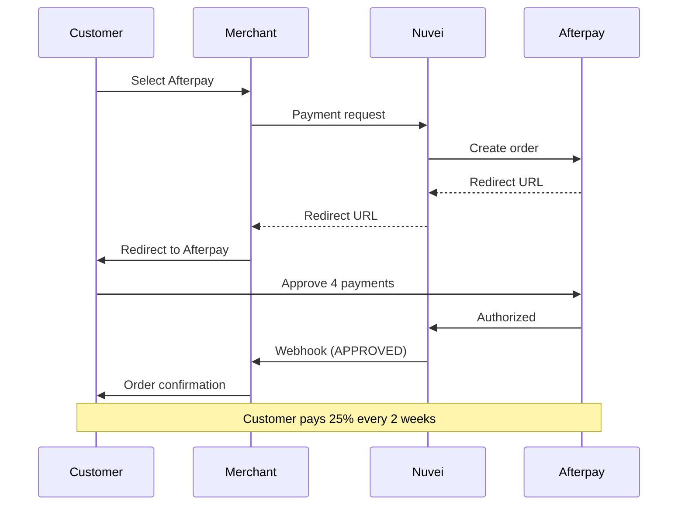

# Afterpay / Clearpay

<Info>
  **Payment Method ID:** `apmgw_Afterpay`  
  **Type:** BNPL (Buy Now, Pay Later)  
  **Countries:** US, Canada, UK, Australia, New Zealand  
  **Currencies:** USD, CAD, GBP, AUD, NZD  
  **Brand:** Afterpay (US/APAC), Clearpay (UK/EU)
</Info>

Afterpay allows customers to split purchases into 4 interest-free payments. Merchants receive full payment upfront minus fees, while Afterpay manages customer payments.

## How Afterpay Works



## Quick Start

### Payment Request

```json
POST /ppp/api/v1/payment.do

{
  "sessionToken": "<sessionToken>",
  "merchantId": "<merchantId>",
  "merchantSiteId": "<merchantSiteId>",
  "clientRequestId": "<unique_request_id>",
  "clientUniqueId": "order_AP_123",
  "amount": "200.00",
  "currency": "USD",
  
  "paymentOption": {
    "alternativePaymentMethod": {
      "paymentMethod": "apmgw_Afterpay"
    }
  },
  
  "billingAddress": {
    "firstName": "Emma",
    "lastName": "Davis",
    "address": "456 Oak Avenue",
    "city": "Los Angeles",
    "state": "CA",
    "zip": "90001",
    "email": "emma@example.com",
    "phone": "+13105551234",
    "country": "US"
  },
  
  "shippingAddress": {
    "firstName": "Emma",
    "lastName": "Davis",
    "address": "456 Oak Avenue",
    "city": "Los Angeles",
    "state": "CA",
    "zip": "90001",
    "country": "US"
  },
  
  "urlDetails": {
    "successUrl": "https://shop.example.com/success",
    "failureUrl": "https://shop.example.com/failure",
    "notificationUrl": "https://shop.example.com/webhooks"
  },
  
  "timeStamp": "<YYYYMMDDHHmmss>",
  "checksum": "<checksum>"
}
```

## Payment Schedule

Customer payments are automatically scheduled:

| Payment | Due Date | Amount |
|---------|----------|--------|
| 1st | At purchase | 25% |
| 2nd | 2 weeks | 25% |
| 3rd | 4 weeks | 25% |
| 4th | 6 weeks | 25% |

<Note>
  Merchants receive the full amount (minus fees) at time of purchase.
</Note>

## Order Limits

| Market | Min | Max |
|--------|-----|-----|
| US | $1 | $4,000 |
| UK | £1 | £1,000 |
| Australia | A$1 | A$2,000 |
| Canada | C$1 | C$2,000 |
| New Zealand | NZ$1 | NZ$2,000 |

## On-Site Messaging

Display Afterpay messaging on product pages:

```html
<afterpay-placement 
  data-locale="en_US" 
  data-currency="USD" 
  data-amount="200.00">
</afterpay-placement>

<script src="https://js.afterpay.com/afterpay-1.x.js" 
        data-max="4000" 
        data-min="1">
</script>
```

### Messaging Examples

**Product page:**
```
Pay in 4 interest-free payments of $50.00 with Afterpay
```

**Cart:**
```
or 4 payments of $50.00 with Afterpay
```

## Feature Support

| Feature | Supported |
|---------|-----------|
| Refunds | ✅ Full & Partial |
| Recurring | ❌ |
| Payouts | ❌ |
| Partial shipment | ✅ |
| Pre-qualification | ❌ |

## Refunds

```json
POST /ppp/api/v1/refundTransaction.do

{
  "merchantId": "<merchantId>",
  "merchantSiteId": "<merchantSiteId>",
  "clientRequestId": "<unique_request_id>",
  "relatedTransactionId": "<original_transaction_id>",
  "amount": "200.00",
  "currency": "USD",
  "authCode": "<original_auth_code>",
  "timeStamp": "<YYYYMMDDHHmmss>",
  "checksum": "<checksum>"
}
```

<Note>
  Refunds adjust customer's remaining payment schedule. Full refunds cancel all remaining payments.
</Note>

## Clearpay (UK/EU)

In UK and some European markets, use Clearpay branding:

```html
<clearpay-placement 
  data-locale="en_GB" 
  data-currency="GBP" 
  data-amount="150.00">
</clearpay-placement>
```

## Testing

### Sandbox Credentials

| Field | Value |
|-------|-------|
| Environment | Sandbox |
| Email | Any valid format |
| Phone | +1 555 555 5555 |

### Test Flow

1. Use sandbox mode
2. Complete checkout with test data
3. Afterpay shows test approval
4. Verify webhook received

## Best Practices

<AccordionGroup>
  <Accordion title="Show payment breakdown" icon="calculator">
    Display "4 payments of $X" prominently. Customers respond to smaller numbers.
  </Accordion>
  
  <Accordion title="Highlight zero interest" icon="percent">
    Emphasize interest-free and no fees if paid on time.
  </Accordion>
  
  <Accordion title="Product page placement" icon="eye">
    Show Afterpay messaging on product pages, not just checkout.
  </Accordion>
  
  <Accordion title="Complete address data" icon="map">
    Send full billing and shipping addresses for better approval rates.
  </Accordion>
</AccordionGroup>

## Declined Orders

If Afterpay declines, it's based on their risk assessment:

| Reason | Suggestion |
|--------|------------|
| Insufficient credit | Offer alternative payment |
| First-time user | May have lower limits |
| Cart amount | May exceed user's limit |

<Warning>
  You won't receive specific decline reasons. Afterpay handles customer communication directly.
</Warning>

## Related

<CardGroup cols={2}>
  <Card title="Klarna" icon="k" href="/apms/bnpl/klarna">
    Alternative BNPL
  </Card>
  <Card title="Affirm" icon="percent" href="/apms/bnpl/affirm">
    Long-term financing
  </Card>
  <Card title="BNPL Overview" icon="credit-card" href="/apms/bnpl/overview">
    All BNPL methods
  </Card>
</CardGroup>
