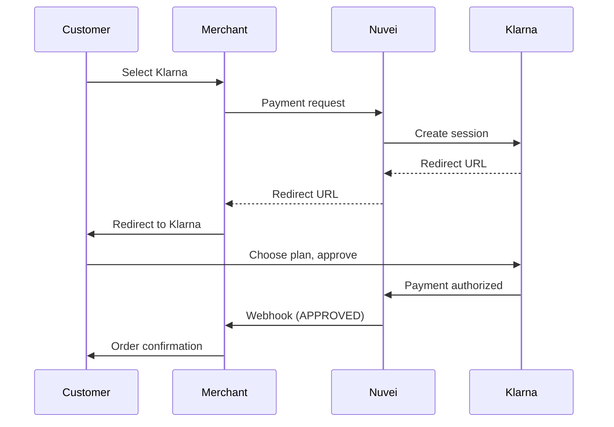

# Klarna

<Info>
  **Payment Method ID:** `apmgw_Klarna`  
  **Type:** BNPL (Buy Now, Pay Later)  
  **Countries:** US, UK, Germany, Sweden, Norway, Finland, Denmark, Austria, Netherlands, Belgium, Switzerland, Australia  
  **Currencies:** USD, GBP, EUR, SEK, NOK, DKK, CHF, AUD
</Info>

Klarna is a leading BNPL provider offering flexible payment options including Pay Later, Pay in 4, and Financing. With 150+ million users, Klarna increases conversion and average order value.

## Payment Options

| Product | Description | Available In |
|---------|-------------|--------------|
| **Pay in 4** | Split into 4 interest-free payments | US, UK, Australia |
| **Pay Later** | Pay in full within 14-30 days | Europe, US |
| **Financing** | Monthly installments (6-36 months) | All markets |

## How Klarna Works



## Quick Start

### Payment Request

```json
POST /ppp/api/v1/payment.do

{
  "sessionToken": "<sessionToken>",
  "merchantId": "<merchantId>",
  "merchantSiteId": "<merchantSiteId>",
  "clientRequestId": "<unique_request_id>",
  "clientUniqueId": "order_KL_123",
  "amount": "299.99",
  "currency": "USD",
  
  "paymentOption": {
    "alternativePaymentMethod": {
      "paymentMethod": "apmgw_Klarna"
    }
  },
  
  "billingAddress": {
    "firstName": "Sarah",
    "lastName": "Johnson",
    "address": "123 Main Street",
    "city": "San Francisco",
    "state": "CA",
    "zip": "94105",
    "email": "sarah@example.com",
    "phone": "+14155551234",
    "country": "US"
  },
  
  "shippingAddress": {
    "firstName": "Sarah",
    "lastName": "Johnson",
    "address": "123 Main Street",
    "city": "San Francisco",
    "state": "CA",
    "zip": "94105",
    "country": "US"
  },
  
  "urlDetails": {
    "successUrl": "https://shop.example.com/success",
    "failureUrl": "https://shop.example.com/failure",
    "notificationUrl": "https://shop.example.com/webhooks"
  },
  
  "timeStamp": "<YYYYMMDDHHmmss>",
  "checksum": "<checksum>"
}
```

## Order Items

Klarna requires line items for risk assessment:

```json
{
  "productId": "sku_12345",
  "amount": "299.99",
  "name": "Winter Jacket",
  "quantity": 1
}
```

Add to additionalParams:

```json
{
  "additionalParams": {
    "order_lines": [
      {
        "type": "physical",
        "reference": "sku_12345",
        "name": "Winter Jacket",
        "quantity": 1,
        "unit_price": 29999,
        "tax_rate": 0,
        "total_amount": 29999
      }
    ]
  }
}
```

## On-Site Messaging

Show Klarna payment options on product pages:

```html
<!-- Klarna On-Site Messaging -->
<klarna-placement
  data-key="credit-promotion-auto-size"
  data-locale="en-US"
  data-purchase-amount="29999">
</klarna-placement>

<script src="https://js.klarna.com/web-sdk/v1/klarna.js"
        data-client-id="YOUR_CLIENT_ID"></script>
```

## Express Checkout

Use Klarna Express Checkout for faster conversion:

```javascript
Klarna.Payments.init({
  client_token: '<klarna_client_token>'
});

Klarna.Payments.load({
  container: '#klarna-container',
  payment_method_category: 'pay_later'
}, function(res) {
  // Klarna widget loaded
});
```

## Feature Support

| Feature | Supported |
|---------|-----------|
| Refunds | ✅ Full & Partial |
| Recurring | ❌ |
| Payouts | ❌ |
| Pre-qualification | ✅ |
| On-site messaging | ✅ |

## Refunds

```json
POST /ppp/api/v1/refundTransaction.do

{
  "merchantId": "<merchantId>",
  "merchantSiteId": "<merchantSiteId>",
  "clientRequestId": "<unique_request_id>",
  "relatedTransactionId": "<original_transaction_id>",
  "amount": "299.99",
  "currency": "USD",
  "authCode": "<original_auth_code>",
  "timeStamp": "<YYYYMMDDHHmmss>",
  "checksum": "<checksum>"
}
```

## Country Configuration

### US Market

```json
{
  "currency": "USD",
  "billingAddress": {
    "country": "US",
    "state": "CA",  // Required
    "zip": "94105"  // Required
  }
}
```

### European Markets

```json
{
  "currency": "EUR",
  "billingAddress": {
    "country": "DE",
    "zip": "10115"  // Required
  }
}
```

## Testing

### Sandbox Personas

| Scenario | Email |
|----------|-------|
| Approved | approved@test.klarna.com |
| Pending | pending@test.klarna.com |
| Rejected | rejected@test.klarna.com |

### Test Flow

1. Use sandbox credentials
2. Select test persona email
3. Complete Klarna flow
4. Verify webhook

## Conversion Tips

<AccordionGroup>
  <Accordion title="Show payment options early" icon="eye">
    Display Klarna on product pages, not just checkout. Use on-site messaging.
  </Accordion>
  
  <Accordion title="Highlight interest-free" icon="percent">
    Emphasize that Pay in 4 is interest-free with no hard credit check.
  </Accordion>
  
  <Accordion title="Show monthly payments" icon="calendar">
    "From $25/mo with Klarna" drives higher-priced purchases.
  </Accordion>
  
  <Accordion title="Complete order data" icon="list">
    Send full order items. Better data = better approval rates.
  </Accordion>
</AccordionGroup>

## Klarna vs Other BNPL

| Feature | Klarna | Afterpay | Affirm |
|---------|--------|----------|--------|
| Interest-free installments | ✅ Pay in 4 | ✅ | Some |
| Longer financing | ✅ 6-36mo | ❌ | ✅ |
| Pre-qualification | ✅ | ✅ | ✅ |
| European coverage | ✅✅ | ⚠️ | ⚠️ |
| US coverage | ✅ | ✅ | ✅ |

## Related

<CardGroup cols={2}>
  <Card title="Afterpay" icon="clock" href="/apms/bnpl/afterpay">
    Alternative BNPL
  </Card>
  <Card title="Affirm" icon="percent" href="/apms/bnpl/affirm">
    Long-term financing
  </Card>
  <Card title="BNPL Overview" icon="credit-card" href="/apms/bnpl/overview">
    All BNPL methods
  </Card>
</CardGroup>
