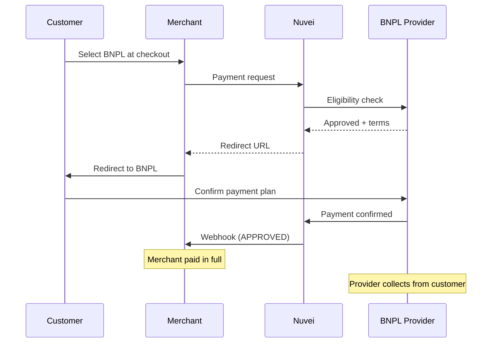

# Buy Now, Pay Later (BNPL)

BNPL services let customers split purchases into installments or defer payment. They've become essential for e-commerce, especially for higher-value purchases.

## Popular BNPL Providers

<CardGroup cols={3}>
  <Card title="Klarna" icon="k" href="/apms/bnpl/klarna">
    🇸🇪 Global leader
  </Card>
  <Card title="Afterpay" icon="a" href="/apms/bnpl/afterpay">
    🇦🇺 Pay in 4
  </Card>
  <Card title="Affirm" icon="check" href="/apms/bnpl/affirm">
    🇺🇸 Flexible terms
  </Card>
</CardGroup>

## BNPL Comparison

| Provider | Markets | Payment Options | Max Amount | Fees |
|----------|---------|-----------------|------------|------|
| Klarna | 45+ countries | Pay Now, Pay Later, Pay in 3/4, Financing | Varies | 2-6% |
| Afterpay | US, UK, AU, NZ, CA | Pay in 4 | ~$1,500 | 4-6% |
| Affirm | US, CA | Pay in 4, 6-36 months | $17,500 | 5-8% |

## Why Offer BNPL?

<AccordionGroup>
  <Accordion title="Increase average order value" icon="cart-plus">
    BNPL customers spend 20-50% more per order. Installments make higher prices accessible.
  </Accordion>
  
  <Accordion title="Reach younger customers" icon="users">
    Gen Z and Millennials strongly prefer BNPL over credit cards. It's the fastest-growing payment category.
  </Accordion>
  
  <Accordion title="Reduce cart abandonment" icon="shopping-cart">
    Customers often abandon at checkout when prices feel too high. BNPL shows manageable installments.
  </Accordion>
  
  <Accordion title="No risk to merchant" icon="shield">
    BNPL providers pay you immediately and take on all credit risk. You get paid upfront.
  </Accordion>
</AccordionGroup>

## How BNPL Works



## Integration Example

### REST API - Klarna Payment

```json
POST /ppp/api/v1/payment.do

{
  "sessionToken": "<sessionToken>",
  "merchantId": "<merchantId>",
  "merchantSiteId": "<merchantSiteId>",
  "clientRequestId": "<unique_request_id>",
  "clientUniqueId": "order_789",
  "amount": "299.00",
  "currency": "EUR",
  
  "paymentOption": {
    "alternativePaymentMethod": {
      "paymentMethod": "apmgw_Klarna"
    }
  },
  
  "billingAddress": {
    "firstName": "Anna",
    "lastName": "Svensson",
    "email": "anna@example.se",
    "address": "Kungsgatan 1",
    "city": "Stockholm",
    "zip": "111 43",
    "country": "SE"
  },
  
  "items": [
    {
      "name": "Blue T-Shirt",
      "price": "99.00",
      "quantity": "2"
    },
    {
      "name": "Shipping",
      "price": "101.00",
      "quantity": "1"
    }
  ],
  
  "urlDetails": {
    "successUrl": "https://shop.example.com/success",
    "failureUrl": "https://shop.example.com/failure",
    "notificationUrl": "https://shop.example.com/webhooks"
  },
  
  "timeStamp": "<YYYYMMDDHHmmss>",
  "checksum": "<checksum>"
}
```

<Warning>
  BNPL providers like Klarna require detailed order items for underwriting decisions. Always include the `items` array.
</Warning>

## Feature Support

| Provider | Refunds | Partial Refunds | Recurring |
|----------|---------|-----------------|-----------|
| Klarna | ✅ | ✅ | ❌ |
| Afterpay | ✅ | ✅ | ❌ |
| Affirm | ✅ | ✅ | ❌ |

## BNPL Payment Options

### Klarna Options

| Option | Description | Customer Pays |
|--------|-------------|---------------|
| Pay Now | Instant bank payment | Full amount now |
| Pay in 30 days | Invoice | After 30 days |
| Pay in 3/4 | Split payments | 3-4 installments |
| Financing | 6-36 months | Monthly + interest |

### Afterpay "Pay in 4"

Automatic 4 equal payments over 6 weeks:

| Payment | Due |
|---------|-----|
| 1st (25%) | At checkout |
| 2nd (25%) | 2 weeks later |
| 3rd (25%) | 4 weeks later |
| 4th (25%) | 6 weeks later |

### Affirm Flexibility

Affirm offers multiple terms based on customer eligibility:

- **Pay in 4**: 4 bi-weekly payments, 0% APR
- **Monthly (3-36 mo)**: Fixed monthly payments, 0-36% APR

## Messaging Requirements

BNPL providers require specific on-site messaging:

```html
<!-- Product page -->
<div class="klarna-messaging">
  <klarna-placement 
    data-key="credit-promotion-badge"
    data-locale="en-US"
    data-purchase-amount="29900">
  </klarna-placement>
</div>

<!-- Cart page -->
<div class="afterpay-messaging">
  Pay in 4 interest-free payments of $74.75
</div>
```

<Note>
  BNPL providers may require you to display installment messaging on product and cart pages. Check provider agreements.
</Note>

## Customer Eligibility

BNPL approval is not guaranteed. Providers assess:

- Order amount (min/max limits)
- Customer payment history
- Country/region
- Product category
- Customer age (18+)

Handle declined eligibility gracefully:

```javascript
if (response.transactionStatus === 'DECLINED') {
  // Don't reveal reason (privacy)
  showMessage('This payment option is not available for this order. Please try another payment method.');
}
```

## Refunds

Refund BNPL transactions like any other APM:

```json
POST /ppp/api/v1/refundTransaction.do

{
  "merchantId": "<merchantId>",
  "merchantSiteId": "<merchantSiteId>",
  "clientRequestId": "<unique_request_id>",
  "relatedTransactionId": "7110000000011234572",
  "amount": "99.00",
  "currency": "EUR",
  "authCode": "<original_auth_code>",
  "timeStamp": "<YYYYMMDDHHmmss>",
  "checksum": "<checksum>"
}
```

<Info>
  When you refund, the BNPL provider adjusts or cancels remaining customer payments automatically.
</Info>

## Testing

### Klarna Sandbox

| Field | Test Value |
|-------|------------|
| Country | SE, DE, US, etc. |
| Phone | Use test phone provided by Klarna |
| OTP | 123456 |

### Afterpay Sandbox

| Field | Test Value |
|-------|------------|
| Email | Any email |
| Phone | Use test phone |
| OTP | Sandbox auto-approves |

### Affirm Sandbox

| Field | Test Value |
|-------|------------|
| Phone | (310) 555-1212 |
| OTP | 1234 |

## Best Practices

<AccordionGroup>
  <Accordion title="Show BNPL at product level" icon="tag">
    Display "Pay in 4 of $X" on product pages to drive interest before checkout.
  </Accordion>
  
  <Accordion title="Include line items" icon="list">
    Always pass detailed order items. BNPL providers use this for risk assessment.
  </Accordion>
  
  <Accordion title="Handle declines gracefully" icon="ban">
    Never show why BNPL was declined. Simply offer alternative payment methods.
  </Accordion>
  
  <Accordion title="Comply with messaging rules" icon="message">
    Each provider has specific marketing requirements. Follow their brand guidelines.
  </Accordion>
  
  <Accordion title="Consider demographics" icon="users">
    BNPL is most popular with 18-44 year olds. Prioritize if that's your audience.
  </Accordion>
</AccordionGroup>

## Regional Availability

| Region | Top BNPL |
|--------|----------|
| 🇺🇸 US | Affirm, Klarna, Afterpay |
| 🇬🇧 UK | Klarna, Clearpay (Afterpay) |
| 🇩🇪 Germany | Klarna, PayPal Pay Later |
| 🇸🇪 Nordics | Klarna |
| 🇦🇺 Australia | Afterpay, Zip |
| 🇫🇷 France | Klarna, Oney |

## Quick Links

<CardGroup cols={2}>
  <Card title="Klarna" icon="k" href="/apms/bnpl/klarna">
    Complete Klarna guide
  </Card>
  <Card title="Afterpay" icon="a" href="/apms/bnpl/afterpay">
    Afterpay integration
  </Card>
  <Card title="Affirm" icon="check" href="/apms/bnpl/affirm">
    Affirm setup
  </Card>
  <Card title="APM Integration" icon="code" href="/apms/integration">
    General APM guide
  </Card>
</CardGroup>
