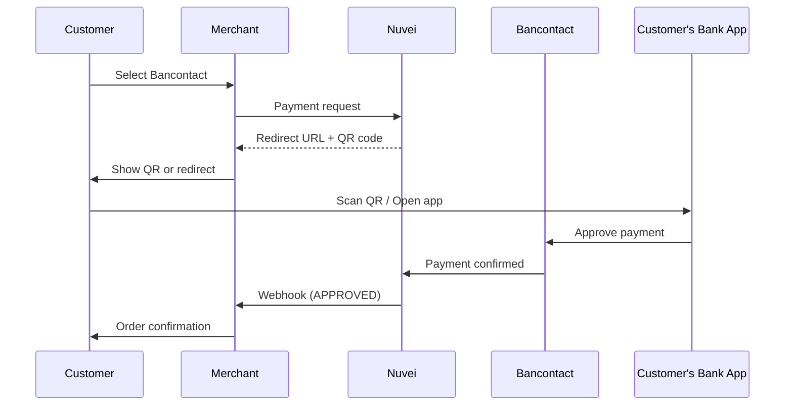

# Bancontact

<Info>
  **Payment Method ID:** `apmgw_Bancontact`  
  **Type:** Card Network / Mobile  
  **Countries:** Belgium 🇧🇪  
  **Currencies:** EUR  
  **Market Share:** ~40% of Belgian e-commerce
</Info>

Bancontact is Belgium's domestic debit card network. Online, it functions as an APM where customers authenticate via their mobile banking app (Payconiq by Bancontact) or card reader.

## How Bancontact Works



## Quick Start

### Payment Request

```json
POST /ppp/api/v1/payment.do

{
  "sessionToken": "<sessionToken>",
  "merchantId": "<merchantId>",
  "merchantSiteId": "<merchantSiteId>",
  "clientRequestId": "<unique_request_id>",
  "clientUniqueId": "order_BE_789",
  "amount": "75.00",
  "currency": "EUR",
  
  "paymentOption": {
    "alternativePaymentMethod": {
      "paymentMethod": "apmgw_Bancontact"
    }
  },
  
  "billingAddress": {
    "firstName": "Jean",
    "lastName": "Dupont",
    "email": "jean@example.be",
    "address": "Grand Place 1",
    "city": "Brussels",
    "zip": "1000",
    "country": "BE"
  },
  
  "urlDetails": {
    "successUrl": "https://shop.example.com/success",
    "failureUrl": "https://shop.example.com/failure",
    "pendingUrl": "https://shop.example.com/pending",
    "notificationUrl": "https://shop.example.com/webhooks/nuvei"
  },
  
  "timeStamp": "<YYYYMMDDHHmmss>",
  "checksum": "<checksum>"
}
```

### Response

```json
{
  "orderId": "350728610",
  "paymentOption": {
    "redirectUrl": "https://gw-apm.nuvei.com/Home?PaymentToken=eyJhbGci...",
    "userPaymentOptionId": "86068560"
  },
  "transactionStatus": "REDIRECT",
  "clientUniqueId": "order_BE_789",
  "status": "SUCCESS"
}
```

## Payment Methods

Bancontact supports multiple authentication methods:

### 1. QR Code (Mobile)
Customers scan a QR code with their Payconiq by Bancontact app.

### 2. Card Reader
Traditional approach using physical card and reader device.

### 3. Mobile App Push
Customers receive a push notification in their banking app.

## Parameters

### Required

| Parameter | Type | Description |
|-----------|------|-------------|
| `paymentMethod` | string | Must be `apmgw_Bancontact` |
| `amount` | string | Payment amount |
| `currency` | string | Must be `EUR` |
| `billingAddress.country` | string | Must be `BE` |
| `billingAddress.email` | string | Customer email |

### Optional

| Parameter | Type | Description |
|-----------|------|-------------|
| `billingAddress.phone` | string | For mobile app push |

## Recurring Payments

Bancontact supports recurring payments through tokenization:

### Initial Payment (with tokenization)

```json
{
  "paymentOption": {
    "alternativePaymentMethod": {
      "paymentMethod": "apmgw_Bancontact"
    }
  },
  "userTokenId": "customer_123"
}
```

### Subsequent Payment (using token)

```json
{
  "paymentOption": {
    "userPaymentOptionId": "86068560"
  },
  "isRebilling": "1"
}
```

<Note>
  Customer must explicitly agree to recurring payments during the initial authorization.
</Note>

## Refunds

Bancontact supports full and partial refunds:

```json
POST /ppp/api/v1/refundTransaction.do

{
  "merchantId": "<merchantId>",
  "merchantSiteId": "<merchantSiteId>",
  "clientRequestId": "<unique_request_id>",
  "relatedTransactionId": "7110000000011234569",
  "amount": "75.00",
  "currency": "EUR",
  "authCode": "<original_auth_code>",
  "timeStamp": "<YYYYMMDDHHmmss>",
  "checksum": "<checksum>"
}
```

## Feature Support

| Feature | Supported |
|---------|-----------|
| Refunds | ✅ Full & Partial |
| Recurring | ✅ Via tokenization |
| Payouts | ❌ |
| Tokenization | ✅ |
| Pre-authorization | ❌ |

## Testing

### Sandbox

In sandbox mode, Bancontact payments are simulated. No special test cards needed.

### Test Flow

1. Submit payment request
2. Redirect to Bancontact test page
3. Approve the payment
4. Get redirected back
5. Receive webhook

## Error Handling

### Common Errors

| Error Code | Reason | Solution |
|------------|--------|----------|
| `1025` | Invalid currency | Must use EUR |
| `1026` | Invalid country | Must use BE |
| `1401` | Transaction expired | Customer didn't complete |
| `1402` | Customer cancelled | User cancelled payment |

### Frontend Example

```javascript
async function payWithBancontact() {
  const response = await fetch('/api/bancontact-payment', {
    method: 'POST',
    headers: { 'Content-Type': 'application/json' },
    body: JSON.stringify({ orderId: currentOrderId })
  });
  
  const data = await response.json();
  
  if (data.transactionStatus === 'REDIRECT') {
    // Check if mobile device
    if (isMobileDevice()) {
      // Open Bancontact app directly
      window.location.href = data.paymentOption.redirectUrl;
    } else {
      // Desktop: show QR code or redirect
      window.location.href = data.paymentOption.redirectUrl;
    }
  }
}

function isMobileDevice() {
  return /Android|iPhone|iPad|iPod/i.test(navigator.userAgent);
}
```

## Best Practices

<AccordionGroup>
  <Accordion title="Optimize for mobile" icon="mobile">
    Most Bancontact payments happen via the mobile app. Ensure your checkout works well on mobile devices.
  </Accordion>
  
  <Accordion title="Show Bancontact prominently" icon="eye">
    For Belgian customers, Bancontact should be a top payment option. It's trusted and widely used.
  </Accordion>
  
  <Accordion title="Mention Payconiq" icon="qrcode">
    Some customers know it as "Payconiq by Bancontact" - consider showing both names.
  </Accordion>
  
  <Accordion title="Handle app deeplinks" icon="link">
    On mobile, the redirect may open the Bancontact app directly. Ensure your return URLs work correctly.
  </Accordion>
</AccordionGroup>

## Related

<CardGroup cols={2}>
  <Card title="Europe APMs" icon="map" href="/apms/europe/overview">
    All European payment methods
  </Card>
  <Card title="iDEAL" icon="bank" href="/apms/europe/ideal">
    Netherlands' leading APM
  </Card>
  <Card title="Recurring Payments" icon="repeat" href="/integrations/features/recurring">
    Set up subscriptions
  </Card>
  <Card title="Webhooks" icon="bell" href="/integrations/features/webhooks">
    Handle notifications
  </Card>
</CardGroup>
