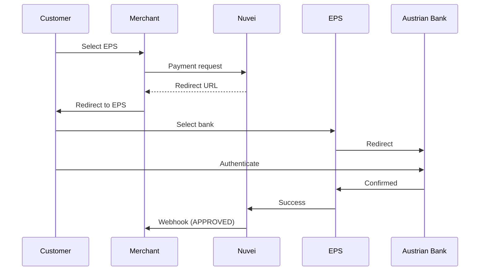

# EPS

<Info>
  **Payment Method ID:** `apmgw_eps`  
  **Type:** Bank Transfer  
  **Countries:** Austria 🇦🇹  
  **Currencies:** EUR  
  **Banks:** All major Austrian banks
</Info>

EPS (Electronic Payment Standard) is Austria's leading online payment system, supported by all major Austrian banks.

## How EPS Works



## Quick Start

### Payment Request

```json
POST /ppp/api/v1/payment.do

{
  "sessionToken": "<sessionToken>",
  "merchantId": "<merchantId>",
  "merchantSiteId": "<merchantSiteId>",
  "clientRequestId": "<unique_request_id>",
  "clientUniqueId": "order_AT_123",
  "amount": "79.00",
  "currency": "EUR",
  
  "paymentOption": {
    "alternativePaymentMethod": {
      "paymentMethod": "apmgw_eps"
    }
  },
  
  "billingAddress": {
    "firstName": "Franz",
    "lastName": "Huber",
    "email": "franz@example.at",
    "country": "AT"
  },
  
  "urlDetails": {
    "successUrl": "https://shop.example.com/success",
    "failureUrl": "https://shop.example.com/failure",
    "notificationUrl": "https://shop.example.com/webhooks"
  },
  
  "timeStamp": "<YYYYMMDDHHmmss>",
  "checksum": "<checksum>"
}
```

## Supported Banks

| Bank | BIC |
|------|-----|
| Erste Bank | GIBAATWWXXX |
| Raiffeisen | RLNWATWW |
| Bank Austria | BKAUATWW |
| BAWAG | BAWAATWW |
| Volksbank | VABORWWW |

## Feature Support

| Feature | Supported |
|---------|-----------|
| Refunds | ✅ Full & Partial |
| Recurring | ❌ |
| Payouts | ❌ |

## Related

<CardGroup cols={2}>
  <Card title="Sofort" icon="bank" href="/apms/europe/sofort">
    Also available in Austria
  </Card>
  <Card title="Europe APMs" icon="map" href="/apms/europe/overview">
    All European methods
  </Card>
</CardGroup>
