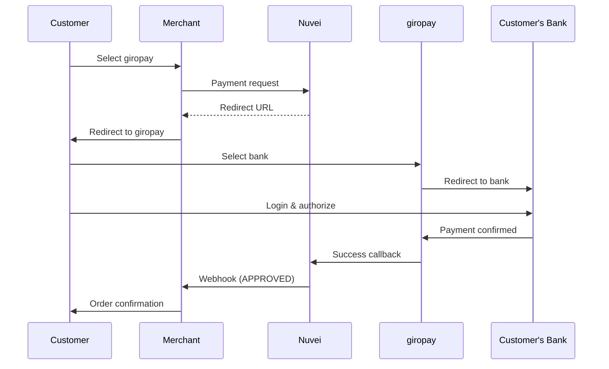

# giropay

<Info>
  **Payment Method ID:** `apmgw_giropay`  
  **Type:** Bank Transfer  
  **Countries:** Germany 🇩🇪  
  **Currencies:** EUR  
  **Real-time:** Yes
</Info>

giropay is a German online payment method that enables customers to pay directly from their bank account using their online banking credentials.

## How giropay Works



## Quick Start

### Payment Request

```json
POST /ppp/api/v1/payment.do

{
  "sessionToken": "<sessionToken>",
  "merchantId": "<merchantId>",
  "merchantSiteId": "<merchantSiteId>",
  "clientRequestId": "<unique_request_id>",
  "clientUniqueId": "order_DE_789",
  "amount": "59.99",
  "currency": "EUR",
  
  "paymentOption": {
    "alternativePaymentMethod": {
      "paymentMethod": "apmgw_giropay"
    }
  },
  
  "billingAddress": {
    "firstName": "Klaus",
    "lastName": "Schmidt",
    "email": "klaus@example.de",
    "country": "DE"
  },
  
  "urlDetails": {
    "successUrl": "https://shop.example.com/success",
    "failureUrl": "https://shop.example.com/failure",
    "notificationUrl": "https://shop.example.com/webhooks/nuvei"
  },
  
  "timeStamp": "<YYYYMMDDHHmmss>",
  "checksum": "<checksum>"
}
```

### Response

```json
{
  "orderId": "350728616",
  "paymentOption": {
    "redirectUrl": "https://gw-apm.nuvei.com/Home?PaymentToken=eyJhbGci..."
  },
  "transactionStatus": "REDIRECT",
  "status": "SUCCESS"
}
```

## Parameters

### Required

| Parameter | Type | Description |
|-----------|------|-------------|
| `paymentMethod` | string | Must be `apmgw_giropay` |
| `amount` | string | Payment amount |
| `currency` | string | Must be `EUR` |
| `billingAddress.country` | string | Must be `DE` |

## Refunds

```json
POST /ppp/api/v1/refundTransaction.do

{
  "merchantId": "<merchantId>",
  "merchantSiteId": "<merchantSiteId>",
  "clientRequestId": "<unique_request_id>",
  "relatedTransactionId": "<original_transaction_id>",
  "amount": "59.99",
  "currency": "EUR",
  "authCode": "<original_auth_code>",
  "timeStamp": "<YYYYMMDDHHmmss>",
  "checksum": "<checksum>"
}
```

## Feature Support

| Feature | Supported |
|---------|-----------|
| Refunds | ✅ Full & Partial |
| Recurring | ❌ |
| Payouts | ❌ |
| Real-time confirmation | ✅ |

## Testing

In sandbox, giropay payments are simulated. The customer flow is shortened for testing.

## Best Practices

<AccordionGroup>
  <Accordion title="German customers only" icon="flag">
    giropay is only available for German bank accounts. Verify billing country before showing.
  </Accordion>
  
  <Accordion title="Real-time confirmation" icon="bolt">
    giropay provides instant payment confirmation, unlike Sofort which may have delays.
  </Accordion>
</AccordionGroup>

## Related

<CardGroup cols={2}>
  <Card title="Sofort" icon="bank" href="/apms/europe/sofort">
    Alternative German bank transfer
  </Card>
  <Card title="Europe APMs" icon="map" href="/apms/europe/overview">
    All European methods
  </Card>
</CardGroup>
