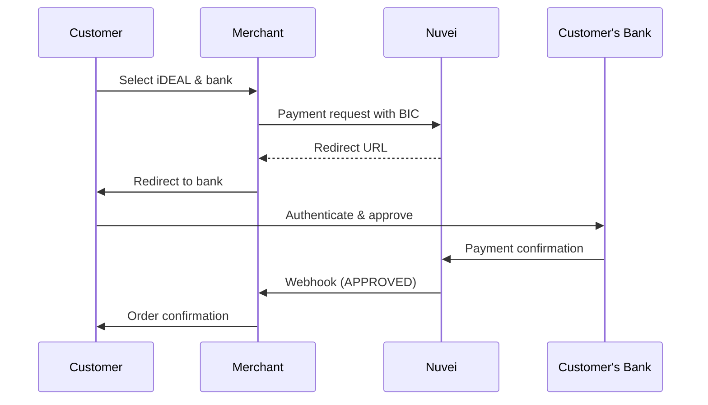

# iDEAL

<Info>
  **Payment Method ID:** `apmgw_iDeal`  
  **Type:** Bank Transfer  
  **Countries:** Netherlands 🇳🇱  
  **Currencies:** EUR  
  **Market Share:** ~60% of Dutch e-commerce
</Info>

iDEAL is the Netherlands' most popular online payment method, connecting directly to all major Dutch banks for instant, secure bank transfers.

## How iDEAL Works



## Quick Start

### 1. Get Available Banks

```json
POST /ppp/api/v1/getMerchantPaymentMethods.do

{
  "sessionToken": "<sessionToken>",
  "merchantId": "<merchantId>",
  "merchantSiteId": "<merchantSiteId>",
  "clientRequestId": "<unique_request_id>",
  "countryCode": "NL",
  "currencyCode": "EUR",
  "timeStamp": "<YYYYMMDDHHmmss>",
  "checksum": "<checksum>"
}
```

Response includes bank list:

```json
{
  "paymentMethods": [
    {
      "paymentMethod": "apmgw_iDeal",
      "fields": [
        {
          "name": "BIC",
          "type": "list",
          "listValues": [
            { "code": "ABNANL2A", "caption": "ABN AMRO" },
            { "code": "INGBNL2A", "caption": "ING" },
            { "code": "RABONL2U", "caption": "Rabobank" },
            { "code": "SNSBNL2A", "caption": "SNS Bank" },
            { "code": "ASNBNL21", "caption": "ASN Bank" },
            { "code": "BUNQNL2A", "caption": "bunq" },
            { "code": "KNABNL2H", "caption": "Knab" },
            { "code": "TRIONL2U", "caption": "Triodos Bank" },
            { "code": "RBRBNL21", "caption": "RegioBank" },
            { "code": "REVOLT21", "caption": "Revolut" },
            { "code": "BITSNL2A", "caption": "N26" }
          ]
        }
      ]
    }
  ]
}
```

### 2. Create Payment

```json
POST /ppp/api/v1/payment.do

{
  "sessionToken": "<sessionToken>",
  "merchantId": "<merchantId>",
  "merchantSiteId": "<merchantSiteId>",
  "clientRequestId": "<unique_request_id>",
  "clientUniqueId": "order_NL_123",
  "amount": "49.95",
  "currency": "EUR",
  
  "paymentOption": {
    "alternativePaymentMethod": {
      "paymentMethod": "apmgw_iDeal",
      "BIC": "INGBNL2A"
    }
  },
  
  "billingAddress": {
    "firstName": "Jan",
    "lastName": "de Vries",
    "email": "jan@example.nl",
    "address": "Damrak 1",
    "city": "Amsterdam",
    "zip": "1012 LG",
    "country": "NL"
  },
  
  "urlDetails": {
    "successUrl": "https://shop.example.com/success",
    "failureUrl": "https://shop.example.com/failure",
    "pendingUrl": "https://shop.example.com/pending",
    "notificationUrl": "https://shop.example.com/webhooks/nuvei"
  },
  
  "timeStamp": "<YYYYMMDDHHmmss>",
  "checksum": "<checksum>"
}
```

### 3. Handle Redirect Response

```json
{
  "orderId": "350728608",
  "paymentOption": {
    "redirectUrl": "https://gw-apm.nuvei.com/Home?PaymentToken=eyJhbGci...",
    "userPaymentOptionId": "86068558"
  },
  "transactionStatus": "REDIRECT",
  "clientUniqueId": "order_NL_123",
  "status": "SUCCESS"
}
```

### 4. Redirect Customer

```javascript
// Frontend JavaScript
if (response.transactionStatus === 'REDIRECT') {
  window.location.href = response.paymentOption.redirectUrl;
}
```

### 5. Receive Webhook

```
POST /webhooks/nuvei HTTP/1.1
Content-Type: application/x-www-form-urlencoded

ppp_status=OK
&Status=APPROVED
&TransactionID=7110000000011234567
&PPP_TransactionID=350728608
&totalAmount=49.95
&currency=EUR
&payment_method=apmgw_iDeal
&customData=order_NL_123
&advanceResponseChecksum=<checksum>
```

## Bank Codes (BIC)

| Bank | BIC Code | Logo |
|------|----------|------|
| ABN AMRO | `ABNANL2A` | 🏦 |
| ING | `INGBNL2A` | 🏦 |
| Rabobank | `RABONL2U` | 🏦 |
| SNS Bank | `SNSBNL2A` | 🏦 |
| ASN Bank | `ASNBNL21` | 🏦 |
| bunq | `BUNQNL2A` | 🏦 |
| Knab | `KNABNL2H` | 🏦 |
| Triodos Bank | `TRIONL2U` | 🏦 |
| RegioBank | `RBRBNL21` | 🏦 |
| Revolut | `REVOLT21` | 🏦 |
| N26 | `BITSNL2A` | 🏦 |

<Note>
  **iDEAL 2.0**: The `BIC` field is optional with iDEAL 2.0. If omitted, the customer can select their bank on the iDEAL page.
</Note>

## Parameters

### Required

| Parameter | Type | Description |
|-----------|------|-------------|
| `paymentMethod` | string | Must be `apmgw_iDeal` |
| `amount` | string | Payment amount |
| `currency` | string | Must be `EUR` |
| `billingAddress.country` | string | Must be `NL` |
| `billingAddress.email` | string | Customer email |

### Optional

| Parameter | Type | Description |
|-----------|------|-------------|
| `BIC` | string | Bank code - optional for iDEAL 2.0 |

## Refunds

iDEAL supports full and partial refunds:

```json
POST /ppp/api/v1/refundTransaction.do

{
  "merchantId": "<merchantId>",
  "merchantSiteId": "<merchantSiteId>",
  "clientRequestId": "<unique_request_id>",
  "relatedTransactionId": "7110000000011234567",
  "amount": "49.95",
  "currency": "EUR",
  "authCode": "<original_auth_code>",
  "timeStamp": "<YYYYMMDDHHmmss>",
  "checksum": "<checksum>"
}
```

<Warning>
  Refunds are processed as SEPA Credit Transfers and may take 1-3 business days to reach the customer's account.
</Warning>

## Feature Support

| Feature | Supported |
|---------|-----------|
| Refunds | ✅ Full & Partial |
| Recurring | ❌ |
| Payouts | ❌ |
| Tokenization | ❌ |
| Pre-authorization | ❌ |

## Testing

### Test Credentials

In the Nuvei sandbox, iDEAL transactions are simulated. Use any valid BIC code.

### Test Scenarios

| Amount | Result |
|--------|--------|
| Any | Approved (sandbox) |

<Note>
  In sandbox mode, iDEAL payments are automatically approved without bank redirect simulation.
</Note>

## Error Handling

### Common Errors

| Error Code | Reason | Solution |
|------------|--------|----------|
| `1023` | Invalid BIC | Verify bank code from getMerchantPaymentMethods |
| `1025` | Currency not supported | Must use EUR |
| `1401` | Transaction expired | Customer didn't complete within 15 minutes |

### Frontend Example

```javascript
async function payWithIdeal(bankCode) {
  try {
    const response = await fetch('/api/ideal-payment', {
      method: 'POST',
      headers: { 'Content-Type': 'application/json' },
      body: JSON.stringify({ bic: bankCode })
    });
    
    const data = await response.json();
    
    if (data.transactionStatus === 'REDIRECT') {
      // Redirect to iDEAL
      window.location.href = data.paymentOption.redirectUrl;
    } else if (data.transactionStatus === 'ERROR') {
      showError(data.gwErrorReason || 'Payment failed');
    }
  } catch (error) {
    showError('Network error - please try again');
  }
}
```

## Best Practices

<AccordionGroup>
  <Accordion title="Show bank selector" icon="list">
    Let customers select their bank on your checkout page for a faster experience. Fetch the bank list from `getMerchantPaymentMethods`.
  </Accordion>
  
  <Accordion title="Handle 15-minute timeout" icon="clock">
    iDEAL payments expire after 15 minutes. Show a countdown or warning to customers.
  </Accordion>
  
  <Accordion title="Use iDEAL 2.0" icon="arrow-up">
    With iDEAL 2.0, you can skip the BIC parameter. Customers select their bank on the iDEAL page, simplifying your integration.
  </Accordion>
  
  <Accordion title="Always rely on webhooks" icon="bell">
    Don't rely on the return URL for payment confirmation. Always verify via webhook.
  </Accordion>
</AccordionGroup>

## Related

<CardGroup cols={2}>
  <Card title="Europe APMs" icon="map" href="/apms/europe/overview">
    All European payment methods
  </Card>
  <Card title="Bancontact" icon="credit-card" href="/apms/europe/bancontact">
    Belgium's leading APM
  </Card>
  <Card title="SEPA" icon="globe" href="/apms/europe/sepa">
    Pan-European bank transfers
  </Card>
  <Card title="Webhooks" icon="bell" href="/integrations/features/webhooks">
    Handle payment notifications
  </Card>
</CardGroup>
