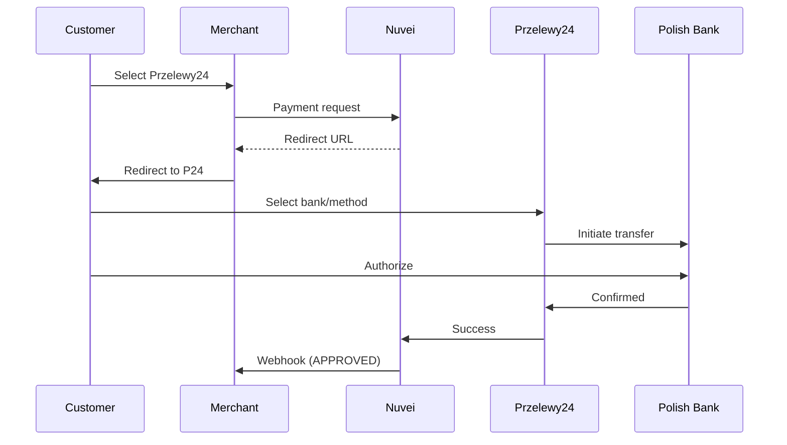

# Przelewy24

<Info>
  **Payment Method ID:** `apmgw_Przelewy24`  
  **Type:** Payment Aggregator  
  **Countries:** Poland 🇵🇱  
  **Currencies:** PLN, EUR  
  **Market Share:** ~40% of Polish e-commerce
</Info>

Przelewy24 (P24) is Poland's most popular online payment platform, aggregating multiple Polish banks and payment methods into a single integration.

## How Przelewy24 Works



## Quick Start

### Payment Request

```json
POST /ppp/api/v1/payment.do

{
  "sessionToken": "<sessionToken>",
  "merchantId": "<merchantId>",
  "merchantSiteId": "<merchantSiteId>",
  "clientRequestId": "<unique_request_id>",
  "clientUniqueId": "order_PL_456",
  "amount": "199.00",
  "currency": "PLN",
  
  "paymentOption": {
    "alternativePaymentMethod": {
      "paymentMethod": "apmgw_Przelewy24"
    }
  },
  
  "billingAddress": {
    "firstName": "Jan",
    "lastName": "Kowalski",
    "email": "jan@example.pl",
    "country": "PL"
  },
  
  "urlDetails": {
    "successUrl": "https://shop.example.com/success",
    "failureUrl": "https://shop.example.com/failure",
    "notificationUrl": "https://shop.example.com/webhooks"
  },
  
  "timeStamp": "<YYYYMMDDHHmmss>",
  "checksum": "<checksum>"
}
```

## Available Banks/Methods

Przelewy24 aggregates:

| Bank/Method | Type |
|-------------|------|
| mBank | Bank Transfer |
| PKO BP | Bank Transfer |
| ING | Bank Transfer |
| Santander | Bank Transfer |
| Pekao | Bank Transfer |
| BLIK | Mobile Payment |
| Credit Cards | Card Payment |

## Feature Support

| Feature | Supported |
|---------|-----------|
| Refunds | ✅ Full & Partial |
| Recurring | ❌ |
| Payouts | ❌ |
| BLIK | ✅ Via P24 |

## Testing

| Field | Test Value |
|-------|------------|
| Currency | PLN |
| Country | PL |

## Best Practices

<AccordionGroup>
  <Accordion title="Use PLN currency" icon="coins">
    While EUR is supported, Polish customers prefer seeing prices in PLN.
  </Accordion>
  
  <Accordion title="BLIK is popular" icon="mobile">
    BLIK mobile payments are very popular in Poland and available through P24.
  </Accordion>
</AccordionGroup>

## Related

<CardGroup cols={2}>
  <Card title="Europe APMs" icon="map" href="/apms/europe/overview">
    All European methods
  </Card>
  <Card title="APM Integration" icon="code" href="/apms/integration">
    Integration guide
  </Card>
</CardGroup>
