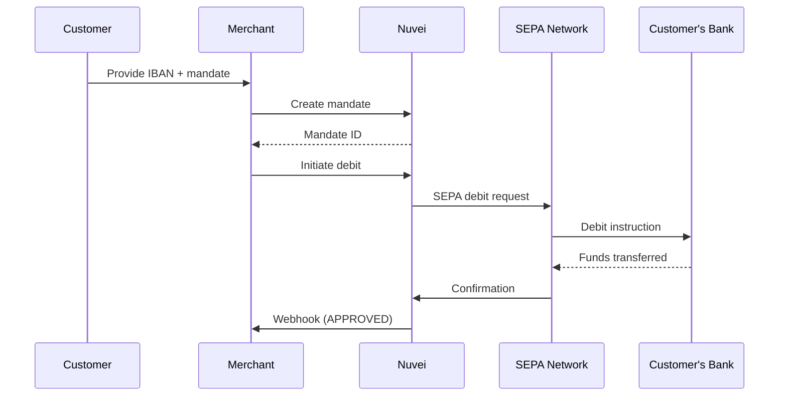

# SEPA Direct Debit

<Info>
  **Payment Method ID:** `apmgw_SEPA`  
  **Type:** Direct Debit  
  **Countries:** 36 SEPA countries  
  **Currencies:** EUR  
  **Use Case:** Recurring payments, subscriptions
</Info>

SEPA (Single Euro Payments Area) Direct Debit allows merchants to pull funds directly from customer bank accounts across 36 European countries. Ideal for recurring payments and subscriptions.

## How SEPA Works



## Quick Start

### Step 1: Create Mandate

```json
POST /ppp/api/v1/payment.do

{
  "sessionToken": "<sessionToken>",
  "merchantId": "<merchantId>",
  "merchantSiteId": "<merchantSiteId>",
  "clientRequestId": "<unique_request_id>",
  "clientUniqueId": "mandate_123",
  "amount": "0.00",
  "currency": "EUR",
  "userTokenId": "customer_456",
  
  "paymentOption": {
    "alternativePaymentMethod": {
      "paymentMethod": "apmgw_SEPA",
      "iban": "DE89370400440532013000",
      "bic": "COBADEFFXXX",
      "accountHolderName": "Max Mustermann"
    }
  },
  
  "billingAddress": {
    "firstName": "Max",
    "lastName": "Mustermann",
    "email": "max@example.de",
    "address": "Hauptstraße 1",
    "city": "Berlin",
    "zip": "10115",
    "country": "DE"
  },
  
  "urlDetails": {
    "notificationUrl": "https://shop.example.com/webhooks"
  },
  
  "timeStamp": "<YYYYMMDDHHmmss>",
  "checksum": "<checksum>"
}
```

### Step 2: Charge the Mandate

```json
POST /ppp/api/v1/payment.do

{
  "sessionToken": "<sessionToken>",
  "merchantId": "<merchantId>",
  "merchantSiteId": "<merchantSiteId>",
  "clientRequestId": "<unique_request_id>",
  "clientUniqueId": "subscription_789",
  "amount": "29.99",
  "currency": "EUR",
  "userTokenId": "customer_456",
  "isRebilling": "1",
  
  "paymentOption": {
    "userPaymentOptionId": "<mandate_upo_id>"
  },
  
  "timeStamp": "<YYYYMMDDHHmmss>",
  "checksum": "<checksum>"
}
```

## SEPA Countries

SEPA covers 36 countries including:

| Region | Countries |
|--------|-----------|
| Eurozone | Germany, France, Italy, Spain, Netherlands, Belgium, Austria, Ireland, Portugal, Finland, Greece, Luxembourg, etc. |
| Non-Euro EU | Sweden, Denmark, Poland, Czech Republic, Hungary, Romania, Bulgaria, Croatia |
| Non-EU | UK, Switzerland, Norway, Iceland, Liechtenstein, Monaco, San Marino, Vatican |

## IBAN Format

| Country | IBAN Length | Example |
|---------|-------------|---------|
| Germany | 22 | DE89370400440532013000 |
| France | 27 | FR7630006000011234567890189 |
| Netherlands | 18 | NL91ABNA0417164300 |
| Spain | 24 | ES9121000418450200051332 |
| Italy | 27 | IT60X0542811101000000123456 |

## Mandate Types

| Type | Description | Use Case |
|------|-------------|----------|
| **CORE** | Consumer accounts | B2C subscriptions |
| **B2B** | Business accounts | B2B payments |

## Settlement Timeline

| Event | Timeline |
|-------|----------|
| Mandate creation | Immediate |
| First collection | T+5 to T+14 days |
| Recurring collection | T+2 to T+5 days |
| Refund/Chargeback window | Up to 8 weeks (CORE) |

<Warning>
  SEPA Direct Debit has a long settlement time. First payments can take up to 14 business days. Plan inventory/fulfillment accordingly.
</Warning>

## Feature Support

| Feature | Supported |
|---------|-----------|
| Refunds | ✅ |
| Recurring | ✅ Primary use case |
| Payouts | ✅ Via SEPA Credit Transfer |
| Mandate management | ✅ |

## Testing

### Test IBANs

| Country | Test IBAN |
|---------|-----------|
| Germany | DE89370400440532013000 |
| France | FR7630006000011234567890189 |
| Netherlands | NL91ABNA0417164300 |

## Error Handling

| Error Code | Reason | Action |
|------------|--------|--------|
| `AC01` | Invalid IBAN | Verify IBAN format |
| `AC04` | Account closed | Request new mandate |
| `AM04` | Insufficient funds | Retry later |
| `MD01` | No valid mandate | Create new mandate |
| `MS02` | Customer refusal | Contact customer |

## Best Practices

<AccordionGroup>
  <Accordion title="Get explicit consent" icon="file-signature">
    SEPA requires customer consent (mandate). Store signed mandate documentation.
  </Accordion>
  
  <Accordion title="Pre-notify customers" icon="bell">
    You must notify customers before each debit. Include amount and date.
  </Accordion>
  
  <Accordion title="Handle chargebacks" icon="rotate-left">
    CORE mandates allow 8-week no-questions-asked refunds. Build this into your business model.
  </Accordion>
  
  <Accordion title="Use for subscriptions" icon="repeat">
    SEPA is ideal for recurring payments where immediate delivery isn't required.
  </Accordion>
</AccordionGroup>

## Related

<CardGroup cols={2}>
  <Card title="Recurring Payments" icon="repeat" href="/integrations/features/recurring">
    Subscription setup
  </Card>
  <Card title="Europe APMs" icon="map" href="/apms/europe/overview">
    All European methods
  </Card>
</CardGroup>
