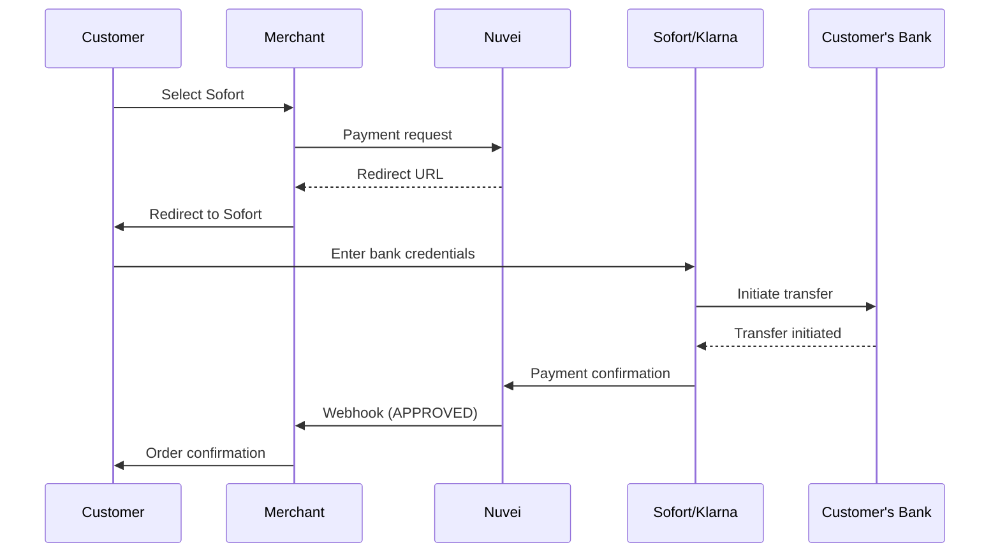

# Sofort

<Info>
  **Payment Method ID:** `apmgw_Sofort`  
  **Type:** Bank Transfer  
  **Countries:** Germany 🇩🇪, Austria 🇦🇹, Switzerland 🇨🇭  
  **Currencies:** EUR, CHF  
  **Part of:** Klarna Group
</Info>

Sofort (now part of Klarna) enables direct online bank transfers in Germany, Austria, and Switzerland. Customers authenticate with their bank credentials and authorize immediate payment.

## How Sofort Works



## Quick Start

### Payment Request

```json
POST /ppp/api/v1/payment.do

{
  "sessionToken": "<sessionToken>",
  "merchantId": "<merchantId>",
  "merchantSiteId": "<merchantSiteId>",
  "clientRequestId": "<unique_request_id>",
  "clientUniqueId": "order_DE_456",
  "amount": "89.99",
  "currency": "EUR",
  
  "paymentOption": {
    "alternativePaymentMethod": {
      "paymentMethod": "apmgw_Sofort"
    }
  },
  
  "billingAddress": {
    "firstName": "Hans",
    "lastName": "Müller",
    "email": "hans@example.de",
    "address": "Alexanderplatz 1",
    "city": "Berlin",
    "zip": "10178",
    "country": "DE"
  },
  
  "urlDetails": {
    "successUrl": "https://shop.example.com/success",
    "failureUrl": "https://shop.example.com/failure",
    "pendingUrl": "https://shop.example.com/pending",
    "notificationUrl": "https://shop.example.com/webhooks/nuvei"
  },
  
  "timeStamp": "<YYYYMMDDHHmmss>",
  "checksum": "<checksum>"
}
```

### Response

```json
{
  "orderId": "350728609",
  "paymentOption": {
    "redirectUrl": "https://gw-apm.nuvei.com/Home?PaymentToken=eyJhbGci...",
    "userPaymentOptionId": "86068559"
  },
  "transactionStatus": "REDIRECT",
  "clientUniqueId": "order_DE_456",
  "status": "SUCCESS"
}
```

### Redirect Customer

```javascript
if (response.transactionStatus === 'REDIRECT') {
  window.location.href = response.paymentOption.redirectUrl;
}
```

### Webhook Notification

```
POST /webhooks/nuvei HTTP/1.1
Content-Type: application/x-www-form-urlencoded

ppp_status=OK
&Status=APPROVED
&TransactionID=7110000000011234568
&PPP_TransactionID=350728609
&totalAmount=89.99
&currency=EUR
&payment_method=apmgw_Sofort
&advanceResponseChecksum=<checksum>
```

## Supported Countries & Currencies

| Country | Currency | Language Code |
|---------|----------|---------------|
| Germany 🇩🇪 | EUR | de_DE |
| Austria 🇦🇹 | EUR | de_AT |
| Switzerland 🇨🇭 | CHF, EUR | de_CH, fr_CH, it_CH |

## Parameters

### Required

| Parameter | Type | Description |
|-----------|------|-------------|
| `paymentMethod` | string | Must be `apmgw_Sofort` |
| `amount` | string | Payment amount |
| `currency` | string | `EUR` or `CHF` |
| `billingAddress.country` | string | `DE`, `AT`, or `CH` |
| `billingAddress.email` | string | Customer email |

### Optional

| Parameter | Type | Description |
|-----------|------|-------------|
| `languageCode` | string | UI language (de_DE, de_AT, etc.) |

## Refunds

Sofort supports full and partial refunds:

```json
POST /ppp/api/v1/refundTransaction.do

{
  "merchantId": "<merchantId>",
  "merchantSiteId": "<merchantSiteId>",
  "clientRequestId": "<unique_request_id>",
  "relatedTransactionId": "7110000000011234568",
  "amount": "89.99",
  "currency": "EUR",
  "authCode": "<original_auth_code>",
  "timeStamp": "<YYYYMMDDHHmmss>",
  "checksum": "<checksum>"
}
```

<Note>
  Refunds are processed as bank transfers and typically take 2-3 business days.
</Note>

## Feature Support

| Feature | Supported |
|---------|-----------|
| Refunds | ✅ Full & Partial |
| Recurring | ❌ |
| Payouts | ❌ |
| Tokenization | ❌ |
| Pre-authorization | ❌ |

## Testing

### Sandbox Test Data

| Field | Value |
|-------|-------|
| Sort Code | `88888888` |
| Account Number | `12345678` |
| PIN | `1234` |
| TAN | `12345` |

### Test Flow

1. Submit payment request
2. Redirect to Sofort test page
3. Enter test bank credentials
4. Confirm with test TAN
5. Receive webhook

### Test Scenarios

| Country | Bank Code | Result |
|---------|-----------|--------|
| DE | `88888888` | Success |
| AT | `88888888` | Success |
| CH | `88888888` | Success |

## Error Handling

### Common Errors

| Error Code | Reason | Solution |
|------------|--------|----------|
| `1025` | Invalid currency | Use EUR or CHF |
| `1026` | Invalid country | Use DE, AT, or CH |
| `1401` | Transaction expired | Customer didn't complete payment |
| `1402` | Customer cancelled | User aborted at Sofort |

### Backend Example

```javascript
async function processSofortPayment(orderData) {
  const payload = {
    sessionToken: await getSessionToken(),
    merchantId: process.env.NUVEI_MERCHANT_ID,
    merchantSiteId: process.env.NUVEI_SITE_ID,
    clientRequestId: generateUUID(),
    clientUniqueId: orderData.orderId,
    amount: orderData.amount.toString(),
    currency: "EUR",
    paymentOption: {
      alternativePaymentMethod: {
        paymentMethod: "apmgw_Sofort"
      }
    },
    billingAddress: {
      firstName: orderData.customer.firstName,
      lastName: orderData.customer.lastName,
      email: orderData.customer.email,
      country: "DE"
    },
    urlDetails: {
      successUrl: `${process.env.BASE_URL}/order/${orderData.orderId}/success`,
      failureUrl: `${process.env.BASE_URL}/order/${orderData.orderId}/failure`,
      notificationUrl: `${process.env.BASE_URL}/webhooks/nuvei`
    },
    timeStamp: getTimestamp(),
    checksum: calculateChecksum(...)
  };

  const response = await nuveiRequest('/payment.do', payload);
  
  if (response.status === 'SUCCESS' && response.transactionStatus === 'REDIRECT') {
    return { redirectUrl: response.paymentOption.redirectUrl };
  }
  
  throw new Error(response.gwErrorReason || 'Payment failed');
}
```

## Klarna Integration Note

<Info>
  Sofort is now owned by Klarna. While `apmgw_Sofort` continues to work, you can also offer Klarna's "Pay Now" option which includes Sofort functionality along with other payment options.
</Info>

## Best Practices

<AccordionGroup>
  <Accordion title="Set correct language" icon="language">
    Use the appropriate `languageCode` based on customer country to show Sofort in their language.
  </Accordion>
  
  <Accordion title="Explain the process" icon="info">
    Let customers know they'll be redirected to their bank to complete the payment securely.
  </Accordion>
  
  <Accordion title="Handle pending status" icon="clock">
    Sofort transactions may initially be `PENDING`. Wait for the final webhook before fulfilling orders.
  </Accordion>
  
  <Accordion title="Consider Klarna" icon="star">
    For German markets, consider also offering Klarna BNPL options as they're very popular.
  </Accordion>
</AccordionGroup>

## Related

<CardGroup cols={2}>
  <Card title="Europe APMs" icon="map" href="/apms/europe/overview">
    All European payment methods
  </Card>
  <Card title="giropay" icon="bank" href="/apms/europe/giropay">
    Another German bank transfer option
  </Card>
  <Card title="Klarna" icon="clock" href="/apms/bnpl/klarna">
    Buy Now, Pay Later
  </Card>
  <Card title="EPS" icon="bank" href="/apms/europe/eps">
    Austrian bank transfers
  </Card>
</CardGroup>
