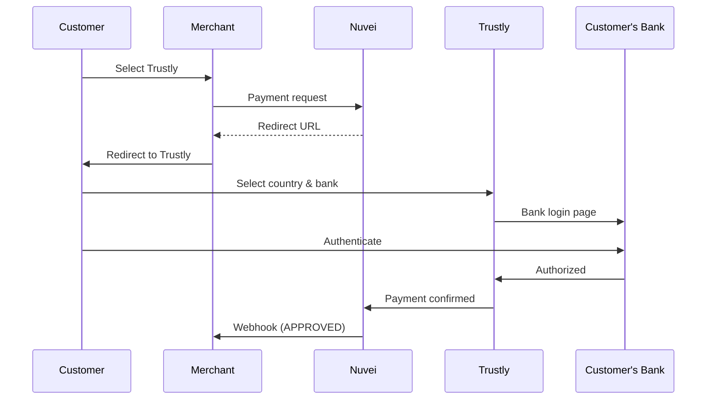

# Trustly

<Info>
  **Payment Method ID:** `apmgw_Trustly`  
  **Type:** Bank Transfer  
  **Countries:** 29 European countries  
  **Currencies:** EUR, SEK, NOK, DKK, GBP, PLN  
  **Features:** Payments + Payouts
</Info>

Trustly is a pan-European online banking payment method that supports both payments and payouts across 29 countries. It's particularly strong in the Nordic region.

## How Trustly Works



## Quick Start

### Payment Request

```json
POST /ppp/api/v1/payment.do

{
  "sessionToken": "<sessionToken>",
  "merchantId": "<merchantId>",
  "merchantSiteId": "<merchantSiteId>",
  "clientRequestId": "<unique_request_id>",
  "clientUniqueId": "order_EU_789",
  "amount": "150.00",
  "currency": "EUR",
  
  "paymentOption": {
    "alternativePaymentMethod": {
      "paymentMethod": "apmgw_Trustly"
    }
  },
  
  "billingAddress": {
    "firstName": "Erik",
    "lastName": "Andersson",
    "email": "erik@example.se",
    "country": "SE"
  },
  
  "urlDetails": {
    "successUrl": "https://shop.example.com/success",
    "failureUrl": "https://shop.example.com/failure",
    "notificationUrl": "https://shop.example.com/webhooks"
  },
  
  "timeStamp": "<YYYYMMDDHHmmss>",
  "checksum": "<checksum>"
}
```

## Supported Countries

### Nordic Countries
| Country | Currency |
|---------|----------|
| Sweden 🇸🇪 | SEK |
| Norway 🇳🇴 | NOK |
| Finland 🇫🇮 | EUR |
| Denmark 🇩🇰 | DKK |

### Western Europe
| Country | Currency |
|---------|----------|
| Germany 🇩🇪 | EUR |
| Netherlands 🇳🇱 | EUR |
| UK 🇬🇧 | GBP |
| Austria 🇦🇹 | EUR |
| Belgium 🇧🇪 | EUR |

### Eastern Europe
| Country | Currency |
|---------|----------|
| Poland 🇵🇱 | PLN |
| Estonia 🇪🇪 | EUR |
| Latvia 🇱🇻 | EUR |
| Lithuania 🇱🇹 | EUR |

## Trustly Payouts

Send instant payouts to customer bank accounts:

```json
POST /ppp/api/v1/payout.do

{
  "merchantId": "<merchantId>",
  "merchantSiteId": "<merchantSiteId>",
  "sessionToken": "<sessionToken>",
  "clientRequestId": "<unique_request_id>",
  "userTokenId": "customer_123",
  "clientUniqueId": "payout_456",
  "amount": "100.00",
  "currency": "EUR",
  
  "paymentOption": {
    "alternativePaymentMethod": {
      "paymentMethod": "apmgw_Trustly"
    }
  },
  
  "userDetails": {
    "firstName": "Erik",
    "lastName": "Andersson",
    "email": "erik@example.se",
    "country": "SE"
  },
  
  "timeStamp": "<YYYYMMDDHHmmss>",
  "checksum": "<checksum>"
}
```

## Feature Support

| Feature | Supported |
|---------|-----------|
| Refunds | ✅ Full & Partial |
| Recurring | ✅ Select markets |
| Payouts | ✅ |
| Instant | ✅ Real-time |

## Testing

Trustly provides a sandbox environment with test bank credentials:

| Field | Test Value |
|-------|------------|
| Country | Any supported |
| Bank | Test Bank |
| Username | test |
| Password | test |

## Best Practices

<AccordionGroup>
  <Accordion title="Nordic coverage" icon="snowflake">
    Trustly is the best single solution for covering all Nordic countries.
  </Accordion>
  
  <Accordion title="Use for payouts" icon="money-bill-transfer">
    Trustly's payout capability makes it ideal for marketplaces and refund-heavy businesses.
  </Accordion>
  
  <Accordion title="Recurring payments" icon="repeat">
    In supported markets, Trustly can store bank account details for recurring charges.
  </Accordion>
</AccordionGroup>

## Related

<CardGroup cols={2}>
  <Card title="Europe APMs" icon="map" href="/apms/europe/overview">
    All European methods
  </Card>
  <Card title="Payouts" icon="money-bill-transfer" href="/integrations/features/payouts">
    Payout guide
  </Card>
</CardGroup>
