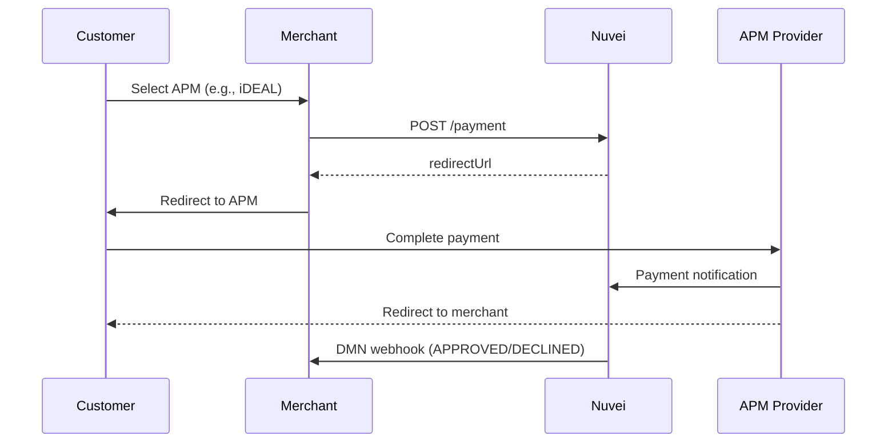
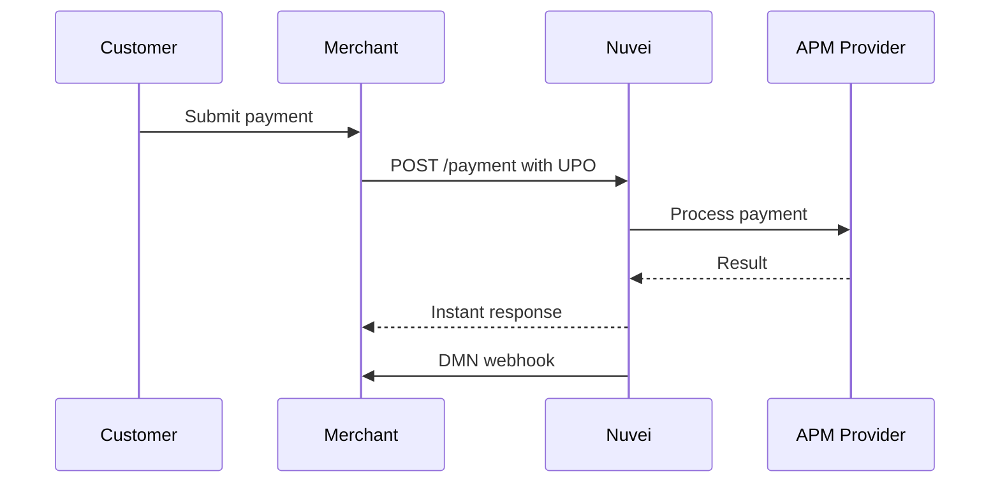

# Alternative Payment Methods (APMs)

Expand your payment acceptance beyond cards with Nuvei's extensive network of 700+ alternative payment methods across 200+ markets.

<Note>
  APMs are configured per merchant account. Contact your Nuvei account manager to enable specific payment methods.
</Note>

## Why APMs?

<CardGroup cols={2}>
  <Card title="Higher Conversion" icon="chart-line">
    Customers prefer local payment methods they trust
  </Card>
  <Card title="Lower Costs" icon="money-bill">
    Many APMs have lower transaction fees than cards
  </Card>
  <Card title="New Markets" icon="globe">
    Accept payments in markets with low card penetration
  </Card>
  <Card title="Less Fraud" icon="shield-check">
    Bank-based methods have built-in verification
  </Card>
</CardGroup>

## APM Categories

### Digital Wallets

Global and regional e-wallets for fast, secure payments.

<CardGroup cols={3}>
  <Card title="PayPal" icon="paypal" href="/apms/wallets/paypal">
    Global digital wallet
  </Card>
  <Card title="Apple Pay" icon="apple" href="/apms/wallets/apple-pay">
    iOS and Safari payments
  </Card>
  <Card title="Google Pay" icon="google" href="/apms/wallets/google-pay">
    Android and Chrome
  </Card>
</CardGroup>

### Bank Transfers (Europe)

Real-time bank transfer methods popular in European markets.

<CardGroup cols={3}>
  <Card title="iDEAL" icon="building-columns" href="/apms/europe/ideal">
    Netherlands #1 method
  </Card>
  <Card title="Sofort" icon="building-columns" href="/apms/europe/sofort">
    Germany & Austria
  </Card>
  <Card title="Bancontact" icon="credit-card" href="/apms/europe/bancontact">
    Belgium
  </Card>
</CardGroup>

### Buy Now Pay Later (BNPL)

Installment payment solutions for higher conversion on larger purchases.

<CardGroup cols={3}>
  <Card title="Klarna" icon="clock" href="/apms/bnpl/klarna">
    Pay in installments
  </Card>
  <Card title="Afterpay" icon="clock" href="/apms/bnpl/afterpay">
    4 interest-free payments
  </Card>
  <Card title="Affirm" icon="clock" href="/apms/bnpl/affirm">
    US installment payments
  </Card>
</CardGroup>

### Local Payment Methods

Regional methods with high adoption in specific markets.

<CardGroup cols={3}>
  <Card title="PIX" icon="bolt" href="/apms/americas/pix">
    Brazil instant payments
  </Card>
  <Card title="UPI" icon="mobile" href="/apms/apac/upi">
    India unified payments
  </Card>
  <Card title="OXXO" icon="store" href="/apms/americas/oxxo">
    Mexico cash voucher
  </Card>
</CardGroup>

## APMs by Region

### Europe

| Method | Countries | Type | Payouts | Refunds | Recurring |
|--------|-----------|------|---------|---------|-----------|
| [iDEAL](/apms/europe/ideal) | Netherlands | Bank Transfer | ✅ | ✅ | ❌ |
| [Sofort](/apms/europe/sofort) | Germany, Austria, Switzerland | Bank Transfer | ✅ | ✅ | ❌ |
| [Bancontact](/apms/europe/bancontact) | Belgium | Cards + Bank | ✅ | ✅ | ✅ |
| [giropay](/apms/europe/giropay) | Germany | Bank Transfer | ❌ | ✅ | ❌ |
| [EPS](/apms/europe/eps) | Austria | Bank Transfer | ❌ | ✅ | ❌ |
| [Przelewy24](/apms/europe/przelewy24) | Poland | Bank Transfer | ❌ | ✅ | ❌ |
| [Trustly](/apms/europe/trustly) | Nordics, EU | Bank Transfer | ✅ | ✅ | ❌ |
| [Multibanco](/apms/europe/multibanco) | Portugal | Bank Reference | ❌ | ✅ | ❌ |
| [SEPA](/apms/europe/sepa) | Eurozone | Direct Debit | ✅ | ✅ | ✅ |

### Americas

| Method | Countries | Type | Payouts | Refunds | Recurring |
|--------|-----------|------|---------|---------|-----------|
| [PIX](/apms/americas/pix) | Brazil | Instant Payment | ✅ | ✅ | ❌ |
| [Boleto](/apms/americas/boleto) | Brazil | Bank Slip | ❌ | ✅ | ❌ |
| [OXXO](/apms/americas/oxxo) | Mexico | Cash Voucher | ❌ | ✅ | ❌ |
| [PSE](/apms/americas/pse) | Colombia | Bank Transfer | ❌ | ✅ | ❌ |
| [Interac](/apms/americas/interac) | Canada | Bank Transfer | ✅ | ✅ | ❌ |
| [ACH](/apms/americas/ach) | USA | Bank Debit | ✅ | ✅ | ✅ |

### Asia-Pacific

| Method | Countries | Type | Payouts | Refunds | Recurring |
|--------|-----------|------|---------|---------|-----------|
| [UPI](/apms/apac/upi) | India | Instant Payment | ❌ | ✅ | ❌ |
| [Alipay](/apms/apac/alipay) | China | Wallet | ❌ | ✅ | ❌ |
| [WeChat Pay](/apms/apac/wechat-pay) | China | Wallet | ❌ | ✅ | ❌ |
| [GrabPay](/apms/apac/grabpay) | Southeast Asia | Wallet | ❌ | ✅ | ❌ |
| [POLi](/apms/apac/poli) | Australia, NZ | Bank Transfer | ❌ | ❌ | ❌ |
| [PayNow](/apms/apac/paynow) | Singapore | Instant Payment | ❌ | ✅ | ❌ |

## APM Integration

APMs work with all Nuvei integration methods. See the [APM Integration Guide](/apms/integration) for details.

<Tabs>
  <Tab title="Payment Page">
    APMs appear automatically based on customer location:
    
    ```
    https://secure.nuvei.com/ppp/purchase.do?
      merchant_id=<merchantId>&
      merchant_site_id=<merchantSiteId>&
      currency=EUR&
      amount=100.00&
      country=NL
    ```
    
    iDEAL and other Dutch methods automatically display.
  </Tab>
  <Tab title="Simply Connect">
    Enable APMs in checkout configuration:
    
    ```javascript
    checkout({
      sessionToken: "<sessionToken>",
      amount: "100.00",
      currency: "EUR",
      country: "NL",
      // APMs auto-display based on country/currency
      // Or explicitly filter:
      paymentMethods: {
        include: ["apmgw_iDeal", "cc_card"]
      }
    });
    ```
  </Tab>
  <Tab title="REST API">
    Get available APMs for a country:
    
    ```json
    POST /ppp/api/v1/getMerchantPaymentMethods.do
    
    {
      "sessionToken": "<sessionToken>",
      "merchantId": "<merchantId>",
      "merchantSiteId": "<merchantSiteId>",
      "countryCode": "NL",
      "currencyCode": "EUR"
    }
    ```
    
    Then submit payment with the APM:
    
    ```json
    POST /ppp/api/v1/payment.do
    
    {
      "paymentOption": {
        "alternativePaymentMethod": {
          "paymentMethod": "apmgw_iDeal",
          "BIC": "INGBNL2A"
        }
      }
    }
    ```
  </Tab>
</Tabs>

## APM Workflow Types

### Redirect Flow (Most Common)

Customer is redirected to the APM provider to complete payment.



### Direct Flow

Customer completes payment on merchant's page (e.g., PayPal Billing Agreements).



## APM Features

### Payouts

Send funds to customers via their APM account:

```json
POST /ppp/api/v1/payout.do

{
  "userTokenId": "<userTokenId>",
  "userPaymentOptionId": "<userPaymentOptionId>",
  "amount": "50.00",
  "currency": "EUR"
}
```

<Note>
  Payouts require an existing UPO from a previous deposit. Not all APMs support payouts.
</Note>

### Refunds

Refund APM transactions the same way as card transactions:

```json
POST /ppp/api/v1/refundTransaction.do

{
  "relatedTransactionId": "<transactionId>",
  "amount": "50.00",
  "currency": "EUR"
}
```

### Recurring Payments

Some APMs support recurring/subscription payments:

- **PayPal Billing Agreements**: Sign once, charge repeatedly
- **SEPA Direct Debit**: Recurring bank debits
- **Bancontact**: Card-on-file recurring

## Browse by Category

<CardGroup cols={2}>
  <Card title="Europe" icon="earth-europe" href="/apms/europe/overview">
    iDEAL, Sofort, Bancontact, and 15+ more
  </Card>
  <Card title="Americas" icon="earth-americas" href="/apms/americas/overview">
    PIX, Boleto, OXXO, Interac, and more
  </Card>
  <Card title="Asia-Pacific" icon="earth-asia" href="/apms/apac/overview">
    UPI, Alipay, WeChat Pay, GrabPay
  </Card>
  <Card title="Digital Wallets" icon="wallet" href="/apms/wallets/overview">
    PayPal, Apple Pay, Google Pay
  </Card>
  <Card title="BNPL" icon="clock" href="/apms/bnpl/overview">
    Klarna, Afterpay, Affirm
  </Card>
  <Card title="Integration Guide" icon="code" href="/apms/integration">
    How to integrate APMs
  </Card>
</CardGroup>
