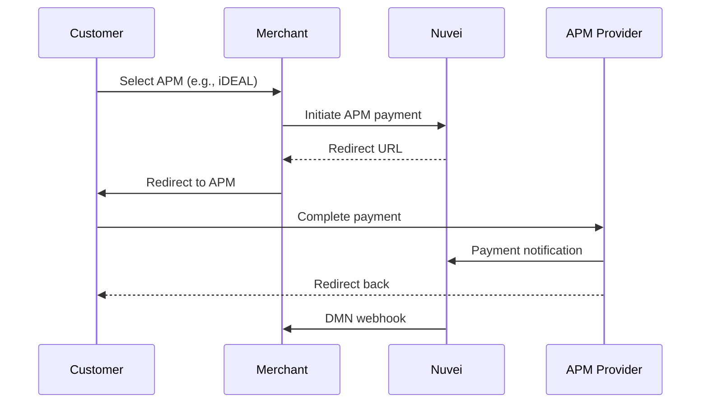

# Alternative Payment Methods (APMs)

Expand your payment acceptance beyond cards with Nuvei's extensive network of 700+ alternative payment methods across 200+ markets.

<Note>
  APMs are configured per merchant account. Contact your Nuvei account manager to enable specific payment methods.
</Note>

## Why APMs?

<CardGroup cols={2}>
  <Card title="Higher Conversion" icon="chart-line">
    Customers prefer local payment methods they trust
  </Card>
  <Card title="Lower Costs" icon="money-bill">
    Many APMs have lower transaction fees than cards
  </Card>
  <Card title="New Markets" icon="globe">
    Accept payments in markets with low card penetration
  </Card>
  <Card title="Less Fraud" icon="shield-check">
    Bank-based methods have built-in verification
  </Card>
</CardGroup>

## Payment Method Categories

### Digital Wallets

<CardGroup cols={3}>
  <Card title="Apple Pay" icon="apple" href="/apms/wallets/apple-pay">
    iOS and Safari payments
  </Card>
  <Card title="Google Pay" icon="google" href="/apms/wallets/google-pay">
    Android and Chrome
  </Card>
  <Card title="PayPal" icon="paypal" href="/apms/wallets/paypal">
    Global digital wallet
  </Card>
</CardGroup>

### Bank Transfers

<CardGroup cols={3}>
  <Card title="iDEAL" icon="building-columns" href="/apms/bank/ideal">
    Netherlands #1 method
  </Card>
  <Card title="Sofort" icon="building-columns" href="/apms/bank/sofort">
    Germany & Austria
  </Card>
  <Card title="Bancontact" icon="building-columns" href="/apms/bank/bancontact">
    Belgium
  </Card>
</CardGroup>

### Buy Now Pay Later (BNPL)

<CardGroup cols={3}>
  <Card title="Klarna" icon="clock" href="/apms/bnpl/klarna">
    Pay in installments
  </Card>
  <Card title="Afterpay" icon="clock" href="/apms/bnpl/afterpay">
    4 interest-free payments
  </Card>
  <Card title="Affirm" icon="clock" href="/apms/bnpl/affirm">
    US installment payments
  </Card>
</CardGroup>

### Local Methods

<CardGroup cols={3}>
  <Card title="PIX" icon="bolt" href="/apms/local/pix">
    Brazil instant payments
  </Card>
  <Card title="UPI" icon="mobile" href="/apms/local/upi">
    India unified payments
  </Card>
  <Card title="OXXO" icon="store" href="/apms/local/oxxo">
    Mexico cash voucher
  </Card>
</CardGroup>

## APMs by Region

### Europe
| Method | Countries | Type |
|--------|-----------|------|
| iDEAL | Netherlands | Bank Transfer |
| Sofort | Germany, Austria | Bank Transfer |
| Bancontact | Belgium | Cards + Bank |
| giropay | Germany | Bank Transfer |
| eps | Austria | Bank Transfer |
| Przelewy24 | Poland | Bank Transfer |
| Trustly | Nordics, EU | Bank Transfer |
| Multibanco | Portugal | Bank Reference |

### Americas
| Method | Countries | Type |
|--------|-----------|------|
| PIX | Brazil | Instant Payment |
| Boleto | Brazil | Bank Slip |
| OXXO | Mexico | Cash Voucher |
| PSE | Colombia | Bank Transfer |
| ACH | USA | Bank Debit |
| Interac | Canada | Bank Transfer |

### Asia-Pacific
| Method | Countries | Type |
|--------|-----------|------|
| UPI | India | Instant Payment |
| PayNow | Singapore | Instant Payment |
| GrabPay | Southeast Asia | Wallet |
| Alipay | China | Wallet |
| WeChat Pay | China | Wallet |
| POLi | Australia, NZ | Bank Transfer |

## Integration

APMs work with all Nuvei integration methods:

<Tabs>
  <Tab title="Payment Page">
    APMs appear automatically based on customer location:
    
    ```json
    {
      "merchantId": "<merchantId>",
      "merchantSiteId": "<merchantSiteId>",
      "currency": "EUR",
      "amount": "100.00",
      "country": "NL"  // Shows iDEAL for Netherlands
    }
    ```
  </Tab>
  <Tab title="Simply Connect">
    Enable APMs in checkout configuration:
    
    ```javascript
    checkout({
      sessionToken: "<sessionToken>",
      amount: "100.00",
      currency: "EUR",
      country: "NL",
      // APMs auto-display based on country
      paymentMethods: {
        // Or explicitly specify
        include: ["apmgw_iDEAL", "cc_card"]
      }
    });
    ```
  </Tab>
  <Tab title="REST API">
    Get available APMs for a country:
    
    ```json
    POST /ppp/api/v1/getApms.do
    
    {
      "sessionToken": "<sessionToken>",
      "merchantId": "<merchantId>",
      "merchantSiteId": "<merchantSiteId>",
      "countryCode": "NL",
      "currencyCode": "EUR"
    }
    ```
  </Tab>
</Tabs>

## APM Flow

Most APMs follow a redirect flow:



## Coming Soon

<Info>
  Full APM documentation for each payment method is being added. This includes:
  
  - Individual method integration guides
  - Testing credentials for sandbox
  - Error codes and handling
  - Regional configuration options
</Info>

## Quick Links

<CardGroup cols={2}>
  <Card title="Payment Page" icon="credit-card" href="/integrations/payment-page/overview">
    Hosted checkout with APMs
  </Card>
  <Card title="Simply Connect" icon="code" href="/integrations/simply-connect/overview">
    Embedded APM checkout
  </Card>
  <Card title="Webhooks" icon="bell" href="/integrations/features/webhooks">
    APM payment notifications
  </Card>
  <Card title="Contact Sales" icon="phone" href="https://nuvei.com/contact">
    Enable specific APMs
  </Card>
</CardGroup>
