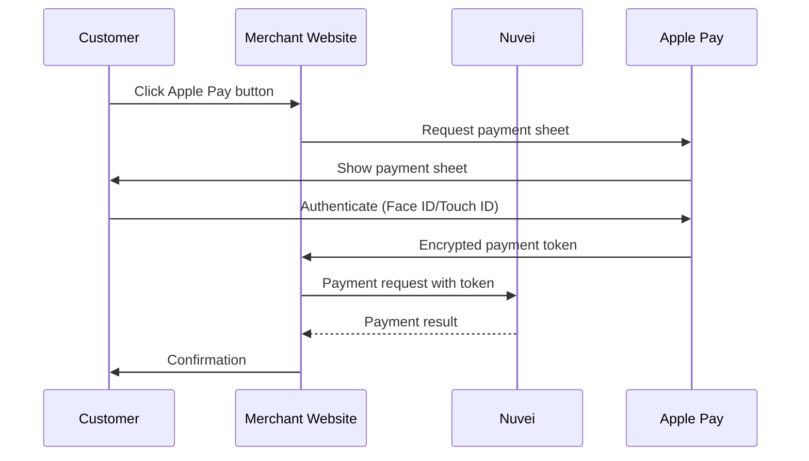

# Apple Pay

<Info>
  **Payment Method ID:** `apmgw_ApplePay`  
  **Type:** Digital Wallet  
  **Devices:** iPhone, iPad, Mac, Apple Watch  
  **Countries:** 70+ countries  
  **Currencies:** Multi-currency
</Info>

Apple Pay provides fast, secure checkout on Apple devices using Face ID, Touch ID, or passcode. With over 500 million users, it delivers high conversion rates and reduced cart abandonment.

## How Apple Pay Works



## Quick Start

### 1. Configure Apple Pay

Before integration, complete Apple Pay merchant setup:

1. Create Apple Developer account
2. Generate Merchant ID certificate
3. Register domains with Apple
4. Provide certificate to Nuvei

### 2. Add Apple Pay Button

```html
<div id="apple-pay-container">
  <apple-pay-button 
    buttonstyle="black" 
    type="buy" 
    locale="en">
  </apple-pay-button>
</div>

<script>
  if (window.ApplePaySession && ApplePaySession.canMakePayments()) {
    document.getElementById('apple-pay-container').style.display = 'block';
  }
</script>
```

### 3. Create Payment Request

```javascript
const paymentRequest = {
  countryCode: 'US',
  currencyCode: 'USD',
  supportedNetworks: ['visa', 'masterCard', 'amex', 'discover'],
  merchantCapabilities: ['supports3DS'],
  total: {
    label: 'Your Store',
    amount: '99.99'
  }
};

const session = new ApplePaySession(3, paymentRequest);

session.onvalidatemerchant = async (event) => {
  // Call Nuvei to validate merchant
  const merchantSession = await validateMerchant(event.validationURL);
  session.completeMerchantValidation(merchantSession);
};

session.onpaymentauthorized = async (event) => {
  // Send token to Nuvei
  const result = await processPayment(event.payment.token);
  session.completePayment(
    result.success 
      ? ApplePaySession.STATUS_SUCCESS 
      : ApplePaySession.STATUS_FAILURE
  );
};

session.begin();
```

### 4. Send to Nuvei

```json
POST /ppp/api/v1/payment.do

{
  "sessionToken": "<sessionToken>",
  "merchantId": "<merchantId>",
  "merchantSiteId": "<merchantSiteId>",
  "clientRequestId": "<unique_request_id>",
  "clientUniqueId": "order_AP_123",
  "amount": "99.99",
  "currency": "USD",
  
  "paymentOption": {
    "card": {
      "externalToken": {
        "externalTokenProvider": "ApplePay",
        "mobileToken": "<apple_pay_token_json>"
      }
    }
  },
  
  "billingAddress": {
    "firstName": "John",
    "lastName": "Smith",
    "email": "john@example.com",
    "country": "US"
  },
  
  "deviceDetails": {
    "deviceType": "MOBILE"
  },
  
  "timeStamp": "<YYYYMMDDHHmmss>",
  "checksum": "<checksum>"
}
```

## Web Payment Request API

For simpler web integration, use Payment Request API:

```javascript
const paymentRequest = new PaymentRequest(
  [{
    supportedMethods: 'https://apple.com/apple-pay',
    data: {
      version: 3,
      merchantIdentifier: 'merchant.com.yourstore',
      merchantCapabilities: ['supports3DS'],
      supportedNetworks: ['visa', 'masterCard'],
      countryCode: 'US'
    }
  }],
  {
    total: {
      label: 'Total',
      amount: { currency: 'USD', value: '99.99' }
    }
  }
);

const response = await paymentRequest.show();
// Send response.details to Nuvei
```

## Feature Support

| Feature | Supported |
|---------|-----------|
| Web | ✅ Safari on Mac/iOS |
| In-App | ✅ Native iOS/watchOS |
| 3D Secure | ✅ Built-in |
| Recurring | ✅ |
| Express Checkout | ✅ |
| Shipping selection | ✅ |

## Supported Countries

Apple Pay is available in 70+ countries including:

| Region | Countries |
|--------|-----------|
| North America | US, Canada |
| Europe | UK, Germany, France, Italy, Spain, Netherlands, etc. |
| Asia Pacific | Australia, Japan, China, Singapore, Hong Kong |
| Middle East | UAE, Saudi Arabia, Israel |

## Button Styles

| Style | Use Case |
|-------|----------|
| `black` | Light backgrounds |
| `white` | Dark backgrounds |
| `white-outline` | Light backgrounds, secondary |

| Type | Use Case |
|------|----------|
| `buy` | Single purchase |
| `pay` | General payment |
| `check-out` | Shopping cart |
| `donate` | Donations |
| `subscribe` | Subscriptions |

## Express Checkout

Enable one-tap checkout without filling shipping/billing:

```javascript
const paymentRequest = {
  requiredShippingContactFields: ['postalAddress', 'email', 'phone'],
  requiredBillingContactFields: ['postalAddress'],
  shippingMethods: [
    {
      label: 'Standard Shipping',
      amount: '5.00',
      identifier: 'standard',
      detail: '3-5 business days'
    },
    {
      label: 'Express Shipping',
      amount: '15.00',
      identifier: 'express',
      detail: '1-2 business days'
    }
  ],
  // ... rest of config
};
```

## Testing

### Sandbox Testing

1. Use Apple Sandbox tester account
2. Add test cards in Wallet app
3. Test on real device (simulator doesn't support Apple Pay)

### Test Cards

| Card Type | Number |
|-----------|--------|
| Visa | 4761 1200 1000 0492 |
| Mastercard | 5204 2477 5000 1471 |

## Best Practices

<AccordionGroup>
  <Accordion title="Button placement" icon="hand-pointer">
    Place Apple Pay button prominently at checkout. Consider adding to product pages for express checkout.
  </Accordion>
  
  <Accordion title="Feature detection" icon="magnifying-glass">
    Always check `ApplePaySession.canMakePayments()` before showing button.
  </Accordion>
  
  <Accordion title="Safari requirement" icon="compass">
    Apple Pay on web only works in Safari. Show alternative for other browsers.
  </Accordion>
  
  <Accordion title="Domain registration" icon="globe">
    Register all domains where Apple Pay will be used with Apple.
  </Accordion>
</AccordionGroup>

## Error Handling

| Error | Cause | Solution |
|-------|-------|----------|
| `InvalidAccessError` | Domain not registered | Register domain with Apple |
| `NotSupportedError` | Browser doesn't support | Check Safari/device |
| Session cancelled | User cancelled | Show alternative payment |

## Related

<CardGroup cols={2}>
  <Card title="Google Pay" icon="google" href="/apms/wallets/google-pay">
    Android wallet
  </Card>
  <Card title="Wallets Overview" icon="wallet" href="/apms/wallets/overview">
    All wallet methods
  </Card>
</CardGroup>
