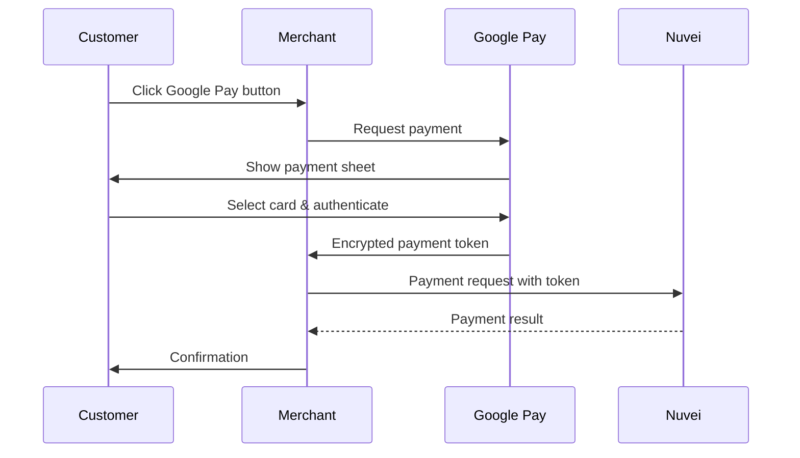

# Google Pay

<Info>
  **Payment Method ID:** `apmgw_GooglePay`  
  **Type:** Digital Wallet  
  **Platforms:** Android, Chrome, Web  
  **Countries:** 90+ countries  
  **Currencies:** Multi-currency
</Info>

Google Pay enables fast, secure payments across Android devices and Chrome browsers. With cards stored in Google accounts, customers can check out in seconds.

## How Google Pay Works



## Quick Start

### 1. Include Google Pay Script

```html
<script src="https://pay.google.com/gp/p/js/pay.js" async></script>
```

### 2. Initialize Google Pay

```javascript
const paymentsClient = new google.payments.api.PaymentsClient({
  environment: 'PRODUCTION' // or 'TEST' for sandbox
});

const baseRequest = {
  apiVersion: 2,
  apiVersionMinor: 0
};

const tokenizationSpecification = {
  type: 'PAYMENT_GATEWAY',
  parameters: {
    gateway: 'nuvei',
    gatewayMerchantId: '<your_nuvei_merchant_id>'
  }
};

const cardPaymentMethod = {
  type: 'CARD',
  parameters: {
    allowedAuthMethods: ['PAN_ONLY', 'CRYPTOGRAM_3DS'],
    allowedCardNetworks: ['VISA', 'MASTERCARD', 'AMEX', 'DISCOVER']
  },
  tokenizationSpecification
};
```

### 3. Check Availability

```javascript
const isReadyToPayRequest = {
  ...baseRequest,
  allowedPaymentMethods: [cardPaymentMethod]
};

paymentsClient.isReadyToPay(isReadyToPayRequest)
  .then(response => {
    if (response.result) {
      addGooglePayButton();
    }
  });
```

### 4. Add Button

```javascript
function addGooglePayButton() {
  const button = paymentsClient.createButton({
    onClick: onGooglePayClicked,
    buttonType: 'buy',
    buttonColor: 'black',
    buttonSizeMode: 'fill'
  });
  document.getElementById('google-pay-container').appendChild(button);
}
```

### 5. Process Payment

```javascript
async function onGooglePayClicked() {
  const paymentDataRequest = {
    ...baseRequest,
    allowedPaymentMethods: [cardPaymentMethod],
    merchantInfo: {
      merchantId: '<your_google_merchant_id>',
      merchantName: 'Your Store'
    },
    transactionInfo: {
      totalPriceStatus: 'FINAL',
      totalPrice: '99.99',
      currencyCode: 'USD',
      countryCode: 'US'
    }
  };

  try {
    const paymentData = await paymentsClient.loadPaymentData(paymentDataRequest);
    // Send to Nuvei
    await processWithNuvei(paymentData);
  } catch (err) {
    console.error('Payment failed:', err);
  }
}
```

### 6. Send to Nuvei

```json
POST /ppp/api/v1/payment.do

{
  "sessionToken": "<sessionToken>",
  "merchantId": "<merchantId>",
  "merchantSiteId": "<merchantSiteId>",
  "clientRequestId": "<unique_request_id>",
  "clientUniqueId": "order_GP_123",
  "amount": "99.99",
  "currency": "USD",
  
  "paymentOption": {
    "card": {
      "externalToken": {
        "externalTokenProvider": "GooglePay",
        "mobileToken": "<google_pay_token_json>"
      }
    }
  },
  
  "billingAddress": {
    "firstName": "John",
    "lastName": "Smith",
    "email": "john@example.com",
    "country": "US"
  },
  
  "timeStamp": "<YYYYMMDDHHmmss>",
  "checksum": "<checksum>"
}
```

## Feature Support

| Feature | Supported |
|---------|-----------|
| Web (Chrome) | ✅ |
| Android apps | ✅ |
| iOS Safari | ❌ |
| 3D Secure | ✅ Built-in |
| Recurring | ✅ |
| Express checkout | ✅ |

## Button Options

### Button Types

| Type | Use Case |
|------|----------|
| `buy` | Single purchase |
| `pay` | General payment |
| `checkout` | Cart checkout |
| `subscribe` | Subscriptions |
| `donate` | Donations |
| `order` | Orders |

### Button Colors

| Color | Use Case |
|-------|----------|
| `black` | Light backgrounds |
| `white` | Dark backgrounds |

## Express Checkout

Request shipping and billing info:

```javascript
const paymentDataRequest = {
  // ... base config
  callbackIntents: ['SHIPPING_ADDRESS', 'SHIPPING_OPTION', 'PAYMENT_AUTHORIZATION'],
  shippingAddressRequired: true,
  shippingAddressParameters: {
    phoneNumberRequired: true,
    allowedCountryCodes: ['US', 'CA']
  },
  shippingOptionRequired: true,
  shippingOptionParameters: {
    defaultSelectedOptionId: 'standard',
    shippingOptions: [
      {
        id: 'standard',
        label: 'Standard Shipping',
        description: '3-5 business days',
        finalPrice: '5.00'
      },
      {
        id: 'express',
        label: 'Express Shipping',
        description: '1-2 business days',
        finalPrice: '15.00'
      }
    ]
  }
};
```

## Dynamic Pricing

Handle shipping selection callbacks:

```javascript
paymentsClient.createButton({
  onClick: onGooglePayClicked,
  buttonType: 'buy'
});

// Handle callbacks
function onPaymentDataChanged(intermediatePaymentData) {
  return new Promise((resolve) => {
    const { callbackTrigger, shippingAddress, shippingOptionData } = intermediatePaymentData;
    
    let paymentDataRequestUpdate = {};
    
    if (callbackTrigger === 'SHIPPING_ADDRESS') {
      // Update shipping options based on address
    }
    
    if (callbackTrigger === 'SHIPPING_OPTION') {
      // Update total based on shipping selection
    }
    
    resolve(paymentDataRequestUpdate);
  });
}
```

## Supported Countries

Google Pay is available in 90+ countries:

| Region | Examples |
|--------|----------|
| North America | US, Canada |
| Europe | UK, Germany, France, Italy, Spain |
| Asia Pacific | Australia, Japan, Singapore, India |
| Latin America | Brazil, Mexico, Argentina |

## Testing

### Test Environment

Set environment to `TEST`:

```javascript
const paymentsClient = new google.payments.api.PaymentsClient({
  environment: 'TEST'
});
```

### Test Cards

| Card | Number |
|------|--------|
| Visa | 4111 1111 1111 1111 |
| Mastercard | 5555 5555 5555 4444 |

## Best Practices

<AccordionGroup>
  <Accordion title="Early detection" icon="check">
    Call `isReadyToPay()` early to know if Google Pay is available before checkout.
  </Accordion>
  
  <Accordion title="Button styling" icon="palette">
    Follow Google's brand guidelines. Don't modify button appearance.
  </Accordion>
  
  <Accordion title="Cross-browser" icon="window">
    Google Pay works in Chrome and many Android browsers. Have fallback for others.
  </Accordion>
  
  <Accordion title="Pre-authorize" icon="shield">
    Use CRYPTOGRAM_3DS for strong authentication when available.
  </Accordion>
</AccordionGroup>

## Error Handling

| Error | Cause | Solution |
|-------|-------|----------|
| `BUYER_ACCOUNT_ERROR` | No payment methods | Show alternative payment |
| `DEVELOPER_ERROR` | Config issue | Check merchant ID |
| `CANCELED` | User cancelled | Handle gracefully |

## Related

<CardGroup cols={2}>
  <Card title="Apple Pay" icon="apple" href="/apms/wallets/apple-pay">
    iOS wallet
  </Card>
  <Card title="Wallets Overview" icon="wallet" href="/apms/wallets/overview">
    All wallet methods
  </Card>
</CardGroup>
