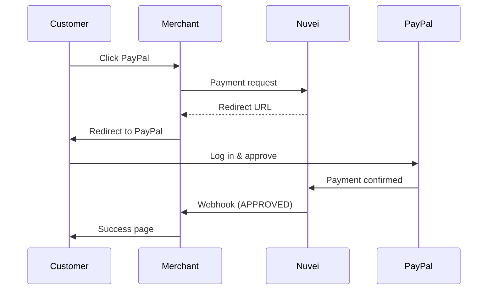
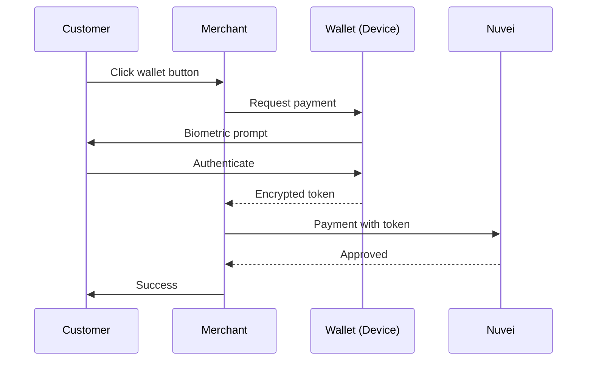

# Digital Wallets

Digital wallets provide fast, secure checkout by storing customer payment credentials. They're available globally and increasingly expected by customers.

## Popular Wallets

<CardGroup cols={3}>
  <Card title="PayPal" icon="paypal" href="/apms/wallets/paypal">
    🌍 400M+ users worldwide
  </Card>
  <Card title="Apple Pay" icon="apple" href="/apms/wallets/apple-pay">
    🍎 iOS & Safari
  </Card>
  <Card title="Google Pay" icon="google" href="/apms/wallets/google-pay">
    🤖 Android & Chrome
  </Card>
</CardGroup>

## Wallet Comparison

| Wallet | Global Users | Platforms | Tokenized | One-Click |
|--------|-------------|-----------|-----------|-----------|
| PayPal | 400M+ | All | ✅ | ✅ |
| Apple Pay | 500M+ | iOS, Safari | ✅ | ✅ |
| Google Pay | 150M+ | Android, Chrome | ✅ | ✅ |

## Why Offer Wallets?

<AccordionGroup>
  <Accordion title="Higher conversion rates" icon="chart-line">
    Wallet payments convert 20-30% higher than manual card entry. Customers don't need to type card numbers.
  </Accordion>
  
  <Accordion title="Stronger security" icon="shield">
    Wallets use device-level biometrics (Face ID, fingerprint) and tokenization. Merchants never see actual card numbers.
  </Accordion>
  
  <Accordion title="Mobile optimization" icon="mobile">
    Perfect for mobile checkout where typing is difficult. One tap to pay.
  </Accordion>
  
  <Accordion title="Customer trust" icon="heart">
    Customers trust familiar wallet brands, especially for first purchases from unknown merchants.
  </Accordion>
</AccordionGroup>

## Integration Overview

### Payment Page & Simply Connect

Wallets are automatically enabled based on your account configuration. Just include the script and wallets appear when available.

```javascript
// Simply Connect - wallets auto-enabled
checkout({
  sessionToken: "<sessionToken>",
  merchantId: "<merchantId>",
  merchantSiteId: "<merchantSiteId>",
  amount: "99.00",
  currency: "USD"
});
```

### REST API 2.0

For direct API integration, each wallet has a specific payment method:

<Tabs>
  <Tab title="PayPal">
    ```json
    POST /ppp/api/v1/payment.do
    
    {
      "sessionToken": "<sessionToken>",
      "merchantId": "<merchantId>",
      "merchantSiteId": "<merchantSiteId>",
      "clientRequestId": "<unique_request_id>",
      "amount": "99.00",
      "currency": "USD",
      
      "paymentOption": {
        "alternativePaymentMethod": {
          "paymentMethod": "apmgw_expresscheckout"
        }
      },
      
      "urlDetails": {
        "successUrl": "https://yoursite.com/success",
        "failureUrl": "https://yoursite.com/failure",
        "notificationUrl": "https://yoursite.com/webhooks"
      },
      
      "timeStamp": "<YYYYMMDDHHmmss>",
      "checksum": "<checksum>"
    }
    ```
  </Tab>
  
  <Tab title="Apple Pay">
    ```json
    POST /ppp/api/v1/payment.do
    
    {
      "sessionToken": "<sessionToken>",
      "merchantId": "<merchantId>",
      "merchantSiteId": "<merchantSiteId>",
      "clientRequestId": "<unique_request_id>",
      "amount": "99.00",
      "currency": "USD",
      
      "paymentOption": {
        "card": {
          "externalToken": {
            "externalTokenProvider": "ApplePay",
            "mobileToken": "<apple_pay_token>"
          }
        }
      },
      
      "timeStamp": "<YYYYMMDDHHmmss>",
      "checksum": "<checksum>"
    }
    ```
  </Tab>
  
  <Tab title="Google Pay">
    ```json
    POST /ppp/api/v1/payment.do
    
    {
      "sessionToken": "<sessionToken>",
      "merchantId": "<merchantId>",
      "merchantSiteId": "<merchantSiteId>",
      "clientRequestId": "<unique_request_id>",
      "amount": "99.00",
      "currency": "USD",
      
      "paymentOption": {
        "card": {
          "externalToken": {
            "externalTokenProvider": "GooglePay",
            "mobileToken": "<google_pay_token>"
          }
        }
      },
      
      "timeStamp": "<YYYYMMDDHHmmss>",
      "checksum": "<checksum>"
    }
    ```
  </Tab>
</Tabs>

## Feature Support

| Wallet | Refunds | Recurring | Payouts | Tokenization |
|--------|---------|-----------|---------|--------------|
| PayPal | ✅ | ✅ | ✅ | ✅ |
| Apple Pay | ✅ | ✅ | ❌ | ✅ |
| Google Pay | ✅ | ✅ | ❌ | ✅ |

## Device Detection

Show appropriate wallet buttons based on customer device:

```javascript
function getAvailableWallets() {
  const wallets = ['paypal']; // Always available
  
  // Apple Pay - Safari on Mac/iOS
  if (window.ApplePaySession && ApplePaySession.canMakePayments()) {
    wallets.push('apple-pay');
  }
  
  // Google Pay - Check via Google Pay API
  if (window.google && google.payments) {
    // Use isReadyToPay() for accurate detection
    wallets.push('google-pay');
  }
  
  return wallets;
}
```

## Wallet Payment Flows

### PayPal (Redirect)



### Apple Pay / Google Pay (In-Page)



## Best Practices

<AccordionGroup>
  <Accordion title="Show wallets prominently" icon="eye">
    Display wallet buttons at the top of checkout, before the card form. They're the fastest payment option.
  </Accordion>
  
  <Accordion title="Use official branding" icon="palette">
    Follow each wallet's brand guidelines. Use official buttons and logos.
  </Accordion>
  
  <Accordion title="Express checkout placement" icon="cart-shopping">
    Consider showing wallet buttons on product pages and cart for true "express checkout".
  </Accordion>
  
  <Accordion title="Fallback gracefully" icon="rotate">
    If a wallet fails, let customers retry with a different method without re-entering info.
  </Accordion>
</AccordionGroup>

## Quick Setup Guide

1. **Enable wallets** in your Nuvei merchant portal
2. **Add domain verification** for Apple Pay
3. **Configure Google Pay merchant ID**
4. **Test in sandbox** with test accounts
5. **Go live** - wallets appear automatically

## Quick Links

<CardGroup cols={2}>
  <Card title="PayPal" icon="paypal" href="/apms/wallets/paypal">
    Complete PayPal integration
  </Card>
  <Card title="Apple Pay" icon="apple" href="/apms/wallets/apple-pay">
    Apple Pay setup guide
  </Card>
  <Card title="Google Pay" icon="google" href="/apms/wallets/google-pay">
    Google Pay integration
  </Card>
  <Card title="Simply Connect" icon="plug" href="/integrations/simply-connect">
    Easiest wallet integration
  </Card>
</CardGroup>
