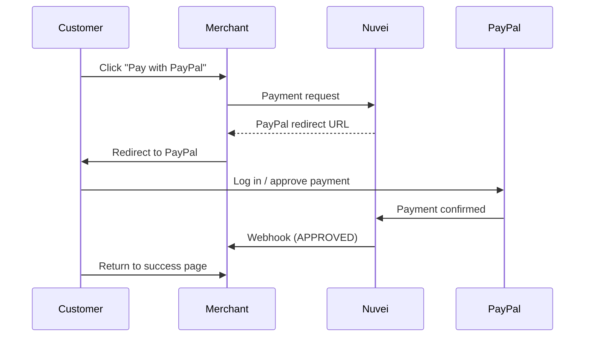

# PayPal

<Info>
  **Payment Method ID:** `apmgw_expresscheckout`  
  **Type:** E-Wallet  
  **Countries:** 200+ countries  
  **Currencies:** 25+ currencies  
  **Users:** 400+ million worldwide
</Info>

PayPal is the world's most widely used digital wallet. Customers can pay with their PayPal balance, linked bank account, or stored cards - all without sharing financial details with merchants.

## How PayPal Works



## Quick Start

### Payment Request

```json
POST /ppp/api/v1/payment.do

{
  "sessionToken": "<sessionToken>",
  "merchantId": "<merchantId>",
  "merchantSiteId": "<merchantSiteId>",
  "clientRequestId": "<unique_request_id>",
  "clientUniqueId": "order_123",
  "amount": "99.00",
  "currency": "USD",
  
  "paymentOption": {
    "alternativePaymentMethod": {
      "paymentMethod": "apmgw_expresscheckout"
    }
  },
  
  "billingAddress": {
    "firstName": "John",
    "lastName": "Smith",
    "email": "john@example.com",
    "country": "US"
  },
  
  "urlDetails": {
    "successUrl": "https://shop.example.com/success",
    "failureUrl": "https://shop.example.com/failure",
    "pendingUrl": "https://shop.example.com/pending",
    "notificationUrl": "https://shop.example.com/webhooks/nuvei"
  },
  
  "timeStamp": "<YYYYMMDDHHmmss>",
  "checksum": "<checksum>"
}
```

### Response

```json
{
  "orderId": "350728615",
  "paymentOption": {
    "redirectUrl": "https://gw-apm.nuvei.com/Home?PaymentToken=eyJhbGci...",
    "userPaymentOptionId": "86068565"
  },
  "transactionStatus": "REDIRECT",
  "clientUniqueId": "order_123",
  "status": "SUCCESS"
}
```

### Redirect Customer

```javascript
if (response.transactionStatus === 'REDIRECT') {
  window.location.href = response.paymentOption.redirectUrl;
}
```

## PayPal Billing Agreements (Recurring)

Enable recurring payments with PayPal Billing Agreements:

### Setup Agreement

```json
POST /ppp/api/v1/payment.do

{
  "sessionToken": "<sessionToken>",
  "merchantId": "<merchantId>",
  "merchantSiteId": "<merchantSiteId>",
  "clientRequestId": "<unique_request_id>",
  "clientUniqueId": "subscription_456",
  "amount": "0.00",
  "currency": "USD",
  "userTokenId": "customer_789",
  
  "paymentOption": {
    "alternativePaymentMethod": {
      "paymentMethod": "apmgw_expresscheckout",
      "submethod": "ReferenceTransaction"
    }
  },
  
  "billingAddress": {
    "firstName": "John",
    "lastName": "Smith",
    "email": "john@example.com",
    "country": "US"
  },
  
  "urlDetails": {
    "successUrl": "https://shop.example.com/success",
    "failureUrl": "https://shop.example.com/failure",
    "notificationUrl": "https://shop.example.com/webhooks/nuvei"
  },
  
  "timeStamp": "<YYYYMMDDHHmmss>",
  "checksum": "<checksum>"
}
```

### Charge Subsequent Payments

```json
POST /ppp/api/v1/payment.do

{
  "sessionToken": "<sessionToken>",
  "merchantId": "<merchantId>",
  "merchantSiteId": "<merchantSiteId>",
  "clientRequestId": "<unique_request_id>",
  "clientUniqueId": "subscription_456_renewal",
  "amount": "29.99",
  "currency": "USD",
  "userTokenId": "customer_789",
  "isRebilling": "1",
  
  "paymentOption": {
    "userPaymentOptionId": "86068565"
  },
  
  "timeStamp": "<YYYYMMDDHHmmss>",
  "checksum": "<checksum>"
}
```

## PayPal Payouts

Send money to PayPal accounts:

```json
POST /ppp/api/v1/payout.do

{
  "merchantId": "<merchantId>",
  "merchantSiteId": "<merchantSiteId>",
  "sessionToken": "<sessionToken>",
  "clientRequestId": "<unique_request_id>",
  "userTokenId": "customer_789",
  "clientUniqueId": "payout_123",
  "amount": "50.00",
  "currency": "USD",
  
  "paymentOption": {
    "alternativePaymentMethod": {
      "paymentMethod": "apmgw_expresscheckout",
      "paypal_payer_email": "recipient@example.com"
    }
  },
  
  "timeStamp": "<YYYYMMDDHHmmss>",
  "checksum": "<checksum>"
}
```

## Refunds

```json
POST /ppp/api/v1/refundTransaction.do

{
  "merchantId": "<merchantId>",
  "merchantSiteId": "<merchantSiteId>",
  "clientRequestId": "<unique_request_id>",
  "relatedTransactionId": "7110000000011234571",
  "amount": "50.00",
  "currency": "USD",
  "authCode": "<original_auth_code>",
  "timeStamp": "<YYYYMMDDHHmmss>",
  "checksum": "<checksum>"
}
```

<Note>
  PayPal refunds typically appear in the customer's account within minutes.
</Note>

## Feature Support

| Feature | Supported |
|---------|-----------|
| Refunds | ✅ Full & Partial |
| Recurring | ✅ Via Billing Agreement |
| Payouts | ✅ |
| Tokenization | ✅ |
| Express Checkout | ✅ |
| Pay Later (BNPL) | ✅ (select markets) |

## Testing

### Sandbox Credentials

Create test accounts at [developer.paypal.com](https://developer.paypal.com)

| Type | Email | Password |
|------|-------|----------|
| Buyer | SCTest1@gmail.com | 123456Aa |

### Test Flow

1. Submit payment request to Nuvei sandbox
2. Redirect to PayPal sandbox
3. Log in with test buyer credentials
4. Approve payment
5. Return to your site
6. Receive webhook

## Error Handling

### Common Errors

| Error Code | Reason | Solution |
|------------|--------|----------|
| `1401` | Customer cancelled | User closed PayPal without paying |
| `1402` | PayPal declined | Check customer's PayPal account |
| `1500` | Agreement failed | Billing agreement not set up |

### Frontend Example

```javascript
async function payWithPayPal(orderData) {
  try {
    const response = await fetch('/api/paypal-payment', {
      method: 'POST',
      headers: { 'Content-Type': 'application/json' },
      body: JSON.stringify(orderData)
    });
    
    const data = await response.json();
    
    if (data.transactionStatus === 'REDIRECT') {
      // Save order state before redirect
      sessionStorage.setItem('pendingOrder', orderData.orderId);
      window.location.href = data.paymentOption.redirectUrl;
    } else if (data.status === 'ERROR') {
      showError('PayPal payment failed. Please try again.');
    }
  } catch (error) {
    showError('Network error. Please try again.');
  }
}

// On return from PayPal
window.addEventListener('load', async () => {
  const pendingOrder = sessionStorage.getItem('pendingOrder');
  if (pendingOrder && window.location.pathname === '/success') {
    // Verify payment via your backend
    const status = await verifyOrder(pendingOrder);
    if (status === 'paid') {
      showSuccess('Payment successful!');
    }
    sessionStorage.removeItem('pendingOrder');
  }
});
```

## PayPal Button Styling

Use PayPal's official button for brand compliance:

```html
<!-- PayPal Button -->
<button class="paypal-button" onclick="payWithPayPal()">
  <svg class="paypal-logo" viewBox="0 0 100 32">
    <!-- PayPal logo SVG -->
  </svg>
  Pay with PayPal
</button>

<style>
.paypal-button {
  background-color: #0070ba;
  color: white;
  border: none;
  border-radius: 4px;
  padding: 12px 24px;
  font-size: 16px;
  cursor: pointer;
  display: flex;
  align-items: center;
  gap: 8px;
}
.paypal-button:hover {
  background-color: #005ea6;
}
</style>
```

## Best Practices

<AccordionGroup>
  <Accordion title="Show PayPal prominently" icon="eye">
    PayPal has strong brand recognition. Display it as a top payment option.
  </Accordion>
  
  <Accordion title="Use PayPal Pay Later" icon="calendar">
    In supported markets, enable PayPal's "Pay in 4" BNPL option to increase conversions.
  </Accordion>
  
  <Accordion title="Handle popups correctly" icon="window-restore">
    PayPal may open in a popup on some flows. Ensure popup blockers don't interfere.
  </Accordion>
  
  <Accordion title="Implement webhooks" icon="bell">
    Always verify payments via webhooks, not return URLs. Customers may close the browser early.
  </Accordion>
  
  <Accordion title="Store the UPO" icon="key">
    Save `userPaymentOptionId` for recurring charges and faster checkout.
  </Accordion>
</AccordionGroup>

## Related

<CardGroup cols={2}>
  <Card title="Wallets Overview" icon="wallet" href="/apms/wallets/overview">
    All digital wallets
  </Card>
  <Card title="Apple Pay" icon="apple" href="/apms/wallets/apple-pay">
    iOS wallet
  </Card>
  <Card title="Recurring Payments" icon="repeat" href="/integrations/features/recurring">
    Subscription setup
  </Card>
  <Card title="Payouts" icon="money-bill-transfer" href="/integrations/features/payouts">
    Send payments
  </Card>
</CardGroup>
