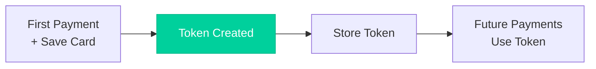

# Card Tokenization

Store card details securely to enable one-click payments for returning customers.

## Benefits

<CardGroup cols={2}>
  <Card title="Faster Checkout" icon="bolt">
    Returning customers don't re-enter cards
  </Card>
  <Card title="PCI Compliance" icon="shield-check">
    Nuvei handles card storage—reduced scope
  </Card>
  <Card title="Higher Conversion" icon="chart-line">
    Saved cards increase repeat purchases
  </Card>
  <Card title="Subscription Ready" icon="rotate">
    Enable recurring billing
  </Card>
</CardGroup>

## How It Works



## Save Card During Payment

Add `createPaymentToken: true` to save the card:

```bash
curl -X POST https://api-sandbox.nuvei.com/payment-api/payments \
  -H "Content-Type: application/json" \
  -H "x-api-key: YOUR_API_KEY" \
  -d '{
    "processingEntityId": "1234567890",
    "transactionType": "Sale",
    "amount": 100,
    "currency": "USD",
    "paymentMethod": {
      "type": "card",
      "card": {
        "cardNumber": "4000027891380961",
        "expirationMonth": "12",
        "expirationYear": "2030",
        "cvv": "217",
        "cardHolderName": "John Smith"
      },
      "createPaymentToken": true
    },
    "buyerDetails": {
      "buyerId": "customer_12345"
    }
  }'
```

### Response with Token

```json
{
  "paymentId": "375011",
  "result": {
    "status": "approved"
  },
  "authCode": "300250",
  "paymentMethod": {
    "type": "card",
    "card": {
      "bin": "400002",
      "last4Digits": "0961",
      "cardBrand": "VISA"
    },
    "paymentTokenId": "tok_abc123xyz"
  }
}
```

<Note>
  Store the `paymentTokenId` associated with the `buyerId` in your database.
</Note>

## Pay with Saved Token

Use the token for future payments:

```bash
curl -X POST https://api-sandbox.nuvei.com/payment-api/payments \
  -H "Content-Type: application/json" \
  -H "x-api-key: YOUR_API_KEY" \
  -d '{
    "processingEntityId": "1234567890",
    "transactionType": "Sale",
    "amount": 50,
    "currency": "USD",
    "paymentMethod": {
      "type": "paymentToken",
      "paymentTokenId": "tok_abc123xyz"
    },
    "buyerDetails": {
      "buyerId": "customer_12345"
    }
  }'
```

## Get Customer's Saved Cards

Retrieve all saved cards for a customer:

```bash
curl -X GET https://api-sandbox.nuvei.com/account-api/buyers/customer_12345/payment-tokens \
  -H "x-api-key: YOUR_API_KEY"
```

### Response

```json
{
  "paymentTokens": [
    {
      "paymentTokenId": "tok_abc123xyz",
      "paymentMethod": {
        "type": "card",
        "card": {
          "bin": "400002",
          "last4Digits": "0961",
          "cardBrand": "VISA",
          "expirationMonth": "12",
          "expirationYear": "2030"
        }
      },
      "createdAt": "2024-01-15T10:30:00Z"
    },
    {
      "paymentTokenId": "tok_def456abc",
      "paymentMethod": {
        "type": "card",
        "card": {
          "bin": "510510",
          "last4Digits": "5100",
          "cardBrand": "MASTERCARD",
          "expirationMonth": "06",
          "expirationYear": "2025"
        }
      },
      "createdAt": "2024-02-20T14:15:00Z"
    }
  ]
}
```

## Display Saved Cards to Customer

Show masked card details to let customers choose:

| Card | Display |
|------|---------|
| Visa ****0961 | `•••• •••• •••• 0961` |
| Mastercard ****5100 | `•••• •••• •••• 5100` |

<Warning>
  Never display full card numbers. Only show last 4 digits and card brand.
</Warning>

## Token Best Practices

<AccordionGroup>
  <Accordion title="Associate tokens with customers" icon="user">
    Always link tokens to a `buyerId` so you can retrieve them later.
  </Accordion>
  
  <Accordion title="Handle expired cards" icon="calendar-xmark">
    Check `expirationMonth`/`expirationYear` and prompt customers to update expired cards.
  </Accordion>
  
  <Accordion title="Provide card management" icon="gear">
    Let customers view and delete saved cards from their account settings.
  </Accordion>
  
  <Accordion title="Use 3DS for token payments" icon="shield-check">
    Even with tokens, you may need 3DS for certain regions or transaction amounts.
  </Accordion>
</AccordionGroup>
