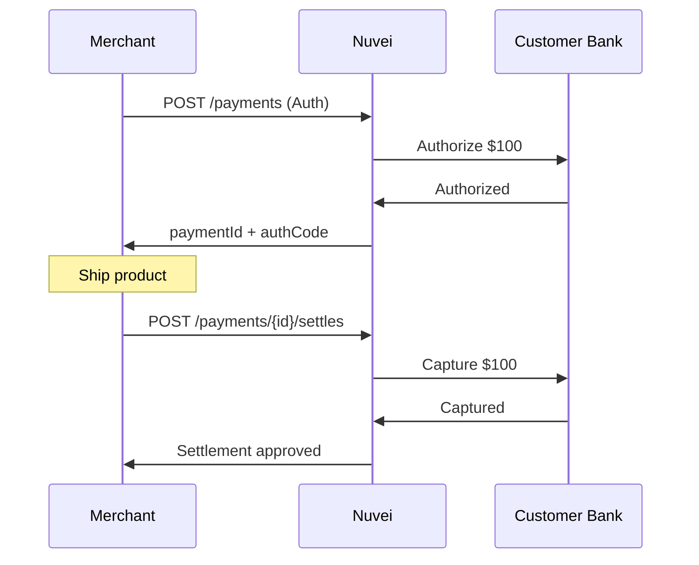

# Settlements

Capture funds from a previously authorized payment.

## When to Settle

- Order is ready to ship
- Service has been delivered
- Verification complete
- Pre-order fulfilled

<Note>
  Settlements are only needed for **Auth** transactions. **Sale** transactions capture automatically.
</Note>

## Settlement Request

<Tabs>
  <Tab title="cURL">
```bash
curl -X POST https://api-sandbox.nuvei.com/payment-api/payments/375011/settles \
  -H "Content-Type: application/json" \
  -H "x-api-key: YOUR_API_KEY" \
  -d '{
    "processingEntityId": "1234567890",
    "amount": 100,
    "currency": "USD"
  }'
```
  </Tab>
  <Tab title="JavaScript">
```javascript
const response = await fetch(
  'https://api-sandbox.nuvei.com/payment-api/payments/375011/settles',
  {
    method: 'POST',
    headers: {
      'Content-Type': 'application/json',
      'x-api-key': 'YOUR_API_KEY'
    },
    body: JSON.stringify({
      processingEntityId: '1234567890',
      amount: 100,
      currency: 'USD'
    })
  }
);

const result = await response.json();
```
  </Tab>
</Tabs>

## Partial Settlement

Capture less than the authorized amount:

```bash
curl -X POST https://api-sandbox.nuvei.com/payment-api/payments/375011/settles \
  -H "Content-Type: application/json" \
  -H "x-api-key: YOUR_API_KEY" \
  -d '{
    "processingEntityId": "1234567890",
    "amount": 75,
    "currency": "USD"
  }'
```

<Tip>
  The remaining $25 authorization will be automatically released.
</Tip>

## Response

```json
{
  "paymentId": "375011",
  "transactionId": "2110000000010964092",
  "amount": 100,
  "currency": "USD",
  "transactionType": "Settle",
  "result": {
    "status": "approved"
  },
  "authCode": "300251"
}
```

## Auth + Settle Flow



## Request Parameters

| Parameter | Type | Required | Description |
|-----------|------|----------|-------------|
| `processingEntityId` | string | ✓ | Your merchant ID |
| `amount` | number | ✓ | Amount to capture (≤ authorized) |
| `currency` | string | ✓ | Must match original |

## Settlement Rules

| Rule | Description |
|------|-------------|
| Amount | Cannot exceed authorized amount |
| Timing | Within auth expiration (7-30 days) |
| Partial | Allowed, remainder is released |
| Multiple | Only one settle per auth |

## Authorization Expiration

| Card Network | Auth Validity |
|--------------|---------------|
| Visa | 7 days |
| Mastercard | 7 days |
| Amex | 7 days |
| Discover | 10 days |

<Warning>
  If authorization expires before settlement, you'll need to create a new payment.
</Warning>

## Error Handling

```json
{
  "error": {
    "code": "AUTH_EXPIRED",
    "message": "Authorization has expired",
    "suggestion": "Create a new payment"
  }
}
```

**Common errors:**
- Authorization expired
- Already settled
- Amount exceeds authorization
- Transaction not found
