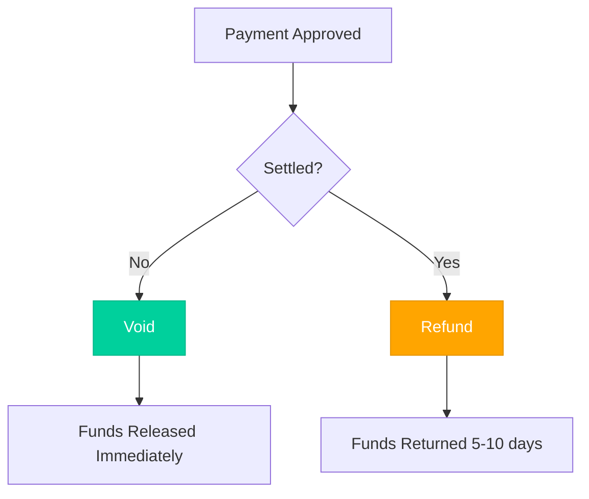

# Voids

Cancel an authorized payment before it settles to release the held funds.

## When to Void

- Customer cancels order before shipment
- Duplicate transaction detected
- Fraud suspected
- Order can't be fulfilled

<Note>
  Voids work on **Auth** transactions or same-day **Sale** transactions before settlement.
</Note>

## Void Request

<Tabs>
  <Tab title="cURL">
```bash
curl -X POST https://api-sandbox.nuvei.com/payment-api/payments/375011/voids \
  -H "Content-Type: application/json" \
  -H "x-api-key: YOUR_API_KEY" \
  -d '{
    "processingEntityId": "1234567890",
    "amount": 100,
    "currency": "USD"
  }'
```
  </Tab>
  <Tab title="JavaScript">
```javascript
const response = await fetch(
  'https://api-sandbox.nuvei.com/payment-api/payments/375011/voids',
  {
    method: 'POST',
    headers: {
      'Content-Type': 'application/json',
      'x-api-key': 'YOUR_API_KEY'
    },
    body: JSON.stringify({
      processingEntityId: '1234567890',
      amount: 100,
      currency: 'USD'
    })
  }
);

const result = await response.json();
```
  </Tab>
</Tabs>

## Response

```json
{
  "paymentId": "375011",
  "transactionId": "2110000000010964091",
  "amount": 100,
  "currency": "USD",
  "transactionType": "Void",
  "result": {
    "status": "approved"
  }
}
```

## Void vs Refund

| Aspect | Void | Refund |
|--------|------|--------|
| **When** | Before settlement | After settlement |
| **Speed** | Instant release | 5-10 days to customer |
| **Fees** | Usually no fees | May incur fees |
| **Best for** | Cancellations | Returns |



## Request Parameters

| Parameter | Type | Required | Description |
|-----------|------|----------|-------------|
| `processingEntityId` | string | ✓ | Your merchant ID |
| `amount` | number | ✓ | Amount to void |
| `currency` | string | ✓ | Must match original |
| `comment` | string | | Internal note |

## Void Timing

| Transaction Type | Void Window |
|-----------------|-------------|
| Auth | Until settled or expired (7-30 days) |
| Sale | Same day before batch settlement |

<Warning>
  If the void window has passed, you must use a refund instead.
</Warning>

## Error Handling

```json
{
  "error": {
    "code": "VOID_NOT_ALLOWED",
    "message": "Transaction has already been settled",
    "suggestion": "Use refund endpoint instead"
  }
}
```

**Common errors:**
- Transaction already settled → Use refund
- Transaction already voided
- Invalid transaction ID
