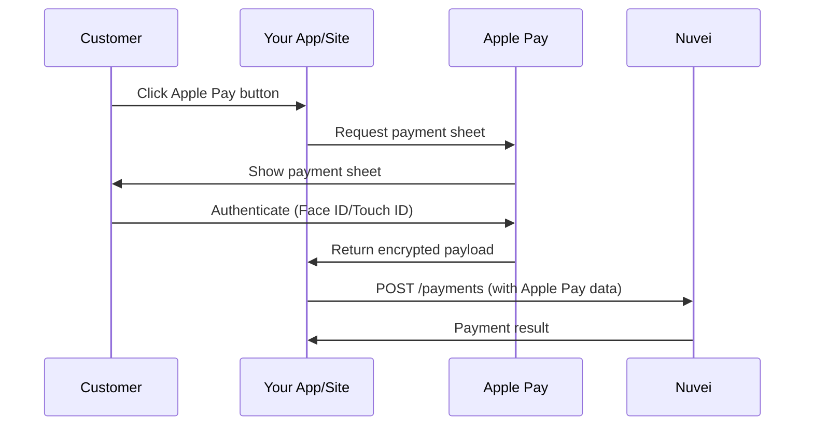

# Apple Pay

Accept Apple Pay for fast, secure one-tap payments on iPhone, iPad, Mac, and Safari.

## Overview

<CardGroup cols={2}>
  <Card title="One-Tap Checkout" icon="hand-pointer">
    Customers pay with Face ID or Touch ID
  </Card>
  <Card title="Tokenized Security" icon="shield-check">
    Apple Pay uses device-specific tokens
  </Card>
</CardGroup>

## Integration Flow



## Step 1: Display Apple Pay Button

Add the Apple Pay button to your checkout:

```html
<apple-pay-button buttonstyle="black" type="buy" locale="en"></apple-pay-button>

<script>
if (window.ApplePaySession && ApplePaySession.canMakePayments()) {
  document.querySelector('apple-pay-button').style.display = 'block';
}
</script>
```

## Step 2: Request Payment Sheet

```javascript
const paymentRequest = {
  countryCode: 'US',
  currencyCode: 'USD',
  supportedNetworks: ['visa', 'masterCard', 'amex', 'discover'],
  merchantCapabilities: ['supports3DS'],
  total: {
    label: 'Your Store',
    amount: '100.00'
  }
};

const session = new ApplePaySession(3, paymentRequest);

session.onpaymentauthorized = async (event) => {
  const applePayToken = event.payment.token;
  
  // Send to your server
  const result = await processApplePayment(applePayToken);
  
  session.completePayment(
    result.success 
      ? ApplePaySession.STATUS_SUCCESS 
      : ApplePaySession.STATUS_FAILURE
  );
};

session.begin();
```

## Step 3: Send Payment to Nuvei

<Tabs>
  <Tab title="cURL">
```bash
curl -X POST https://api-sandbox.nuvei.com/payment-api/payments \
  -H "Content-Type: application/json" \
  -H "x-api-key: YOUR_API_KEY" \
  -d '{
    "processingEntityId": "1234567890",
    "transactionType": "Sale",
    "amount": 100,
    "currency": "USD",
    "paymentMethod": {
      "type": "applePay",
      "applePay": {
        "paymentToken": {
          "paymentData": {
            "data": "BASE64_ENCRYPTED_PAYMENT_DATA",
            "signature": "BASE64_SIGNATURE",
            "header": {
              "ephemeralPublicKey": "BASE64_PUBLIC_KEY",
              "publicKeyHash": "BASE64_KEY_HASH",
              "transactionId": "TRANSACTION_ID"
            },
            "version": "EC_v1"
          },
          "paymentMethod": {
            "displayName": "Visa 0961",
            "network": "Visa",
            "type": "debit"
          }
        }
      }
    }
  }'
```
  </Tab>
  <Tab title="JavaScript">
```javascript
async function processApplePayment(applePayToken) {
  const response = await fetch('https://api-sandbox.nuvei.com/payment-api/payments', {
    method: 'POST',
    headers: {
      'Content-Type': 'application/json',
      'x-api-key': 'YOUR_API_KEY'
    },
    body: JSON.stringify({
      processingEntityId: '1234567890',
      transactionType: 'Sale',
      amount: 100,
      currency: 'USD',
      paymentMethod: {
        type: 'applePay',
        applePay: {
          paymentToken: applePayToken
        }
      }
    })
  });

  return response.json();
}
```
  </Tab>
</Tabs>

## Response

```json
{
  "paymentId": "375011",
  "transactionId": "2110000000010964089",
  "amount": 100,
  "currency": "USD",
  "transactionType": "Sale",
  "result": {
    "status": "approved"
  },
  "authCode": "300250",
  "paymentMethod": {
    "type": "applePay",
    "card": {
      "bin": "400002",
      "last4Digits": "0961",
      "cardBrand": "VISA"
    }
  }
}
```

## Setup Requirements

<Steps>
  <Step title="Apple Developer Account">
    Register at [developer.apple.com](https://developer.apple.com)
  </Step>
  <Step title="Create Merchant ID">
    Create an Apple Pay Merchant ID in your developer account
  </Step>
  <Step title="Generate Certificate">
    Create a Payment Processing Certificate
  </Step>
  <Step title="Upload to Nuvei">
    Upload your certificate in the Nuvei Control Panel
  </Step>
  <Step title="Domain Verification">
    Verify your domain with Apple Pay
  </Step>
</Steps>

<Tip>
  For testing, use the Apple Pay sandbox environment with test cards from your Apple Developer account.
</Tip>
