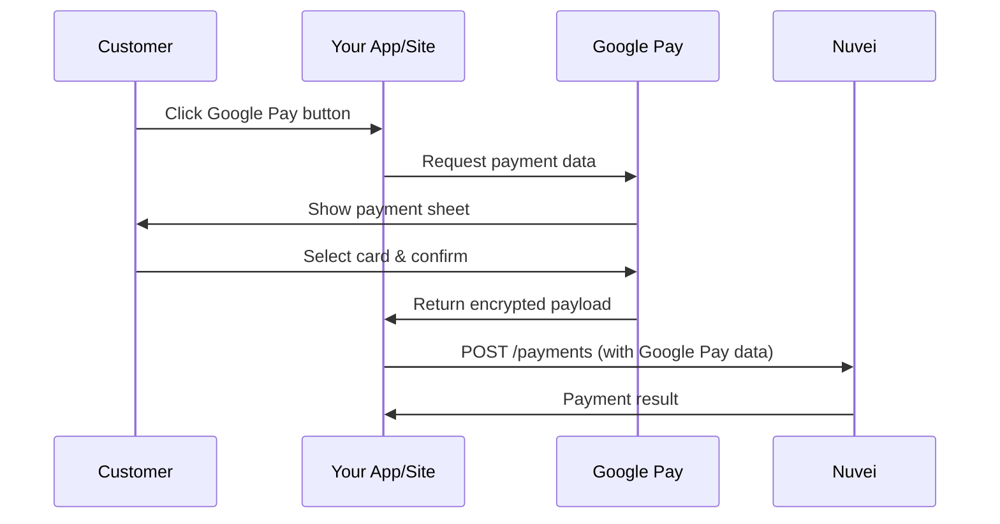

# Google Pay

Accept Google Pay for fast, secure payments on Android devices and Chrome.

## Overview

<CardGroup cols={2}>
  <Card title="Cross-Platform" icon="globe">
    Works on Android apps and web browsers
  </Card>
  <Card title="Billions of Cards" icon="credit-card">
    Access cards saved in Google accounts
  </Card>
</CardGroup>

## Integration Flow



## Step 1: Load Google Pay API

```html
<script async src="https://pay.google.com/gp/p/js/pay.js"></script>

<div id="google-pay-button"></div>
```

## Step 2: Initialize and Show Button

```javascript
const paymentsClient = new google.payments.api.PaymentsClient({
  environment: 'TEST' // or 'PRODUCTION'
});

const baseRequest = {
  apiVersion: 2,
  apiVersionMinor: 0
};

const tokenizationSpecification = {
  type: 'PAYMENT_GATEWAY',
  parameters: {
    gateway: 'nuvei',
    gatewayMerchantId: 'YOUR_MERCHANT_ID'
  }
};

const cardPaymentMethod = {
  type: 'CARD',
  parameters: {
    allowedAuthMethods: ['PAN_ONLY', 'CRYPTOGRAM_3DS'],
    allowedCardNetworks: ['VISA', 'MASTERCARD', 'AMEX', 'DISCOVER']
  },
  tokenizationSpecification: tokenizationSpecification
};

// Check if Google Pay is available
const isReadyToPayRequest = {
  ...baseRequest,
  allowedPaymentMethods: [cardPaymentMethod]
};

paymentsClient.isReadyToPay(isReadyToPayRequest)
  .then(response => {
    if (response.result) {
      const button = paymentsClient.createButton({
        onClick: onGooglePayClick,
        buttonColor: 'black',
        buttonType: 'buy'
      });
      document.getElementById('google-pay-button').appendChild(button);
    }
  });
```

## Step 3: Handle Payment

```javascript
async function onGooglePayClick() {
  const paymentDataRequest = {
    ...baseRequest,
    allowedPaymentMethods: [cardPaymentMethod],
    transactionInfo: {
      totalPriceStatus: 'FINAL',
      totalPrice: '100.00',
      currencyCode: 'USD',
      countryCode: 'US'
    },
    merchantInfo: {
      merchantName: 'Your Store',
      merchantId: 'YOUR_GOOGLE_MERCHANT_ID'
    }
  };

  try {
    const paymentData = await paymentsClient.loadPaymentData(paymentDataRequest);
    
    // Send to your server
    const result = await processGooglePayment(paymentData);
    
    // Handle result
    if (result.status === 'approved') {
      window.location.href = '/success';
    }
  } catch (err) {
    console.error('Payment failed:', err);
  }
}
```

## Step 4: Send Payment to Nuvei

<Tabs>
  <Tab title="cURL">
```bash
curl -X POST https://api-sandbox.nuvei.com/payment-api/payments \
  -H "Content-Type: application/json" \
  -H "x-api-key: YOUR_API_KEY" \
  -d '{
    "processingEntityId": "1234567890",
    "transactionType": "Sale",
    "amount": 100,
    "currency": "USD",
    "paymentMethod": {
      "type": "googlePay",
      "googlePay": {
        "paymentToken": "ENCRYPTED_PAYMENT_DATA_FROM_GOOGLE"
      }
    }
  }'
```
  </Tab>
  <Tab title="JavaScript">
```javascript
async function processGooglePayment(paymentData) {
  const response = await fetch('https://api-sandbox.nuvei.com/payment-api/payments', {
    method: 'POST',
    headers: {
      'Content-Type': 'application/json',
      'x-api-key': 'YOUR_API_KEY'
    },
    body: JSON.stringify({
      processingEntityId: '1234567890',
      transactionType: 'Sale',
      amount: 100,
      currency: 'USD',
      paymentMethod: {
        type: 'googlePay',
        googlePay: {
          paymentToken: paymentData.paymentMethodData.tokenizationData.token
        }
      }
    })
  });

  return response.json();
}
```
  </Tab>
</Tabs>

## Response

```json
{
  "paymentId": "375011",
  "transactionId": "2110000000010964089",
  "amount": 100,
  "currency": "USD",
  "transactionType": "Sale",
  "result": {
    "status": "approved"
  },
  "authCode": "300250",
  "paymentMethod": {
    "type": "googlePay",
    "card": {
      "bin": "400002",
      "last4Digits": "0961",
      "cardBrand": "VISA"
    }
  }
}
```

## Setup Requirements

<Steps>
  <Step title="Google Pay Business Console">
    Register at [pay.google.com/business/console](https://pay.google.com/business/console)
  </Step>
  <Step title="Get Merchant ID">
    Obtain your Google Merchant ID from the console
  </Step>
  <Step title="Configure in Nuvei">
    Add Google Pay as a payment method in Nuvei Control Panel
  </Step>
  <Step title="Test Integration">
    Use Google Pay test environment before going live
  </Step>
</Steps>

<Note>
  In TEST environment, Google Pay uses test cards. Switch to PRODUCTION for real payments.
</Note>
