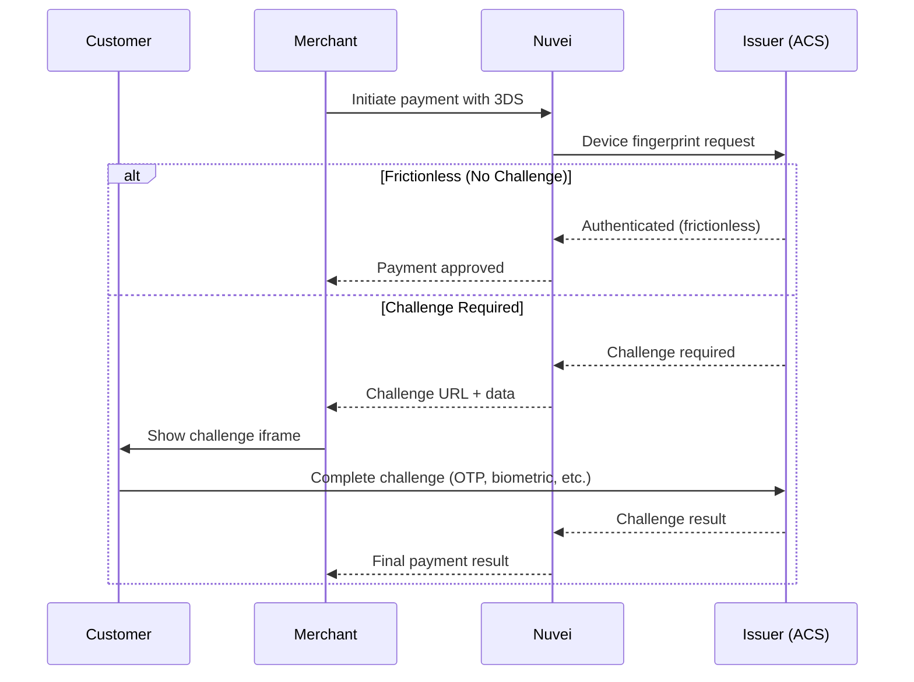

# 3D Secure (3DS)

3D Secure adds an authentication layer to card payments, reducing fraud and shifting liability to the card issuer.

## What is 3D Secure?

3D Secure is a protocol that adds an extra verification step during online card payments. The cardholder authenticates with their bank, proving they are the legitimate card owner.

<CardGroup cols={2}>
  <Card title="Reduced Fraud" icon="shield-check">
    Additional authentication reduces chargebacks
  </Card>
  <Card title="Liability Shift" icon="scale-balanced">
    Fraud liability shifts to card issuer
  </Card>
  <Card title="PSD2 Compliance" icon="landmark">
    Required for European SCA regulations
  </Card>
  <Card title="Better Conversion" icon="chart-line">
    3DS 2.0 offers frictionless flows
  </Card>
</CardGroup>

## 3DS Versions

| Version | Description |
|---------|-------------|
| **3DS 1.0** | Legacy - full-page redirect, poor mobile experience |
| **3DS 2.0** | Modern - frictionless authentication, better UX |

<Note>
  Nuvei supports both 3DS 1.0 and 3DS 2.0. We recommend 3DS 2.0 for better conversion rates.
</Note>

## 3DS 2.0 Flow



## 3DS Outcomes

| Outcome | Description | Liability |
|---------|-------------|-----------|
| **Frictionless** | Cardholder authenticated without challenge | Issuer |
| **Challenge** | Cardholder completed additional verification | Issuer |
| **Attempted** | 3DS attempted but issuer not enrolled | Merchant |
| **Failed** | Authentication failed | Merchant |

## Integration by Product

### Payment Page & Simply Connect

3DS is handled **automatically**. No additional implementation required.

```javascript
// Simply Connect example - 3DS is automatic
checkout({
  sessionToken: '<sessionToken>',
  // ... other params
  // 3DS handled automatically
});
```

### Web SDK

3DS is handled **automatically** by the SDK:

```javascript
// Web SDK 1.0 - 3DS is automatic
safecharge.createPayment({
  sessionToken: sessionToken,
  cardHolderName: 'John Smith',
  paymentOption: cardNumber,
  // 3DS handled automatically
}, callback);
```

### REST API (Server-to-Server)

For direct API integration, you must implement the full 3DS flow:

<Steps>
  <Step title="Initialize 3DS">
    Call `/initPayment` to get device fingerprint data
  </Step>
  <Step title="Collect Fingerprint">
    Load hidden iframe for device fingerprinting
  </Step>
  <Step title="Submit Payment">
    Call `/payment` with 3DS data
  </Step>
  <Step title="Handle Challenge (if required)">
    Redirect customer to issuer challenge page
  </Step>
  <Step title="Complete Payment">
    Call `/payment` again with challenge result
  </Step>
</Steps>

#### Step 1: Initialize 3DS

```json
// POST /initPayment
{
  "sessionToken": "<sessionToken>",
  "merchantId": "<merchantId>",
  "merchantSiteId": "<merchantSiteId>",
  "clientRequestId": "init_123",
  "clientUniqueId": "order_456",
  "currency": "USD",
  "amount": "100",
  "paymentOption": {
    "card": {
      "cardNumber": "4000027891380961",
      "cardHolderName": "John Smith",
      "expirationMonth": "12",
      "expirationYear": "2028",
      "CVV": "217"
    }
  },
  "billingAddress": {
    "firstName": "John",
    "lastName": "Smith",
    "country": "US",
    "email": "john@example.com"
  },
  "deviceDetails": {
    "ipAddress": "93.146.254.172"
  },
  "timeStamp": "<timestamp>",
  "checksum": "<checksum>"
}
```

#### Step 2: Load Fingerprint IFrame

```html
<!-- Hidden iframe for device fingerprinting -->
<iframe 
  id="3ds-fingerprint"
  name="3ds-fingerprint"
  style="display: none;"
  src="<url from initPayment response>">
</iframe>
```

#### Step 3: Submit Payment

Include 3DS data in the payment request:

```json
// POST /payment
{
  "sessionToken": "<sessionToken>",
  // ... payment details
  "relatedTransactionId": "<from initPayment>",
  "deviceDetails": {
    "ipAddress": "93.146.254.172"
  }
}
```

#### Step 4: Handle Challenge

If `transactionStatus` is `REDIRECT`, redirect to the challenge:

```javascript
if (response.transactionStatus === 'REDIRECT') {
  // Create form and submit to acsUrl
  const form = document.createElement('form');
  form.method = 'POST';
  form.action = response.acsUrl;
  
  const creqInput = document.createElement('input');
  creqInput.name = 'creq';
  creqInput.value = response.cReq;
  form.appendChild(creqInput);
  
  document.body.appendChild(form);
  form.submit();
}
```

## 3DS Exemptions

You can request exemptions to skip 3DS in certain scenarios:

| Exemption | Use Case |
|-----------|----------|
| `lowValueExemption` | Transactions under €30 |
| `trustedBeneficiary` | Returning trusted customer |
| `transactionRiskAnalysis` | Low-risk transaction (TRA) |
| `secureCorporate` | B2B corporate payments |
| `delegatedAuthentication` | Your own 3DS performed |

```javascript
// Simply Connect with exemption request
checkout({
  sessionToken: '<sessionToken>',
  // Request exemption
  v2AdditionalParams: {
    challengePreference: 'ExemptionRequest',
    exemptionRequestReason: 'LowValue'
  }
});
```

<Warning>
  Exemptions are requests, not guarantees. The issuer may still require a challenge.
</Warning>

## Best Practices

<AccordionGroup>
  <Accordion title="Collect billing address" icon="location-dot">
    Providing complete billing address data improves frictionless approval rates.
  </Accordion>
  
  <Accordion title="Include device details" icon="mobile">
    Browser and device information helps issuers assess risk accurately.
  </Accordion>
  
  <Accordion title="Use appropriate transaction types" icon="tag">
    Set correct transaction type (goods purchase, subscription, etc.) for better outcomes.
  </Accordion>
  
  <Accordion title="Handle all outcomes" icon="check-double">
    Implement handling for frictionless, challenge, and failed scenarios.
  </Accordion>
</AccordionGroup>

## Quick Links

<CardGroup cols={2}>
  <Card title="Web SDK 3DS" icon="code" href="/integrations/web-sdk-1/3ds">
    SDK implementation details
  </Card>
  <Card title="REST API 3DS" icon="server" href="/integrations/rest-api-1/3ds">
    Full server-side 3DS guide
  </Card>
  <Card title="Exemptions" icon="shield" href="/integrations/features/3ds-exemptions">
    Request 3DS exemptions
  </Card>
  <Card title="Testing 3DS" icon="vial" href="/resources/testing">
    Test cards for 3DS scenarios
  </Card>
</CardGroup>
