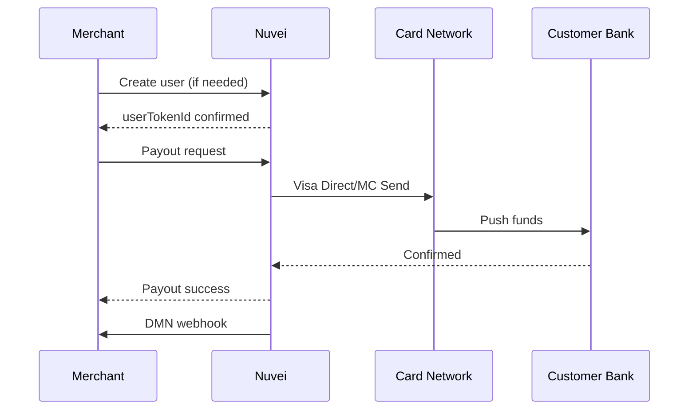

# Payouts

Nuvei Payouts allows you to send funds directly to customers' cards or bank accounts - perfect for refunds to different cards, marketplace seller payments, insurance claims, and more.

## Payout Methods

<CardGroup cols={3}>
  <Card title="Card Payouts" icon="credit-card">
    Send to Visa/Mastercard via Visa Direct or Mastercard Send
  </Card>
  <Card title="Bank Transfers" icon="building-columns">
    Direct ACH, SEPA, or local bank transfers
  </Card>
  <Card title="APM Payouts" icon="wallet">
    PayPal, Skrill, and other e-wallets
  </Card>
</CardGroup>

## How It Works



## Setting Up Payouts

### Prerequisites

<Steps>
  <Step title="Enable Payouts">
    Contact your Nuvei account manager to enable payout capabilities for your account.
  </Step>
  <Step title="Compliance">
    Ensure you have proper KYC/AML processes for payout recipients.
  </Step>
  <Step title="Configure DMN">
    Set up webhooks to receive payout status notifications.
  </Step>
</Steps>

### Step 1: Create or Identify User

Before processing a payout, ensure you have a `userTokenId`:

```json
POST /ppp/api/v1/addUPOCreditCardByTempToken.do

{
  "sessionToken": "<sessionToken>",
  "merchantId": "<merchantId>",
  "merchantSiteId": "<merchantSiteId>",
  "userTokenId": "recipient_12345",
  "clientRequestId": "<unique_request_id>",
  "ccTempToken": "<ccTempToken>",
  "billingAddress": {
    "firstName": "John",
    "lastName": "Smith",
    "email": "john@example.com",
    "country": "US"
  }
}
```

### Step 2: Get Session Token

```json
POST /ppp/api/v1/getSessionToken.do

{
  "merchantId": "<merchantId>",
  "merchantSiteId": "<merchantSiteId>",
  "clientRequestId": "payout_session_123",
  "timeStamp": "<timestamp>",
  "checksum": "<checksum>"
}
```

### Step 3: Process Payout

<Tabs>
  <Tab title="Card Payout">
    ```json
    POST /ppp/api/v1/payout.do
    
    {
      "sessionToken": "<sessionToken>",
      "merchantId": "<merchantId>",
      "merchantSiteId": "<merchantSiteId>",
      "userTokenId": "recipient_12345",
      "clientUniqueId": "payout_abc123",
      "clientRequestId": "req_payout_001",
      "amount": "100.00",
      "currency": "USD",
      "paymentOption": {
        "card": {
          "cardNumber": "4111111111111111",
          "cardHolderName": "John Smith",
          "expirationMonth": "12",
          "expirationYear": "2030"
        }
      },
      "userDetails": {
        "firstName": "John",
        "lastName": "Smith",
        "email": "john@example.com",
        "phone": "1234567890",
        "country": "US"
      },
      "deviceDetails": {
        "ipAddress": "192.168.1.1"
      },
      "urlDetails": {
        "notificationUrl": "https://yoursite.com/webhooks/payout"
      }
    }
    ```
  </Tab>
  <Tab title="Saved Card Payout">
    ```json
    POST /ppp/api/v1/payout.do
    
    {
      "sessionToken": "<sessionToken>",
      "merchantId": "<merchantId>",
      "merchantSiteId": "<merchantSiteId>",
      "userTokenId": "recipient_12345",
      "clientUniqueId": "payout_abc456",
      "clientRequestId": "req_payout_002",
      "amount": "100.00",
      "currency": "USD",
      "paymentOption": {
        "userPaymentOptionId": "987654321"
      },
      "deviceDetails": {
        "ipAddress": "192.168.1.1"
      },
      "urlDetails": {
        "notificationUrl": "https://yoursite.com/webhooks/payout"
      }
    }
    ```
  </Tab>
</Tabs>

### Payout Response

```json
{
  "sessionToken": "<sessionToken>",
  "clientUniqueId": "payout_abc123",
  "transactionId": "7110000000011234567",
  "userPaymentOptionId": "987654321",
  "transactionType": "Credit",
  "transactionStatus": "APPROVED",
  "gwExtendedErrorCode": 0,
  "gwErrorCode": 0,
  "gwErrorReason": "",
  "paymentMethodErrorCode": 0,
  "paymentMethodErrorReason": "",
  "status": "SUCCESS",
  "errCode": 0,
  "reason": ""
}
```

## Use Cases

### Marketplace Seller Payments

```javascript
async function payoutToSeller(sellerId, amount, currency) {
  // Get seller's saved payment method
  const seller = await getSellerById(sellerId);
  
  // Get session token
  const sessionToken = await getSessionToken();
  
  // Process payout
  const result = await nuveiPayout({
    sessionToken,
    userTokenId: seller.nuveiUserId,
    clientUniqueId: `seller_payout_${Date.now()}`,
    amount,
    currency,
    paymentOption: {
      userPaymentOptionId: seller.payoutMethodId
    }
  });
  
  // Record payout
  await recordPayout({
    sellerId,
    amount,
    currency,
    transactionId: result.transactionId,
    status: result.transactionStatus
  });
  
  return result;
}
```

### Insurance Claim Payment

```javascript
async function processClaimPayout(claimId, recipientCard) {
  const claim = await getClaimById(claimId);
  
  const result = await nuveiPayout({
    sessionToken: await getSessionToken(),
    userTokenId: claim.customerId,
    clientUniqueId: `claim_${claimId}`,
    amount: claim.approvedAmount,
    currency: claim.currency,
    paymentOption: {
      card: {
        cardNumber: recipientCard.number,
        cardHolderName: recipientCard.holderName,
        expirationMonth: recipientCard.expMonth,
        expirationYear: recipientCard.expYear
      }
    }
  });
  
  if (result.transactionStatus === 'APPROVED') {
    await updateClaimStatus(claimId, 'PAID', result.transactionId);
  }
  
  return result;
}
```

## Payout Methods

| Method | Speed | Regions | Description |
|--------|-------|---------|-------------|
| Visa Direct | Real-time | Global | Push to Visa cards |
| Mastercard Send | Real-time | Global | Push to Mastercard |
| ACH | 1-3 days | US | US bank accounts |
| SEPA | 1 day | EU | European bank accounts |
| Faster Payments | Real-time | UK | UK bank accounts |

## Status Handling

```javascript
app.post('/webhooks/payout', (req, res) => {
  const { Status, TransactionID, amount, type } = req.body;
  
  if (type === 'WITHDRAWAL') {
    switch (Status) {
      case 'APPROVED':
        // Payout successful
        updatePayoutStatus(TransactionID, 'completed');
        notifyRecipient(TransactionID, 'Funds sent');
        break;
        
      case 'PENDING':
        // Processing
        updatePayoutStatus(TransactionID, 'processing');
        break;
        
      case 'DECLINED':
        // Failed - check reason
        updatePayoutStatus(TransactionID, 'failed');
        logFailure(TransactionID, req.body.Reason);
        break;
    }
  }
  
  res.status(200).send('OK');
});
```

## Error Handling

<AccordionGroup>
  <Accordion title="Invalid Card" icon="credit-card">
    The card number is invalid or doesn't support receiving funds.
    
    **Solution**: Verify card number and ensure it's a debit card for Visa Direct/MC Send.
  </Accordion>
  
  <Accordion title="Card Not Eligible" icon="ban">
    The card doesn't support OCT (Original Credit Transaction).
    
    **Solution**: Ask recipient for a different card (debit cards have better support).
  </Accordion>
  
  <Accordion title="Exceeds Limits" icon="chart-line">
    Payout exceeds daily/monthly limits.
    
    **Solution**: Check your account limits with Nuvei support.
  </Accordion>
  
  <Accordion title="Compliance Hold" icon="shield">
    Payout flagged for compliance review.
    
    **Solution**: Provide additional documentation if requested.
  </Accordion>
</AccordionGroup>

## Best Practices

<AccordionGroup>
  <Accordion title="Validate recipient details" icon="check">
    Verify recipient information before processing payouts to avoid failed transactions.
  </Accordion>
  
  <Accordion title="Use saved payment methods" icon="key">
    Store recipient payment methods to avoid collecting card details repeatedly.
  </Accordion>
  
  <Accordion title="Implement idempotency" icon="clone">
    Use unique `clientUniqueId` to prevent duplicate payouts.
  </Accordion>
  
  <Accordion title="Monitor webhooks" icon="bell">
    Always listen for payout DMN webhooks to confirm delivery.
  </Accordion>
  
  <Accordion title="Handle timezone" icon="clock">
    Bank processing times vary by region. Plan accordingly.
  </Accordion>
</AccordionGroup>

## Compliance Considerations

<Warning>
  **KYC/AML Requirements**: Depending on your region and payout volumes, you may need to implement Know Your Customer (KYC) and Anti-Money Laundering (AML) checks for payout recipients.
</Warning>

- Verify recipient identity before large payouts
- Keep records of all payout transactions
- Report suspicious activities as required
- Follow regional regulations (GDPR, etc.)

## Quick Links

<CardGroup cols={2}>
  <Card title="API Reference" icon="code" href="/api-reference/rest-1/payout">
    Payout endpoint documentation
  </Card>
  <Card title="Webhooks" icon="bell" href="/integrations/features/webhooks">
    Payout notification handling
  </Card>
  <Card title="Tokenization" icon="key" href="/integrations/features/tokenization">
    Save recipient payment methods
  </Card>
  <Card title="Testing" icon="vial" href="/resources/testing">
    Test payout scenarios
  </Card>
</CardGroup>
