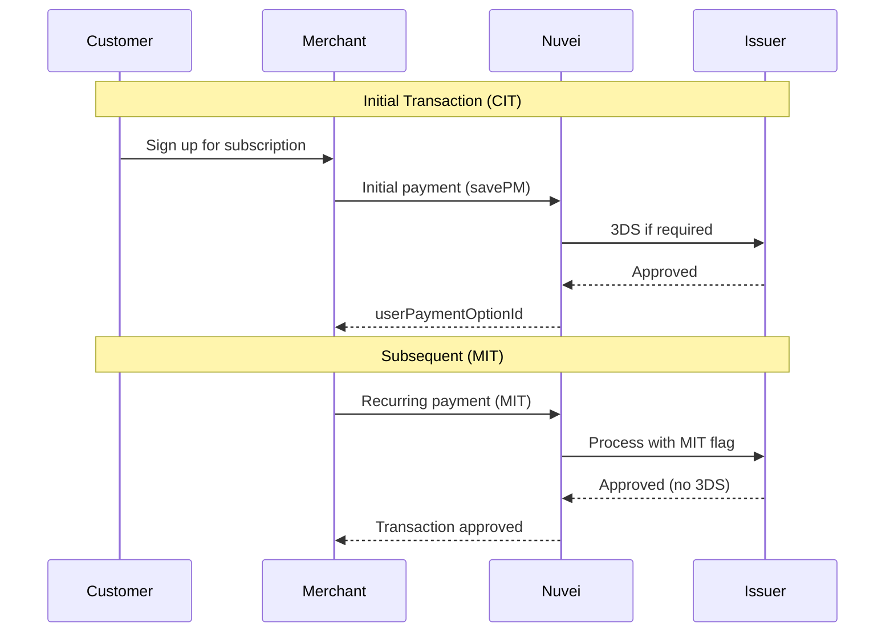

# Recurring Payments

Nuvei supports multiple models for recurring payments, from simple repeat charges to merchant-initiated transactions (MIT) for subscriptions.

## Recurring Models

<CardGroup cols={2}>
  <Card title="Subscription" icon="repeat">
    Regular, scheduled payments (e.g., monthly)
  </Card>
  <Card title="Unscheduled MIT" icon="credit-card">
    Merchant-initiated when events occur
  </Card>
  <Card title="Installments" icon="list-ol">
    Split payment into multiple charges
  </Card>
  <Card title="Standing Order" icon="calendar">
    Fixed recurring with variable amounts
  </Card>
</CardGroup>

## How It Works



## Setting Up Recurring

### Step 1: Initial Payment (Customer-Initiated)

Save the payment method during the first transaction:

<Tabs>
  <Tab title="Simply Connect">
    ```javascript
    checkout({
      sessionToken: "<sessionToken>",
      merchantId: "<merchantId>",
      merchantSiteId: "<merchantSiteId>",
      amount: "29.99",
      currency: "USD",
      userDetails: {
        firstName: "John",
        lastName: "Smith",
        email: "john@example.com",
        phone: "1234567890",
        country: "US"
      },
      billingAddress: {
        firstName: "John",
        lastName: "Smith",
        country: "US",
        email: "john@example.com"
      },
      // Save payment method for recurring
      savePM: "always",
      // Indicate this is a recurring setup
      isRebilling: "0", // Initial transaction
      rebillingType: "RECURRING"
    });
    ```
  </Tab>
  <Tab title="REST API 1.0">
    ```json
    {
      "sessionToken": "<sessionToken>",
      "merchantId": "<merchantId>",
      "merchantSiteId": "<merchantSiteId>",
      "clientUniqueId": "subscription_init_12345",
      "transactionType": "Sale",
      "amount": "29.99",
      "currency": "USD",
      "paymentOption": {
        "card": {
          "cardNumber": "4111111111111111",
          "cardHolderName": "John Smith",
          "expirationMonth": "12",
          "expirationYear": "2030",
          "CVV": "217"
        }
      },
      "deviceDetails": {
        "ipAddress": "192.168.1.1"
      },
      "billingAddress": {
        "firstName": "John",
        "lastName": "Smith",
        "country": "US",
        "email": "john@example.com"
      },
      // Save and mark as recurring
      "userTokenId": "customer_12345",
      "isRebilling": "0",
      "rebillingType": "RECURRING"
    }
    ```
  </Tab>
  <Tab title="REST API 2.0">
    ```json
    POST /orders
    x-api-key: <your_api_key>
    
    {
      "currency": "USD",
      "amount": 29.99,
      "items": [
        {
          "name": "Monthly Subscription",
          "quantity": 1,
          "price": 29.99
        }
      ],
      "consumer": {
        "id": "customer_12345",
        "firstName": "John",
        "lastName": "Smith",
        "email": "john@example.com"
      },
      "payment": {
        "option": {
          "card": {
            "number": "4111111111111111",
            "expirationMonth": "12",
            "expirationYear": "2030",
            "securityCode": "217",
            "holderName": "John Smith"
          }
        }
      },
      "recurring": {
        "type": "RECURRING",
        "mode": "INITIAL"
      }
    }
    ```
  </Tab>
</Tabs>

### Step 2: Store the Token

Save the returned `userPaymentOptionId` for future charges:

```javascript
// Response from initial payment
{
  "transactionStatus": "APPROVED",
  "paymentOption": {
    "userPaymentOptionId": "12345678",
    "card": {
      "last4": "1111",
      "brand": "visa",
      "expirationMonth": "12",
      "expirationYear": "2030"
    }
  }
}

// Store in your database
await saveCustomerPaymentMethod({
  customerId: "customer_12345",
  userPaymentOptionId: "12345678",
  cardLast4: "1111",
  cardBrand: "visa",
  expirationDate: "12/2030"
});
```

### Step 3: Recurring Payments (Merchant-Initiated)

Process subsequent charges without customer interaction:

<Tabs>
  <Tab title="REST API 1.0">
    ```json
    POST /ppp/api/v1/payment.do
    
    {
      "sessionToken": "<sessionToken>",
      "merchantId": "<merchantId>",
      "merchantSiteId": "<merchantSiteId>",
      "clientUniqueId": "subscription_renewal_67890",
      "transactionType": "Sale",
      "amount": "29.99",
      "currency": "USD",
      "paymentOption": {
        "userPaymentOptionId": "12345678"
      },
      "userTokenId": "customer_12345",
      "isRebilling": "1",
      "rebillingType": "RECURRING",
      "relatedTransactionId": "<originalTransactionId>"
    }
    ```
  </Tab>
  <Tab title="REST API 2.0">
    ```json
    POST /orders
    x-api-key: <your_api_key>
    
    {
      "currency": "USD",
      "amount": 29.99,
      "items": [
        {
          "name": "Monthly Subscription - Renewal",
          "quantity": 1,
          "price": 29.99
        }
      ],
      "consumer": {
        "id": "customer_12345"
      },
      "payment": {
        "option": {
          "tokenId": "12345678"
        }
      },
      "recurring": {
        "type": "RECURRING",
        "mode": "SUBSEQUENT",
        "initialTransactionId": "<originalTransactionId>"
      }
    }
    ```
  </Tab>
</Tabs>

## Recurring Types

| Type | Use Case | Example |
|------|----------|---------|
| `RECURRING` | Fixed schedule subscriptions | Netflix, gym membership |
| `INSTALLMENTS` | Split payment over time | Pay in 4 installments |
| `UNSCHEDULED` | Event-triggered charges | Low balance top-up |
| `STANDING_ORDER` | Variable recurring amounts | Utility bills |

## Rebilling Parameters

| Parameter | Value | Description |
|-----------|-------|-------------|
| `isRebilling` | `0` | Initial transaction (CIT with 3DS) |
| `isRebilling` | `1` | Subsequent transaction (MIT, no 3DS) |
| `rebillingType` | `RECURRING` | Type of recurring model |
| `relatedTransactionId` | `string` | Reference to initial transaction |

## Network Tokenization

For higher approval rates on recurring payments:

```json
{
  "paymentOption": {
    "userPaymentOptionId": "12345678",
    "card": {
      "networkTokenization": {
        "enabled": true
      }
    }
  }
}
```

<Tip>
  Network tokens replace card numbers with scheme-provided tokens, improving approval rates and reducing declines when cards are reissued.
</Tip>

## Handling Failed Recurring

<AccordionGroup>
  <Accordion title="Soft Decline" icon="rotate-right">
    Temporary failure - retry after a few days.
    
    ```javascript
    if (response.errorCode === '4001' || response.reasonCode === '5') {
      // Schedule retry in 3 days
      scheduleRetry(customerId, 3);
    }
    ```
  </Accordion>
  
  <Accordion title="Hard Decline" icon="ban">
    Permanent failure - card expired, closed, etc. Contact customer.
    
    ```javascript
    if (response.errorCode === '4003') {
      // Notify customer to update payment method
      sendUpdatePaymentEmail(customerId);
      pauseSubscription(customerId);
    }
    ```
  </Accordion>
  
  <Accordion title="Retry Strategy" icon="arrows-rotate">
    Recommended retry schedule:
    
    | Attempt | Wait | Action |
    |---------|------|--------|
    | 1 | Immediate | First attempt |
    | 2 | 3 days | Retry |
    | 3 | 7 days | Retry |
    | 4 | 14 days | Final retry + notify |
    | 5 | - | Suspend subscription |
  </Accordion>
</AccordionGroup>

## Subscription Lifecycle

```javascript
// Simplified subscription manager
class SubscriptionManager {
  async createSubscription(customerId, plan) {
    // 1. Initial payment with 3DS
    const result = await processInitialPayment(customerId, plan);
    
    if (result.status === 'APPROVED') {
      // 2. Save token and schedule
      await saveSubscription({
        customerId,
        planId: plan.id,
        tokenId: result.userPaymentOptionId,
        nextBillingDate: addMonths(new Date(), 1),
        status: 'ACTIVE'
      });
    }
    
    return result;
  }
  
  async processRenewal(subscription) {
    // MIT - no 3DS required
    const result = await processRecurringPayment(
      subscription.customerId,
      subscription.tokenId,
      subscription.amount
    );
    
    if (result.status === 'APPROVED') {
      // Update next billing date
      await updateSubscription(subscription.id, {
        nextBillingDate: addMonths(new Date(), 1),
        lastPaymentDate: new Date()
      });
    } else {
      // Handle failure
      await handleFailedPayment(subscription, result);
    }
    
    return result;
  }
  
  async cancelSubscription(subscriptionId) {
    await updateSubscription(subscriptionId, {
      status: 'CANCELLED',
      cancelledAt: new Date()
    });
  }
}
```

## Best Practices

<AccordionGroup>
  <Accordion title="Always 3DS on initial" icon="shield">
    The first payment (CIT) should always include 3DS authentication for liability shift and compliance.
  </Accordion>
  
  <Accordion title="Reference original transaction" icon="link">
    Always include `relatedTransactionId` pointing to the initial CIT for better approval rates.
  </Accordion>
  
  <Accordion title="Use network tokens" icon="key">
    Enable network tokenization for better approval rates on recurring charges.
  </Accordion>
  
  <Accordion title="Clear communication" icon="envelope">
    Notify customers before charging and when payment fails.
  </Accordion>
  
  <Accordion title="Implement dunning" icon="bell">
    Have a proper retry strategy for failed payments before cancellation.
  </Accordion>
  
  <Accordion title="Store transaction IDs" icon="database">
    Keep the original transaction ID for refunds and scheme compliance.
  </Accordion>
</AccordionGroup>

## Compliance Notes

<Warning>
  **PSD2/SCA Requirements**: Initial transactions require Strong Customer Authentication (3DS). Subsequent merchant-initiated transactions (MIT) are exempt from SCA when properly flagged.
</Warning>

- Use `isRebilling: "0"` for customer-initiated (CIT)
- Use `isRebilling: "1"` for merchant-initiated (MIT)
- Always include `rebillingType` to indicate the recurring model
- Store and reference the original `transactionId`

## Quick Links

<CardGroup cols={2}>
  <Card title="Tokenization" icon="key" href="/integrations/features/tokenization">
    Save payment methods
  </Card>
  <Card title="3D Secure" icon="shield" href="/integrations/features/3ds">
    Initial transaction authentication
  </Card>
  <Card title="Webhooks" icon="bell" href="/integrations/features/webhooks">
    Payment notifications
  </Card>
  <Card title="API Reference" icon="code" href="/api-reference/rest-1/payment">
    Payment endpoint docs
  </Card>
</CardGroup>
