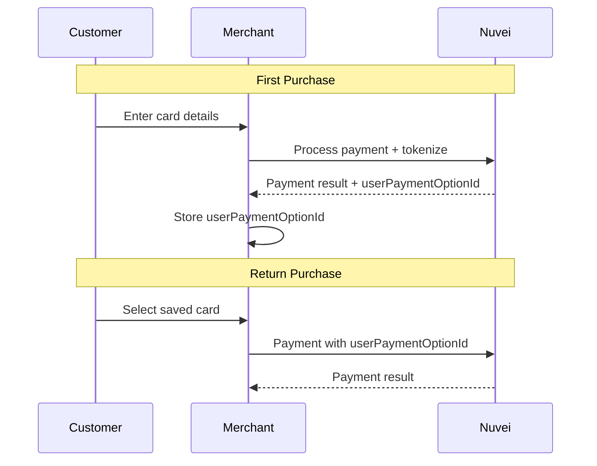

# Tokenization

Tokenization allows you to securely store payment methods for returning customers, enabling one-click payments and recurring billing.

## What is Tokenization?

Tokenization replaces sensitive card data with a non-sensitive token (User Payment Option ID). You store the token; Nuvei securely stores the card details.

<CardGroup cols={2}>
  <Card title="One-Click Payments" icon="bolt">
    Returning customers pay instantly
  </Card>
  <Card title="Recurring Billing" icon="repeat">
    Charge subscriptions automatically
  </Card>
  <Card title="PCI Compliance" icon="shield-check">
    No sensitive data in your systems
  </Card>
  <Card title="Better Conversion" icon="chart-line">
    Reduce checkout friction
  </Card>
</CardGroup>

## How It Works



## Key Concepts

### User Payment Option (UPO)

A UPO is a tokenized payment method linked to a customer (`userTokenId`). It contains:

- Token ID (`userPaymentOptionId`)
- Card type and last 4 digits
- Expiry date
- Card brand
- Billing address

### User Token ID

A unique identifier for the customer in your system. All saved payment methods are linked to this ID.

```javascript
// Example userTokenId - your customer ID
const userTokenId = "customer_12345";
```

## Tokenizing Cards

### During Payment

The simplest approach - tokenize when processing a payment:

<Tabs>
  <Tab title="Simply Connect">
    ```javascript
    checkout({
      sessionToken: '<sessionToken>',
      userTokenId: 'customer_12345', // Required for tokenization
      // ... other params
      
      onResult: function(result) {
        if (result.result === 'APPROVED') {
          // Store the token for future use
          const tokenId = result.userPaymentOptionId;
          saveToDatabase(result.userTokenId, tokenId);
        }
      }
    });
    ```
  </Tab>
  <Tab title="Web SDK">
    ```javascript
    safecharge.createPayment({
      sessionToken: sessionToken,
      userTokenId: 'customer_12345', // Required for tokenization
      paymentOption: cardNumber,
      // ... other params
    }, function(response) {
      if (response.result === 'APPROVED') {
        const tokenId = response.userPaymentOptionId;
        saveToDatabase(response.userTokenId, tokenId);
      }
    });
    ```
  </Tab>
  <Tab title="REST API">
    ```json
    // POST /payment
    {
      "sessionToken": "<sessionToken>",
      "merchantId": "<merchantId>",
      "merchantSiteId": "<merchantSiteId>",
      "userTokenId": "customer_12345",
      "amount": "100",
      "currency": "USD",
      "transactionType": "Sale",
      "paymentOption": {
        "card": {
          "cardNumber": "4000027891380961",
          "cardHolderName": "John Smith",
          "expirationMonth": "12",
          "expirationYear": "2028",
          "CVV": "217"
        }
      },
      "timeStamp": "<timestamp>",
      "checksum": "<checksum>"
    }
    ```
  </Tab>
</Tabs>

### Without Payment (Card on File)

Tokenize a card without charging:

```json
// POST /addUPOCreditCardByToken or Web SDK addCardUpo()
{
  "merchantId": "<merchantId>",
  "merchantSiteId": "<merchantSiteId>",
  "userTokenId": "customer_12345",
  "ccCardNumber": "4000027891380961",
  "ccExpMonth": "12",
  "ccExpYear": "2028",
  "ccNameOnCard": "John Smith",
  "billingAddress": {
    "firstName": "John",
    "lastName": "Smith",
    "country": "US",
    "email": "john@example.com"
  },
  "timeStamp": "<timestamp>",
  "checksum": "<checksum>"
}
```

## Using Saved Cards

### Payment with Token

<Tabs>
  <Tab title="Simply Connect">
    Simply Connect automatically shows saved cards when you provide `userTokenId`:
    
    ```javascript
    checkout({
      sessionToken: '<sessionToken>',
      userTokenId: 'customer_12345', // Shows saved cards
      // ... other params
    });
    ```
  </Tab>
  <Tab title="Web SDK">
    ```javascript
    safecharge.createPayment({
      sessionToken: sessionToken,
      paymentOption: {
        userPaymentOptionId: 'stored_token_id'
      }
    }, callback);
    ```
  </Tab>
  <Tab title="REST API">
    ```json
    // POST /payment
    {
      "sessionToken": "<sessionToken>",
      "merchantId": "<merchantId>",
      "merchantSiteId": "<merchantSiteId>",
      "userTokenId": "customer_12345",
      "amount": "100",
      "currency": "USD",
      "transactionType": "Sale",
      "paymentOption": {
        "userPaymentOptionId": "stored_token_id"
      },
      "timeStamp": "<timestamp>",
      "checksum": "<checksum>"
    }
    ```
  </Tab>
</Tabs>

## Retrieving Saved Cards

Get all saved payment methods for a customer:

```json
// POST /getUserUPOs
{
  "merchantId": "<merchantId>",
  "merchantSiteId": "<merchantSiteId>",
  "userTokenId": "customer_12345",
  "clientRequestId": "get_cards_123",
  "timeStamp": "<timestamp>",
  "checksum": "<checksum>"
}
```

### Response

```json
{
  "paymentMethods": [
    {
      "userPaymentOptionId": "12345678",
      "paymentMethodName": "cc_card",
      "upoStatus": "enabled",
      "upoData": {
        "ccCardNumber": "4****0961",
        "ccExpMonth": "12",
        "ccExpYear": "28",
        "ccNameOnCard": "John Smith",
        "brand": "VISA"
      }
    },
    {
      "userPaymentOptionId": "87654321",
      "paymentMethodName": "cc_card",
      "upoStatus": "enabled",
      "upoData": {
        "ccCardNumber": "5****5761",
        "ccExpMonth": "06",
        "ccExpYear": "27",
        "ccNameOnCard": "John Smith",
        "brand": "MASTERCARD"
      }
    }
  ],
  "status": "SUCCESS"
}
```

## Managing Tokens

### Delete a Token

```json
// POST /deleteUPO
{
  "merchantId": "<merchantId>",
  "merchantSiteId": "<merchantSiteId>",
  "userTokenId": "customer_12345",
  "userPaymentOptionId": "12345678",
  "clientRequestId": "delete_123",
  "timeStamp": "<timestamp>",
  "checksum": "<checksum>"
}
```

### Update Token (Card Account Updater)

Nuvei automatically updates expired cards through the Card Account Updater service. New expiry dates are automatically applied to stored tokens.

## Best Practices

<AccordionGroup>
  <Accordion title="Use consistent userTokenId" icon="user">
    Always use the same `userTokenId` for each customer to properly track their saved cards.
  </Accordion>
  
  <Accordion title="Handle expired cards" icon="calendar-xmark">
    Display expiry dates and prompt customers to update expired cards. Enable Card Account Updater for automatic updates.
  </Accordion>
  
  <Accordion title="Show card details clearly" icon="credit-card">
    Display card brand, last 4 digits, and expiry so customers can identify their cards.
  </Accordion>
  
  <Accordion title="Allow card removal" icon="trash">
    Let customers delete saved cards from their account for security and compliance.
  </Accordion>
  
  <Accordion title="Secure token storage" icon="lock">
    While tokens aren't sensitive like card numbers, store them securely and associate with the correct customer.
  </Accordion>
</AccordionGroup>

## Recurring Payments

For subscription billing, see the [Recurring Payments](/integrations/features/recurring) guide.

## Quick Links

<CardGroup cols={2}>
  <Card title="Recurring Payments" icon="repeat" href="/integrations/features/recurring">
    Subscription billing
  </Card>
  <Card title="Card Account Updater" icon="refresh" href="/integrations/features/card-updater">
    Automatic card updates
  </Card>
  <Card title="API Reference" icon="code" href="/api-reference/rest-1/add-upo">
    Tokenization endpoints
  </Card>
  <Card title="PCI Compliance" icon="shield" href="/resources/pci">
    Security best practices
  </Card>
</CardGroup>
