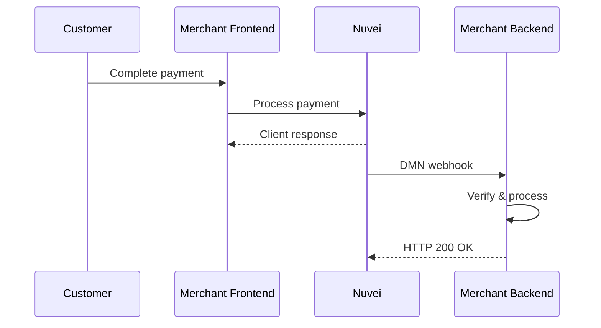

# Webhooks (DMN)

Direct Merchant Notification (DMN) is Nuvei's webhook system that sends real-time notifications to your server when payment events occur.

<Note>
  DMN is also known as IPN (Instant Payment Notification) or callbacks.
</Note>

## Why Use Webhooks?

<CardGroup cols={2}>
  <Card title="Real-Time Updates" icon="bolt">
    Instant notification when payments complete
  </Card>
  <Card title="Async APM Support" icon="clock">
    Essential for APMs that complete hours later
  </Card>
  <Card title="Reliable Verification" icon="shield-check">
    Server-to-server, can't be manipulated
  </Card>
  <Card title="Retry Logic" icon="rotate">
    Failed deliveries automatically retried
  </Card>
</CardGroup>

<Warning>
  **Always use DMN for payment verification**. Client-side responses can be manipulated by end users.
</Warning>

## How It Works



## Setting Up Webhooks

### Configure DMN URL

Set your webhook endpoint in:

1. **Control Panel**: Settings → Merchant Settings → DMN URL
2. **Per-request**: Include `notificationUrl` in API requests

```json
{
  "urlDetails": {
    "notificationUrl": "https://yoursite.com/webhooks/nuvei"
  }
}
```

### Endpoint Requirements

Your endpoint must:

- Accept `POST` requests
- Return HTTP `200 OK` within 10 seconds
- Be publicly accessible (no authentication required)
- Use HTTPS in production

## DMN Payload

### Example Payment DMN

```
POST /webhooks/nuvei HTTP/1.1
Content-Type: application/x-www-form-urlencoded

ppp_status=OK
&Status=APPROVED
&ExErrCode=0
&ErrCode=0
&errApmCode=0
&errApmDescription=
&errScCode=0
&errScDescription=
&Reason=
&ReasonCode=0
&PPP_TransactionID=12345678
&TransactionID=1110000000004146935
&userid=customer_12345
&merchant_unique_id=order_789
&customData=
&productId=
&first_name=John
&last_name=Smith
&email=john@example.com
&totalAmount=100.00
&currency=USD
&requestVersion=1.0
&message=APPROVED
&type=DEPOSIT
&clientRequestId=123456
&merchantId=<merchantId>
&merchantSiteId=<merchantSiteId>
&merchantLocale=en_US
&unknownParameters=
&payment_method=cc_card
&ID=
&merchant_site_id=<merchantSiteId>
&merchant_id=<merchantId>
&responseTimeStamp=2026-01-29.14:30:22
&buyButtonProductBundleId=
&advanceResponseChecksum=<checksum>
```

### Key Fields

| Field | Description |
|-------|-------------|
| `ppp_status` | Overall status: `OK`, `FAIL`, `PENDING` |
| `Status` | Transaction status: `APPROVED`, `DECLINED`, `ERROR`, `PENDING` |
| `TransactionID` | Nuvei transaction ID |
| `PPP_TransactionID` | Internal transaction reference |
| `totalAmount` | Transaction amount |
| `currency` | Transaction currency |
| `payment_method` | Payment method used |
| `advanceResponseChecksum` | Security checksum for verification |

## Verifying DMN Signature

<Warning>
  **Critical**: Always verify the `advanceResponseChecksum` to ensure the DMN is authentic.
</Warning>

### Checksum Calculation

Concatenate these fields in order + your secret key, then SHA-256:

```
secretKey + totalAmount + currency + responseTimeStamp + PPP_TransactionID + Status + productId
```

<CodeGroup>
```php PHP
<?php
function verifyDMN($params, $secretKey) {
    $checksumString = $secretKey . 
        $params['totalAmount'] . 
        $params['currency'] . 
        $params['responseTimeStamp'] . 
        $params['PPP_TransactionID'] . 
        $params['Status'] . 
        ($params['productId'] ?? '');
    
    $expectedChecksum = hash('sha256', $checksumString);
    
    return $expectedChecksum === $params['advanceResponseChecksum'];
}

// Usage
$secretKey = 'your_secret_key';
if (verifyDMN($_POST, $secretKey)) {
    // Valid DMN - process the payment
    if ($_POST['Status'] === 'APPROVED') {
        // Update order status, send confirmation email, etc.
    }
    http_response_code(200);
    echo 'OK';
} else {
    // Invalid DMN - reject
    http_response_code(400);
    echo 'Invalid checksum';
}
?>
```

```javascript Node.js
const crypto = require('crypto');
const express = require('express');
const app = express();

app.use(express.urlencoded({ extended: true }));

function verifyDMN(params, secretKey) {
    const checksumString = secretKey + 
        params.totalAmount + 
        params.currency + 
        params.responseTimeStamp + 
        params.PPP_TransactionID + 
        params.Status + 
        (params.productId || '');
    
    const expectedChecksum = crypto
        .createHash('sha256')
        .update(checksumString)
        .digest('hex');
    
    return expectedChecksum === params.advanceResponseChecksum;
}

app.post('/webhooks/nuvei', (req, res) => {
    const secretKey = 'your_secret_key';
    
    if (verifyDMN(req.body, secretKey)) {
        // Valid DMN
        if (req.body.Status === 'APPROVED') {
            // Process successful payment
            console.log('Payment approved:', req.body.TransactionID);
        }
        res.status(200).send('OK');
    } else {
        // Invalid DMN
        res.status(400).send('Invalid checksum');
    }
});
```
</CodeGroup>

## DMN Types

| Type | Trigger |
|------|---------|
| `DEPOSIT` | Payment/deposit completed |
| `WITHDRAWAL` | Withdrawal completed |
| `REFUND` | Refund processed |
| `CHARGEBACK` | Chargeback received |
| `CHARGEBACK_REVERSAL` | Chargeback reversed |

## Handling Different Statuses

```javascript
app.post('/webhooks/nuvei', (req, res) => {
    const { Status, TransactionID, totalAmount, currency } = req.body;
    
    switch (Status) {
        case 'APPROVED':
            // Payment successful
            updateOrderStatus(TransactionID, 'paid');
            sendConfirmationEmail(req.body.email);
            break;
            
        case 'DECLINED':
            // Payment declined
            updateOrderStatus(TransactionID, 'failed');
            notifyCustomer(req.body.email, 'Payment declined');
            break;
            
        case 'PENDING':
            // Async APM - waiting for completion
            updateOrderStatus(TransactionID, 'pending');
            break;
            
        case 'ERROR':
            // Processing error
            logError(TransactionID, req.body.Reason);
            break;
    }
    
    res.status(200).send('OK');
});
```

## Retry Logic

If your endpoint doesn't return HTTP `200 OK`, Nuvei retries:

| Attempt | Delay |
|---------|-------|
| 1 | Immediate |
| 2 | 1 minute |
| 3 | 5 minutes |
| 4 | 30 minutes |
| 5 | 2 hours |
| 6 | 12 hours |

<Tip>
  Implement idempotency - handle the same DMN multiple times gracefully using `TransactionID` as a unique key.
</Tip>

## Best Practices

<AccordionGroup>
  <Accordion title="Always verify checksum" icon="shield">
    Never process a DMN without verifying the `advanceResponseChecksum`.
  </Accordion>
  
  <Accordion title="Respond quickly" icon="bolt">
    Return HTTP 200 within 10 seconds. Process heavy operations asynchronously.
  </Accordion>
  
  <Accordion title="Implement idempotency" icon="clone">
    The same DMN may be sent multiple times. Use `TransactionID` to detect duplicates.
  </Accordion>
  
  <Accordion title="Log all DMNs" icon="file-lines">
    Log the full DMN payload for debugging and audit purposes.
  </Accordion>
  
  <Accordion title="Use HTTPS" icon="lock">
    Always use HTTPS for your webhook endpoint in production.
  </Accordion>
  
  <Accordion title="Handle all statuses" icon="list-check">
    Implement handling for APPROVED, DECLINED, PENDING, and ERROR statuses.
  </Accordion>
</AccordionGroup>

## Testing Webhooks

### Sandbox Testing

1. Set your DMN URL in sandbox Control Panel
2. Process test transactions
3. Check your endpoint receives DMNs

### Local Development

Use tools like [ngrok](https://ngrok.com) to expose your local server:

```bash
ngrok http 3000
# Use the generated URL as your notificationUrl
```

## Quick Links

<CardGroup cols={2}>
  <Card title="API Reference" icon="code" href="/api-reference/rest-1/dmn">
    Full DMN field reference
  </Card>
  <Card title="Testing Guide" icon="vial" href="/resources/testing">
    Test webhook scenarios
  </Card>
  <Card title="Troubleshooting" icon="wrench" href="/resources/troubleshooting">
    Common DMN issues
  </Card>
  <Card title="Control Panel" icon="gear" href="https://sandbox.nuvei.com">
    Configure DMN URL
  </Card>
</CardGroup>
