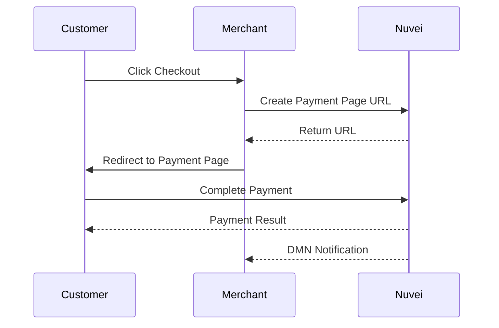

# Payment Page (Cashier)

The Payment Page solution is the quickest way to seamlessly integrate Nuvei's market-leading features, using an IFrame or a full page redirect.

<Note>
  **Best for**: Gaming, Forex, merchants wanting minimal development effort
</Note>

## Why Use Payment Page?

<CardGroup cols={2}>
  <Card title="Fastest Integration" icon="bolt">
    Go live in days, not weeks
  </Card>
  <Card title="Zero PCI Scope" icon="shield-check">
    Nuvei handles all card data
  </Card>
  <Card title="Deposits & Withdrawals" icon="arrows-rotate">
    Full cashier functionality
  </Card>
  <Card title="Remembers Customers" icon="user-check">
    Shows previous payment methods
  </Card>
</CardGroup>

## Key Features

- **Sell products and services** over the web with increased conversion rates
- **Process deposits and withdrawals** through Cashier pages
- **Customer recognition** - Pages presented in preferred language, currency, and display previous payment methods
- **UI customization** on a per-request basis for web and mobile
- **Wide payment coverage** - Cards and 200+ APMs via Nuvei Gateway

## Customization Options

You can customize your Payment Page in two ways:

1. **Page Builder** (Basic) - Use the Page Builder menu in the Control Panel for basic customizations
2. **Custom Branding** (Advanced) - Contact your account manager for complex customizations

## Example Payment Page

<Frame>
  
</Frame>

## Integration Flow

## Quick Links

<CardGroup cols={2}>
  <Card title="Quick Start" icon="rocket" href="/integrations/payment-page/quickstart">
    Get started in 5 minutes
  </Card>
  <Card title="Customization" icon="paintbrush" href="/integrations/payment-page/customization">
    Style your Payment Page
  </Card>
  <Card title="API Reference" icon="code" href="/api-reference/rest-1/payment-page">
    Technical endpoint docs
  </Card>
  <Card title="Demo" icon="play" href="https://demos.nuvei.com/cashierdemo/">
    Try the live demo
  </Card>
</CardGroup>

## When to Use Payment Page vs Other Options

| Scenario | Recommendation |
|----------|---------------|
| Quick launch, minimal development | ✅ **Payment Page** |
| Need deposits AND withdrawals | ✅ **Payment Page** |
| Want checkout embedded in your page | ❌ Use Simply Connect |
| Need full UX control | ❌ Use Web SDK |
| Multi-PSP setup | ❌ Use REST API |

## Next Steps

<Steps>
  <Step title="Get Credentials">
    Obtain your `merchantId`, `merchantSiteId`, and secret key from the [Control Panel](https://sandbox.nuvei.com/settings/my_payment_settings)
  </Step>
  <Step title="Follow Quick Start">
    Complete the [Quick Start guide](/integrations/payment-page/quickstart)
  </Step>
  <Step title="Customize">
    Use Page Builder or contact your account manager for branding
  </Step>
  <Step title="Go Live">
    Switch from sandbox to production URLs
  </Step>
</Steps>
