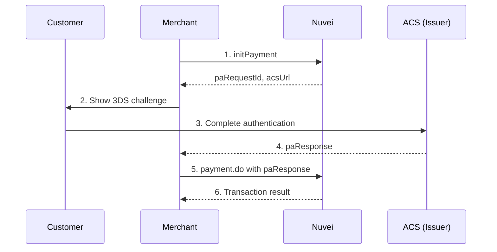

# 3D Secure with REST API 1.0

Implement Strong Customer Authentication (SCA) with 3D Secure 2.0 using REST API 1.0's server-to-server integration.

## 3DS Flow Overview



## Step 1: Initialize Payment

Start the 3DS process with `/initPayment`:

```javascript
async function initPayment(sessionToken, paymentData) {
  const timeStamp = getTimestamp();
  const clientRequestId = Date.now().toString();
  const clientUniqueId = `order_${Date.now()}`;
  
  const checksum = generateChecksum(
    config.merchantId,
    config.merchantSiteId,
    clientRequestId,
    paymentData.amount,
    paymentData.currency,
    timeStamp,
    config.secretKey
  );
  
  const response = await axios.post(`${config.baseUrl}/initPayment.do`, {
    sessionToken,
    merchantId: config.merchantId,
    merchantSiteId: config.merchantSiteId,
    clientRequestId,
    clientUniqueId,
    currency: paymentData.currency,
    amount: paymentData.amount,
    timeStamp,
    checksum,
    
    paymentOption: {
      card: {
        cardNumber: paymentData.cardNumber,
        cardHolderName: paymentData.cardHolderName,
        expirationMonth: paymentData.expirationMonth,
        expirationYear: paymentData.expirationYear,
        CVV: paymentData.cvv
      }
    },
    
    billingAddress: {
      firstName: paymentData.firstName,
      lastName: paymentData.lastName,
      email: paymentData.email,
      country: paymentData.country
    },
    
    deviceDetails: {
      ipAddress: paymentData.ipAddress,
      deviceType: 'DESKTOP'
    },
    
    // 3DS specific
    threeD: {
      v2supported: true,
      notificationURL: 'https://yoursite.com/3ds-callback'
    }
  });
  
  return response.data;
}
```

### initPayment Response

```json
{
  "sessionToken": "<sessionToken>",
  "clientUniqueId": "order_1234567890",
  "transactionId": "7110000000011234567",
  "transactionStatus": "REDIRECT",
  "paymentOption": {
    "card": {
      "ccCardNumber": "4****1111",
      "bin": "411111",
      "last4Digits": "1111"
    },
    "threeD": {
      "v2supported": true,
      "version": "2.1.0",
      "methodUrl": "https://acs.issuer.com/method",
      "methodPayload": "<base64_payload>",
      "paRequestId": "request_abc123",
      "acsUrl": "https://acs.issuer.com/challenge",
      "cReq": "<base64_creq>"
    }
  },
  "status": "SUCCESS"
}
```

## Step 2: Handle 3DS Challenge

### 3DS 2.0 Method (Fingerprinting)

First, submit the 3DS method if `methodUrl` is provided:

```html
<iframe id="threeds-method" style="display:none;"></iframe>

<script>
const methodData = {
  threeDSServerTransID: threeDSServerTransID,
  threeDSMethodNotificationURL: 'https://yoursite.com/3ds-method-callback'
};

// Create form and submit to methodUrl
const form = document.createElement('form');
form.method = 'POST';
form.action = initResponse.paymentOption.threeD.methodUrl;
form.target = 'threeds-method';

const input = document.createElement('input');
input.type = 'hidden';
input.name = 'threeDSMethodData';
input.value = btoa(JSON.stringify(methodData));
form.appendChild(input);

document.body.appendChild(form);
document.getElementById('threeds-method').contentWindow.document.body.appendChild(form);
form.submit();
</script>
```

### 3DS 2.0 Challenge

If a challenge is required, redirect the customer to the ACS:

```html
<!-- 3DS Challenge Iframe -->
<div id="challenge-container">
  <iframe id="threeds-challenge" width="400" height="600"></iframe>
</div>

<script>
// Submit cReq to acsUrl
const challengeForm = document.createElement('form');
challengeForm.method = 'POST';
challengeForm.action = initResponse.paymentOption.threeD.acsUrl;
challengeForm.target = 'threeds-challenge';

const cReqInput = document.createElement('input');
cReqInput.type = 'hidden';
cReqInput.name = 'creq';
cReqInput.value = initResponse.paymentOption.threeD.cReq;
challengeForm.appendChild(cReqInput);

const termUrlInput = document.createElement('input');
termUrlInput.type = 'hidden';
termUrlInput.name = 'threeDSSessionData';
termUrlInput.value = sessionToken; // Your tracking reference
challengeForm.appendChild(termUrlInput);

document.body.appendChild(challengeForm);
challengeForm.submit();
</script>
```

### 3DS Callback Handler

```javascript
// Handle 3DS callback
app.post('/3ds-callback', (req, res) => {
  const { cres, threeDSSessionData } = req.body;
  
  // Return HTML that closes iframe and continues payment
  res.send(`
    <html>
    <body>
      <script>
        // Notify parent window
        window.parent.postMessage({
          type: 'threeds-complete',
          cres: '${cres}',
          sessionData: '${threeDSSessionData}'
        }, '*');
      </script>
    </body>
    </html>
  `);
});
```

## Step 3: Complete Payment

After 3DS authentication, complete the payment:

```javascript
async function completePayment(sessionToken, initResponse, cRes) {
  const timeStamp = getTimestamp();
  const clientRequestId = Date.now().toString();
  
  const checksum = generateChecksum(
    config.merchantId,
    config.merchantSiteId,
    clientRequestId,
    initResponse.amount,
    initResponse.currency,
    timeStamp,
    config.secretKey
  );
  
  const response = await axios.post(`${config.baseUrl}/payment.do`, {
    sessionToken,
    merchantId: config.merchantId,
    merchantSiteId: config.merchantSiteId,
    clientRequestId,
    clientUniqueId: initResponse.clientUniqueId,
    amount: initResponse.amount,
    currency: initResponse.currency,
    transactionType: 'Sale',
    timeStamp,
    checksum,
    
    relatedTransactionId: initResponse.transactionId,
    
    paymentOption: {
      card: {
        cardNumber: initResponse.cardNumber,
        cardHolderName: initResponse.cardHolderName,
        expirationMonth: initResponse.expirationMonth,
        expirationYear: initResponse.expirationYear,
        CVV: initResponse.cvv,
        threeD: {
          // Include cRes from 3DS challenge
          cRes: cRes,
          // Or paResponse for 3DS 1.0
          paResponse: initResponse.paResponse
        }
      }
    },
    
    billingAddress: initResponse.billingAddress,
    
    deviceDetails: {
      ipAddress: initResponse.ipAddress
    }
  });
  
  return response.data;
}
```

## Frictionless Flow

Sometimes 3DS completes without customer interaction (frictionless):

```javascript
async function process3DSPayment(paymentData) {
  // 1. Open order
  const sessionToken = await openOrder(paymentData.amount, paymentData.currency);
  
  // 2. Init payment
  const initResult = await initPayment(sessionToken, paymentData);
  
  // Check if frictionless (no challenge required)
  if (initResult.transactionStatus === 'APPROVED') {
    // Frictionless - already approved
    return initResult;
  }
  
  if (initResult.paymentOption?.threeD?.acsUrl) {
    // Challenge required - show to customer
    const cRes = await showChallengeAndWait(initResult);
    
    // Complete with challenge result
    return await completePayment(sessionToken, initResult, cRes);
  }
  
  // No 3DS required
  return await processPaymentWithout3DS(sessionToken, paymentData);
}
```

## 3DS Outcomes

| Status | Auth Result | Description | Liability |
|--------|------------|-------------|-----------|
| APPROVED | Y | Full authentication | Issuer |
| APPROVED | A | Attempted authentication | Issuer |
| DECLINED | N | Authentication failed | Merchant |
| REDIRECT | C | Challenge required | - |
| ERROR | U | Technical failure | Merchant |

## Exemptions

Request SCA exemptions when applicable:

```javascript
const payload = {
  // ... payment details
  threeD: {
    v2supported: true,
    externalMpi: {
      isExemptionRequestInAuthentication: "1",
      exemptionRequestReason: "LOW_VALUE" // or "TRA", "RECURRING", etc.
    }
  }
};
```

### Exemption Types

| Type | Description | Max Amount |
|------|-------------|------------|
| `LOW_VALUE` | Low value transaction | €30 |
| `TRA` | Transaction Risk Analysis | €500 |
| `RECURRING` | Subsequent recurring | N/A |
| `TRUSTED_BENEFICIARY` | Whitelisted merchant | N/A |
| `SECURE_CORPORATE` | Corporate cards | N/A |

## Complete Example

```javascript
const express = require('express');
const app = express();

app.use(express.json());
app.use(express.urlencoded({ extended: true }));

// Payment with 3DS
app.post('/api/pay', async (req, res) => {
  try {
    const { amount, currency, card, customer } = req.body;
    
    // 1. Get session
    const sessionToken = await openOrder(amount, currency);
    
    // 2. Init payment (start 3DS)
    const initResult = await initPayment(sessionToken, {
      amount,
      currency,
      ...card,
      ...customer,
      ipAddress: req.ip
    });
    
    // Store for later
    await storeTransaction(initResult.clientUniqueId, {
      sessionToken,
      amount,
      currency,
      card,
      customer,
      initResult
    });
    
    if (initResult.transactionStatus === 'APPROVED') {
      // Frictionless - done
      return res.json({ 
        success: true, 
        transactionId: initResult.transactionId 
      });
    }
    
    if (initResult.paymentOption?.threeD?.acsUrl) {
      // Challenge required
      return res.json({
        requires3DS: true,
        acsUrl: initResult.paymentOption.threeD.acsUrl,
        cReq: initResult.paymentOption.threeD.cReq,
        clientUniqueId: initResult.clientUniqueId
      });
    }
    
    // No 3DS, process directly
    const paymentResult = await directPayment(sessionToken, {
      amount,
      currency,
      ...card,
      ...customer
    });
    
    res.json({ success: true, transactionId: paymentResult.transactionId });
    
  } catch (error) {
    res.status(500).json({ error: error.message });
  }
});

// 3DS callback from ACS
app.post('/3ds-callback', async (req, res) => {
  const { cres, threeDSSessionData } = req.body;
  
  // Return page that notifies parent frame
  res.send(`
    <!DOCTYPE html>
    <html>
    <head><title>3DS Complete</title></head>
    <body>
      <script>
        window.parent.postMessage({
          type: '3ds-complete',
          cres: '${cres}',
          sessionData: '${threeDSSessionData}'
        }, '*');
      </script>
    </body>
    </html>
  `);
});

// Complete payment after 3DS
app.post('/api/complete-3ds', async (req, res) => {
  try {
    const { clientUniqueId, cRes } = req.body;
    
    // Retrieve stored transaction
    const stored = await getTransaction(clientUniqueId);
    
    // Complete payment
    const result = await completePayment(
      stored.sessionToken,
      stored,
      cRes
    );
    
    if (result.transactionStatus === 'APPROVED') {
      res.json({ success: true, transactionId: result.transactionId });
    } else {
      res.json({ 
        success: false, 
        error: result.gwErrorReason || 'Payment declined' 
      });
    }
  } catch (error) {
    res.status(500).json({ error: error.message });
  }
});

app.listen(3000);
```

## Frontend 3DS Handler

```javascript
// Handle 3DS challenge in iframe
async function handle3DSChallenge(challengeData) {
  return new Promise((resolve, reject) => {
    // Create overlay
    const overlay = document.createElement('div');
    overlay.id = 'threeds-overlay';
    overlay.style.cssText = `
      position: fixed;
      top: 0;
      left: 0;
      width: 100%;
      height: 100%;
      background: rgba(0,0,0,0.5);
      display: flex;
      justify-content: center;
      align-items: center;
      z-index: 9999;
    `;
    
    // Create iframe
    const iframe = document.createElement('iframe');
    iframe.id = 'threeds-challenge';
    iframe.style.cssText = `
      width: 400px;
      height: 600px;
      border: none;
      background: white;
      border-radius: 8px;
    `;
    
    overlay.appendChild(iframe);
    document.body.appendChild(overlay);
    
    // Listen for completion
    window.addEventListener('message', function handler(event) {
      if (event.data.type === '3ds-complete') {
        window.removeEventListener('message', handler);
        document.body.removeChild(overlay);
        resolve(event.data.cres);
      }
    });
    
    // Submit challenge
    const form = document.createElement('form');
    form.method = 'POST';
    form.action = challengeData.acsUrl;
    form.target = 'threeds-challenge';
    
    const cReqInput = document.createElement('input');
    cReqInput.type = 'hidden';
    cReqInput.name = 'creq';
    cReqInput.value = challengeData.cReq;
    form.appendChild(cReqInput);
    
    document.body.appendChild(form);
    form.submit();
    document.body.removeChild(form);
    
    // Timeout after 10 minutes
    setTimeout(() => {
      if (document.getElementById('threeds-overlay')) {
        document.body.removeChild(overlay);
        reject(new Error('3DS challenge timeout'));
      }
    }, 600000);
  });
}

// Usage
async function processPayment() {
  const response = await fetch('/api/pay', {
    method: 'POST',
    headers: { 'Content-Type': 'application/json' },
    body: JSON.stringify(paymentData)
  });
  
  const result = await response.json();
  
  if (result.requires3DS) {
    // Handle 3DS challenge
    const cRes = await handle3DSChallenge(result);
    
    // Complete payment
    const finalResult = await fetch('/api/complete-3ds', {
      method: 'POST',
      headers: { 'Content-Type': 'application/json' },
      body: JSON.stringify({
        clientUniqueId: result.clientUniqueId,
        cRes
      })
    });
    
    return await finalResult.json();
  }
  
  return result;
}
```

## Best Practices

<AccordionGroup>
  <Accordion title="Provide complete billing address" icon="map">
    Full address data improves frictionless rates.
  </Accordion>
  
  <Accordion title="Send device details" icon="mobile">
    Include IP address, user agent, and device type.
  </Accordion>
  
  <Accordion title="Request exemptions appropriately" icon="badge-check">
    Use low-value or TRA exemptions when eligible.
  </Accordion>
  
  <Accordion title="Handle all outcomes" icon="list-check">
    Test for APPROVED, DECLINED, REDIRECT, and ERROR states.
  </Accordion>
  
  <Accordion title="Implement proper timeout" icon="clock">
    Set reasonable timeouts for the 3DS challenge (5-10 minutes).
  </Accordion>
</AccordionGroup>

## Next Steps

<CardGroup cols={2}>
  <Card title="REST API 1.0 Quickstart" icon="code" href="/integrations/rest-api-1/quickstart">
    Basic payment integration
  </Card>
  <Card title="Tokenization" icon="key" href="/integrations/features/tokenization">
    Save cards for recurring
  </Card>
  <Card title="Webhooks" icon="bell" href="/integrations/features/webhooks">
    DMN notifications
  </Card>
  <Card title="Testing" icon="vial" href="/resources/testing">
    3DS test scenarios
  </Card>
</CardGroup>
