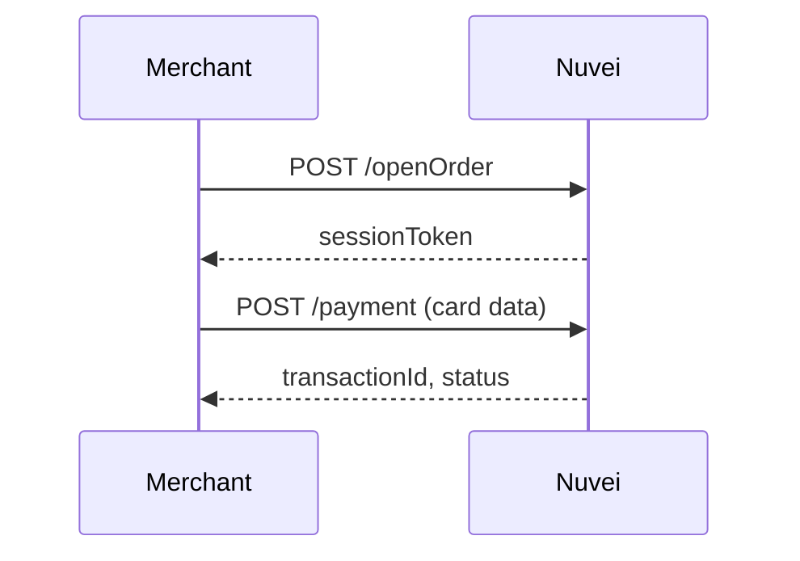
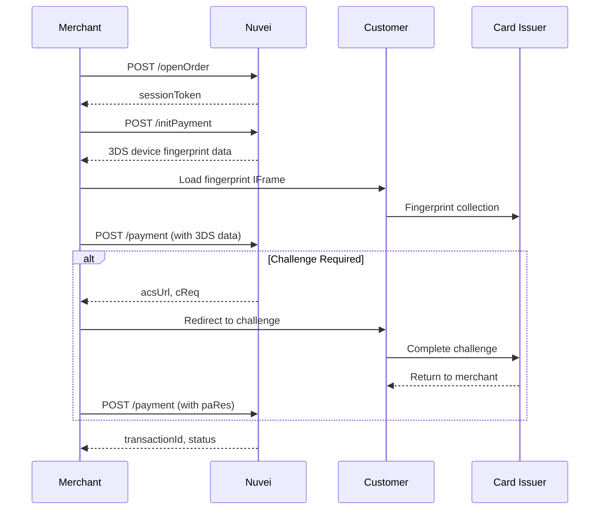

# REST API 1.0 (Server-to-Server)

REST API 1.0 is Nuvei's primary server-to-server integration, giving you full control over the payment flow directly from your backend.

<Note>
  **Status**: Stable / Production
  
  This is the primary API powering Payment Page, Simply Connect, and Web SDK 1.0.
</Note>

## Why Use Server-to-Server?

<CardGroup cols={2}>
  <Card title="Full Control" icon="sliders">
    Direct API calls for every payment operation
  </Card>
  <Card title="Multi-PSP Ready" icon="shuffle">
    Easy to integrate alongside other providers
  </Card>
  <Card title="Complex Workflows" icon="diagram-project">
    Build custom payment orchestration
  </Card>
  <Card title="Backend Only" icon="server">
    No frontend dependencies required
  </Card>
</CardGroup>

<Warning>
  **PCI Compliance Required**: Server-to-server integration with raw card data requires PCI DSS SAQ-D compliance. For PCI descoping, use [Web SDK](/integrations/web-sdk-1/overview) or [Simply Connect](/integrations/simply-connect/overview).
</Warning>

## When to Use REST API Direct

- You're **PCI Level 1 certified** and handle card data directly
- You need to build **multi-PSP payment orchestration**
- You require **complex payment workflows** not supported by SDK
- You're integrating with **backend systems** (no frontend)
- You need **full 3DS control** with custom fingerprinting

## API Endpoints

### Base URLs

| Environment | URL |
|-------------|-----|
| Sandbox | `https://ppp-test.nuvei.com/ppp/api/v1/` |
| Production | `https://secure.safecharge.com/ppp/api/v1/` |

### Core Endpoints

| Endpoint | Description |
|----------|-------------|
| `/getSessionToken` | Get authentication token |
| `/openOrder` | Initialize order with session |
| `/initPayment` | Initialize 3DS (device fingerprint) |
| `/payment` | Process payment |
| `/settleTransaction` | Settle authorized payment |
| `/refundTransaction` | Refund a settled payment |
| `/voidTransaction` | Void an authorization |
| `/getPaymentStatus` | Get transaction status |
| `/payout` | Process payouts to cards |

## Authentication

All requests require a `checksum` calculated from request parameters + your secret key.

### Checksum Calculation

Concatenate fields in the specified order (varies by endpoint) and calculate SHA-256:

```javascript
// Example for /openOrder
const checksumString = merchantId + merchantSiteId + clientRequestId + amount + currency + timeStamp + secretKey;
const checksum = crypto.createHash('sha256').update(checksumString).digest('hex');
```

<Warning>
  Never expose your `secretKey` on the frontend. All API calls with checksum should be server-side only.
</Warning>

## Payment Flow

### Simple Payment (Non-3DS)



### Payment with 3DS



## Quick Start Example

### 1. Get Session Token

<CodeGroup>
```bash cURL
curl -X POST https://ppp-test.nuvei.com/ppp/api/v1/getSessionToken.do \
  -H "Content-Type: application/json" \
  -d '{
    "merchantId": "<your merchantId>",
    "merchantSiteId": "<your merchantSiteId>",
    "clientRequestId": "123456",
    "timeStamp": "20260129120000",
    "checksum": "<calculated checksum>"
  }'
```

```javascript Node.js
const crypto = require('crypto');
const axios = require('axios');

async function getSessionToken() {
  const merchantId = 'your_merchant_id';
  const merchantSiteId = 'your_site_id';
  const secretKey = 'your_secret_key';
  const clientRequestId = Date.now().toString();
  const timeStamp = new Date().toISOString().replace(/[-:T.Z]/g, '').slice(0, 14);

  const checksumString = merchantId + merchantSiteId + clientRequestId + timeStamp + secretKey;
  const checksum = crypto.createHash('sha256').update(checksumString).digest('hex');

  const response = await axios.post(
    'https://ppp-test.nuvei.com/ppp/api/v1/getSessionToken.do',
    { merchantId, merchantSiteId, clientRequestId, timeStamp, checksum }
  );

  return response.data.sessionToken;
}
```
</CodeGroup>

### 2. Process Payment

<CodeGroup>
```json Request
{
  "sessionToken": "<sessionToken>",
  "merchantId": "<your merchantId>",
  "merchantSiteId": "<your merchantSiteId>",
  "clientRequestId": "123456",
  "clientUniqueId": "order_789",
  "amount": "100",
  "currency": "USD",
  "transactionType": "Sale",
  "paymentOption": {
    "card": {
      "cardNumber": "4000027891380961",
      "cardHolderName": "John Smith",
      "expirationMonth": "12",
      "expirationYear": "2028",
      "CVV": "217"
    }
  },
  "billingAddress": {
    "firstName": "John",
    "lastName": "Smith",
    "email": "john@example.com",
    "country": "US"
  },
  "timeStamp": "20260129120000",
  "checksum": "<calculated checksum>"
}
```

```json Response
{
  "transactionId": "1110000000004146935",
  "transactionType": "Sale",
  "transactionStatus": "APPROVED",
  "authCode": "075449",
  "gwExtendedErrorCode": 0,
  "clientRequestId": "123456",
  "clientUniqueId": "order_789",
  "amount": "100",
  "currency": "USD",
  "status": "SUCCESS",
  "errCode": 0,
  "reason": "",
  "version": "1.0"
}
```
</CodeGroup>

## Transaction Types

| Type | Description |
|------|-------------|
| `Sale` | Authorize and settle in one step |
| `Auth` | Authorize only (settle later) |
| `PreAuth` | Pre-authorization (extended hold) |

## Post-Payment Operations

### Settle (for Auth transactions)

```json
{
  "merchantId": "<merchantId>",
  "merchantSiteId": "<merchantSiteId>",
  "clientRequestId": "settle_123",
  "relatedTransactionId": "<original transactionId>",
  "amount": "100",
  "currency": "USD",
  "authCode": "<original authCode>",
  "timeStamp": "20260129120000",
  "checksum": "<checksum>"
}
```

### Refund

```json
{
  "merchantId": "<merchantId>",
  "merchantSiteId": "<merchantSiteId>",
  "clientRequestId": "refund_123",
  "relatedTransactionId": "<original transactionId>",
  "amount": "50",
  "currency": "USD",
  "authCode": "<original authCode>",
  "timeStamp": "20260129120000",
  "checksum": "<checksum>"
}
```

### Void

```json
{
  "merchantId": "<merchantId>",
  "merchantSiteId": "<merchantSiteId>",
  "clientRequestId": "void_123",
  "relatedTransactionId": "<original transactionId>",
  "amount": "100",
  "currency": "USD",
  "authCode": "<original authCode>",
  "timeStamp": "20260129120000",
  "checksum": "<checksum>"
}
```

## Quick Links

<CardGroup cols={2}>
  <Card title="Quick Start" icon="rocket" href="/integrations/rest-api-1/quickstart">
    Complete integration guide
  </Card>
  <Card title="3D Secure" icon="lock" href="/integrations/rest-api-1/3ds">
    Full 3DS implementation
  </Card>
  <Card title="Payouts" icon="money-bill-transfer" href="/integrations/rest-api-1/payouts">
    Send money to cards
  </Card>
  <Card title="API Reference" icon="code" href="/api-reference/rest-1/overview">
    Full endpoint docs
  </Card>
</CardGroup>

## REST API 1.0 vs 2.0

| Feature | REST API 1.0 | REST API 2.0 |
|---------|-------------|-------------|
| **Status** | Production (Stable) | Beta |
| **Auth** | Checksum calculation | API key header |
| **Session** | `sessionToken` via `/openOrder` | `sessionId` via `POST /orders` |
| **Ecosystem** | Payment Page, Simply Connect, Web SDK 1.0 | Web SDK 2.0 |
| **APM Coverage** | Full (200+ APMs) | Growing |

[Learn about REST API 2.0 →](/rest-2/introduction)

## When NOT to Use Server-to-Server

| Scenario | Better Alternative |
|----------|-------------------|
| Not PCI compliant | Use [Web SDK](/integrations/web-sdk-1/overview) or [Simply Connect](/integrations/simply-connect/overview) |
| Quick integration needed | Use [Payment Page](/integrations/payment-page/overview) |
| Want embedded checkout | Use [Simply Connect](/integrations/simply-connect/overview) |
| Need frontend card fields | Use [Web SDK](/integrations/web-sdk-1/overview) |
