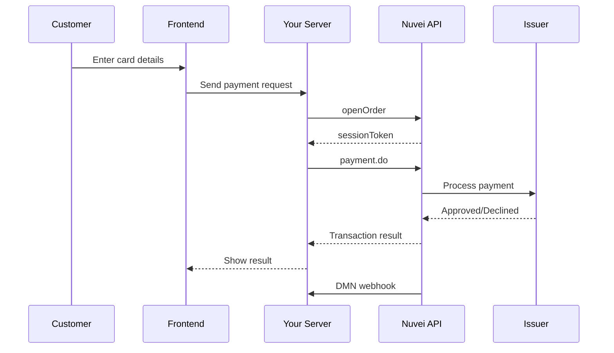

# REST API 1.0 Quick Start

Build a complete server-to-server payment integration using REST API 1.0.

## Prerequisites

- Merchant ID, Merchant Site ID, and Secret Key from Nuvei
- Server-side programming environment (Node.js, PHP, Python, etc.)

## Integration Flow



## Step 1: Get Session Token

Every transaction starts with getting a session token via `/openOrder`:

<CodeGroup>
```javascript Node.js
const crypto = require('crypto');
const axios = require('axios');

const config = {
  merchantId: 'YOUR_MERCHANT_ID',
  merchantSiteId: 'YOUR_SITE_ID',
  secretKey: 'YOUR_SECRET_KEY',
  baseUrl: 'https://ppp-test.nuvei.com/ppp/api/v1'
};

function generateChecksum(...params) {
  const concatenated = params.join('');
  return crypto.createHash('sha256').update(concatenated).digest('hex');
}

function getTimestamp() {
  return new Date().toISOString().replace(/[-:T]/g, '').slice(0, 14);
}

async function openOrder(amount, currency) {
  const timeStamp = getTimestamp();
  const clientRequestId = Date.now().toString();
  
  // Checksum: merchantId + merchantSiteId + clientRequestId + amount + currency + timeStamp + secretKey
  const checksum = generateChecksum(
    config.merchantId,
    config.merchantSiteId,
    clientRequestId,
    amount,
    currency,
    timeStamp,
    config.secretKey
  );
  
  const response = await axios.post(`${config.baseUrl}/openOrder.do`, {
    merchantId: config.merchantId,
    merchantSiteId: config.merchantSiteId,
    clientRequestId,
    amount,
    currency,
    timeStamp,
    checksum
  });
  
  return response.data.sessionToken;
}
```

```php PHP
<?php
$config = [
    'merchantId' => 'YOUR_MERCHANT_ID',
    'merchantSiteId' => 'YOUR_SITE_ID',
    'secretKey' => 'YOUR_SECRET_KEY',
    'baseUrl' => 'https://ppp-test.nuvei.com/ppp/api/v1'
];

function generateChecksum(...$params) {
    return hash('sha256', implode('', $params));
}

function getTimestamp() {
    return date('YmdHis');
}

function openOrder($amount, $currency) {
    global $config;
    
    $timeStamp = getTimestamp();
    $clientRequestId = time();
    
    $checksum = generateChecksum(
        $config['merchantId'],
        $config['merchantSiteId'],
        $clientRequestId,
        $amount,
        $currency,
        $timeStamp,
        $config['secretKey']
    );
    
    $payload = [
        'merchantId' => $config['merchantId'],
        'merchantSiteId' => $config['merchantSiteId'],
        'clientRequestId' => $clientRequestId,
        'amount' => $amount,
        'currency' => $currency,
        'timeStamp' => $timeStamp,
        'checksum' => $checksum
    ];
    
    $ch = curl_init($config['baseUrl'] . '/openOrder.do');
    curl_setopt($ch, CURLOPT_RETURNTRANSFER, true);
    curl_setopt($ch, CURLOPT_POST, true);
    curl_setopt($ch, CURLOPT_POSTFIELDS, json_encode($payload));
    curl_setopt($ch, CURLOPT_HTTPHEADER, ['Content-Type: application/json']);
    
    $response = json_decode(curl_exec($ch), true);
    curl_close($ch);
    
    return $response['sessionToken'];
}
?>
```

```python Python
import hashlib
import requests
from datetime import datetime

config = {
    'merchant_id': 'YOUR_MERCHANT_ID',
    'merchant_site_id': 'YOUR_SITE_ID',
    'secret_key': 'YOUR_SECRET_KEY',
    'base_url': 'https://ppp-test.nuvei.com/ppp/api/v1'
}

def generate_checksum(*params):
    concatenated = ''.join(str(p) for p in params)
    return hashlib.sha256(concatenated.encode()).hexdigest()

def get_timestamp():
    return datetime.now().strftime('%Y%m%d%H%M%S')

def open_order(amount, currency):
    timestamp = get_timestamp()
    client_request_id = str(int(datetime.now().timestamp()))
    
    checksum = generate_checksum(
        config['merchant_id'],
        config['merchant_site_id'],
        client_request_id,
        amount,
        currency,
        timestamp,
        config['secret_key']
    )
    
    response = requests.post(
        f"{config['base_url']}/openOrder.do",
        json={
            'merchantId': config['merchant_id'],
            'merchantSiteId': config['merchant_site_id'],
            'clientRequestId': client_request_id,
            'amount': amount,
            'currency': currency,
            'timeStamp': timestamp,
            'checksum': checksum
        }
    )
    
    return response.json()['sessionToken']
```
</CodeGroup>

## Step 2: Process Payment

With the session token, process the payment via `/payment.do`:

<CodeGroup>
```javascript Node.js
async function processPayment(sessionToken, paymentData) {
  const timeStamp = getTimestamp();
  const clientRequestId = Date.now().toString();
  const clientUniqueId = `order_${Date.now()}`;
  
  // Payment checksum
  const checksum = generateChecksum(
    config.merchantId,
    config.merchantSiteId,
    clientRequestId,
    paymentData.amount,
    paymentData.currency,
    timeStamp,
    config.secretKey
  );
  
  const response = await axios.post(`${config.baseUrl}/payment.do`, {
    sessionToken,
    merchantId: config.merchantId,
    merchantSiteId: config.merchantSiteId,
    clientRequestId,
    clientUniqueId,
    amount: paymentData.amount,
    currency: paymentData.currency,
    transactionType: 'Sale',
    timeStamp,
    checksum,
    
    // Card details
    paymentOption: {
      card: {
        cardNumber: paymentData.cardNumber,
        cardHolderName: paymentData.cardHolderName,
        expirationMonth: paymentData.expirationMonth,
        expirationYear: paymentData.expirationYear,
        CVV: paymentData.cvv
      }
    },
    
    // Customer details
    billingAddress: {
      firstName: paymentData.firstName,
      lastName: paymentData.lastName,
      email: paymentData.email,
      country: paymentData.country
    },
    
    // Device info (for fraud)
    deviceDetails: {
      ipAddress: paymentData.ipAddress
    },
    
    // Webhook URL
    urlDetails: {
      notificationUrl: 'https://yoursite.com/webhooks/nuvei'
    }
  });
  
  return response.data;
}

// Usage
async function handlePayment(req, res) {
  try {
    // 1. Get session token
    const sessionToken = await openOrder('100.00', 'USD');
    
    // 2. Process payment
    const result = await processPayment(sessionToken, {
      amount: '100.00',
      currency: 'USD',
      cardNumber: '4111111111111111',
      cardHolderName: 'John Smith',
      expirationMonth: '12',
      expirationYear: '2030',
      cvv: '217',
      firstName: 'John',
      lastName: 'Smith',
      email: 'john@example.com',
      country: 'US',
      ipAddress: req.ip
    });
    
    if (result.transactionStatus === 'APPROVED') {
      res.json({
        success: true,
        transactionId: result.transactionId,
        authCode: result.authCode
      });
    } else {
      res.json({
        success: false,
        error: result.gwErrorReason || result.paymentMethodErrorReason
      });
    }
  } catch (error) {
    res.status(500).json({ error: error.message });
  }
}
```

```php PHP
<?php
function processPayment($sessionToken, $paymentData) {
    global $config;
    
    $timeStamp = getTimestamp();
    $clientRequestId = time();
    $clientUniqueId = 'order_' . time();
    
    $checksum = generateChecksum(
        $config['merchantId'],
        $config['merchantSiteId'],
        $clientRequestId,
        $paymentData['amount'],
        $paymentData['currency'],
        $timeStamp,
        $config['secretKey']
    );
    
    $payload = [
        'sessionToken' => $sessionToken,
        'merchantId' => $config['merchantId'],
        'merchantSiteId' => $config['merchantSiteId'],
        'clientRequestId' => $clientRequestId,
        'clientUniqueId' => $clientUniqueId,
        'amount' => $paymentData['amount'],
        'currency' => $paymentData['currency'],
        'transactionType' => 'Sale',
        'timeStamp' => $timeStamp,
        'checksum' => $checksum,
        'paymentOption' => [
            'card' => [
                'cardNumber' => $paymentData['cardNumber'],
                'cardHolderName' => $paymentData['cardHolderName'],
                'expirationMonth' => $paymentData['expirationMonth'],
                'expirationYear' => $paymentData['expirationYear'],
                'CVV' => $paymentData['cvv']
            ]
        ],
        'billingAddress' => [
            'firstName' => $paymentData['firstName'],
            'lastName' => $paymentData['lastName'],
            'email' => $paymentData['email'],
            'country' => $paymentData['country']
        ],
        'deviceDetails' => [
            'ipAddress' => $_SERVER['REMOTE_ADDR']
        ],
        'urlDetails' => [
            'notificationUrl' => 'https://yoursite.com/webhooks/nuvei'
        ]
    ];
    
    $ch = curl_init($config['baseUrl'] . '/payment.do');
    curl_setopt($ch, CURLOPT_RETURNTRANSFER, true);
    curl_setopt($ch, CURLOPT_POST, true);
    curl_setopt($ch, CURLOPT_POSTFIELDS, json_encode($payload));
    curl_setopt($ch, CURLOPT_HTTPHEADER, ['Content-Type: application/json']);
    
    $response = json_decode(curl_exec($ch), true);
    curl_close($ch);
    
    return $response;
}

// Usage
$sessionToken = openOrder('100.00', 'USD');
$result = processPayment($sessionToken, [
    'amount' => '100.00',
    'currency' => 'USD',
    'cardNumber' => '4111111111111111',
    'cardHolderName' => 'John Smith',
    'expirationMonth' => '12',
    'expirationYear' => '2030',
    'cvv' => '217',
    'firstName' => 'John',
    'lastName' => 'Smith',
    'email' => 'john@example.com',
    'country' => 'US'
]);

if ($result['transactionStatus'] === 'APPROVED') {
    echo "Payment successful! Transaction ID: " . $result['transactionId'];
} else {
    echo "Payment failed: " . ($result['gwErrorReason'] ?? $result['paymentMethodErrorReason']);
}
?>
```
</CodeGroup>

## Response Handling

### Successful Response

```json
{
  "transactionId": "7110000000011234567",
  "transactionStatus": "APPROVED",
  "transactionType": "Sale",
  "authCode": "123456",
  "gwErrorCode": 0,
  "gwErrorReason": "",
  "paymentOption": {
    "card": {
      "ccCardNumber": "4****1111",
      "bin": "411111",
      "last4Digits": "1111",
      "ccExpMonth": "12",
      "ccExpYear": "30",
      "cardType": "Credit",
      "cardBrand": "VISA"
    }
  },
  "sessionToken": "<sessionToken>",
  "clientUniqueId": "order_1234567890",
  "orderId": "12345678",
  "status": "SUCCESS"
}
```

### Error Response

```json
{
  "transactionId": "7110000000011234568",
  "transactionStatus": "DECLINED",
  "gwErrorCode": 4001,
  "gwErrorReason": "Insufficient funds",
  "paymentMethodErrorCode": 1,
  "paymentMethodErrorReason": "Decline",
  "status": "ERROR"
}
```

## Transaction Types

| Type | Description | Use Case |
|------|-------------|----------|
| `Sale` | Immediate capture | Standard purchase |
| `Auth` | Authorization only | Hold funds, capture later |
| `PreAuth` | Pre-authorization | Hotel booking, car rental |

### Auth + Settle Flow

```javascript
// Step 1: Authorize
async function authorizePayment(sessionToken, paymentData) {
  const response = await axios.post(`${config.baseUrl}/payment.do`, {
    ...paymentData,
    transactionType: 'Auth', // Authorization only
    sessionToken
  });
  
  return {
    transactionId: response.data.transactionId,
    authCode: response.data.authCode
  };
}

// Step 2: Settle (capture) later
async function settleTransaction(transactionId, authCode, amount, currency) {
  const timeStamp = getTimestamp();
  const clientRequestId = Date.now().toString();
  
  const checksum = generateChecksum(
    config.merchantId,
    config.merchantSiteId,
    clientRequestId,
    amount,
    currency,
    transactionId,
    authCode,
    timeStamp,
    config.secretKey
  );
  
  const response = await axios.post(`${config.baseUrl}/settleTransaction.do`, {
    merchantId: config.merchantId,
    merchantSiteId: config.merchantSiteId,
    clientRequestId,
    relatedTransactionId: transactionId,
    amount,
    currency,
    authCode,
    timeStamp,
    checksum
  });
  
  return response.data;
}
```

## Post-Payment Operations

### Refund

```javascript
async function refundTransaction(transactionId, authCode, amount, currency) {
  const timeStamp = getTimestamp();
  const clientRequestId = Date.now().toString();
  
  const checksum = generateChecksum(
    config.merchantId,
    config.merchantSiteId,
    clientRequestId,
    amount,
    currency,
    transactionId,
    authCode,
    '',  // urlDetails.notificationUrl or empty
    timeStamp,
    config.secretKey
  );
  
  const response = await axios.post(`${config.baseUrl}/refundTransaction.do`, {
    merchantId: config.merchantId,
    merchantSiteId: config.merchantSiteId,
    clientRequestId,
    relatedTransactionId: transactionId,
    amount,
    currency,
    authCode,
    timeStamp,
    checksum
  });
  
  return response.data;
}
```

### Void

```javascript
async function voidTransaction(transactionId, authCode, amount, currency) {
  const timeStamp = getTimestamp();
  const clientRequestId = Date.now().toString();
  
  const checksum = generateChecksum(
    config.merchantId,
    config.merchantSiteId,
    clientRequestId,
    amount,
    currency,
    transactionId,
    authCode,
    '',
    timeStamp,
    config.secretKey
  );
  
  const response = await axios.post(`${config.baseUrl}/voidTransaction.do`, {
    merchantId: config.merchantId,
    merchantSiteId: config.merchantSiteId,
    clientRequestId,
    relatedTransactionId: transactionId,
    amount,
    currency,
    authCode,
    timeStamp,
    checksum
  });
  
  return response.data;
}
```

## Test Cards

| Card Number | Brand | Result |
|-------------|-------|--------|
| 4111111111111111 | Visa | Approved |
| 5111111111111118 | Mastercard | Approved |
| 4000000000000002 | Visa | Declined |
| 4000000000000069 | Visa | Expired Card |

- Expiration: Any future date
- CVV: Any 3 digits

## Complete Example

Here's a minimal Express.js server:

```javascript
const express = require('express');
const crypto = require('crypto');
const axios = require('axios');

const app = express();
app.use(express.json());

const config = {
  merchantId: process.env.NUVEI_MERCHANT_ID,
  merchantSiteId: process.env.NUVEI_SITE_ID,
  secretKey: process.env.NUVEI_SECRET_KEY,
  baseUrl: 'https://ppp-test.nuvei.com/ppp/api/v1'
};

// Helper functions
const generateChecksum = (...params) => 
  crypto.createHash('sha256').update(params.join('')).digest('hex');

const getTimestamp = () => 
  new Date().toISOString().replace(/[-:T]/g, '').slice(0, 14);

// Payment endpoint
app.post('/api/pay', async (req, res) => {
  try {
    const { amount, currency, card, customer } = req.body;
    const timeStamp = getTimestamp();
    const clientRequestId = Date.now().toString();
    
    // 1. Open order
    const openOrderChecksum = generateChecksum(
      config.merchantId, config.merchantSiteId,
      clientRequestId, amount, currency, timeStamp, config.secretKey
    );
    
    const orderResponse = await axios.post(`${config.baseUrl}/openOrder.do`, {
      merchantId: config.merchantId,
      merchantSiteId: config.merchantSiteId,
      clientRequestId,
      amount,
      currency,
      timeStamp,
      checksum: openOrderChecksum
    });
    
    const sessionToken = orderResponse.data.sessionToken;
    
    // 2. Process payment
    const paymentChecksum = generateChecksum(
      config.merchantId, config.merchantSiteId,
      clientRequestId, amount, currency, timeStamp, config.secretKey
    );
    
    const paymentResponse = await axios.post(`${config.baseUrl}/payment.do`, {
      sessionToken,
      merchantId: config.merchantId,
      merchantSiteId: config.merchantSiteId,
      clientRequestId,
      clientUniqueId: `order_${Date.now()}`,
      amount,
      currency,
      transactionType: 'Sale',
      timeStamp,
      checksum: paymentChecksum,
      paymentOption: { card },
      billingAddress: customer,
      deviceDetails: { ipAddress: req.ip }
    });
    
    const result = paymentResponse.data;
    
    if (result.transactionStatus === 'APPROVED') {
      res.json({
        success: true,
        transactionId: result.transactionId,
        authCode: result.authCode
      });
    } else {
      res.status(400).json({
        success: false,
        error: result.gwErrorReason || result.paymentMethodErrorReason
      });
    }
  } catch (error) {
    res.status(500).json({ error: error.message });
  }
});

// Webhook endpoint
app.post('/webhooks/nuvei', (req, res) => {
  console.log('DMN received:', req.body);
  // Verify checksum and process
  res.status(200).send('OK');
});

app.listen(3000, () => console.log('Server running on port 3000'));
```

## Next Steps

<CardGroup cols={2}>
  <Card title="3D Secure" icon="shield" href="/integrations/rest-api-1/3ds">
    Implement 3DS authentication
  </Card>
  <Card title="Tokenization" icon="key" href="/integrations/features/tokenization">
    Save cards for future use
  </Card>
  <Card title="Webhooks" icon="bell" href="/integrations/features/webhooks">
    Handle DMN notifications
  </Card>
  <Card title="Recurring" icon="repeat" href="/integrations/features/recurring">
    Set up subscriptions
  </Card>
</CardGroup>
