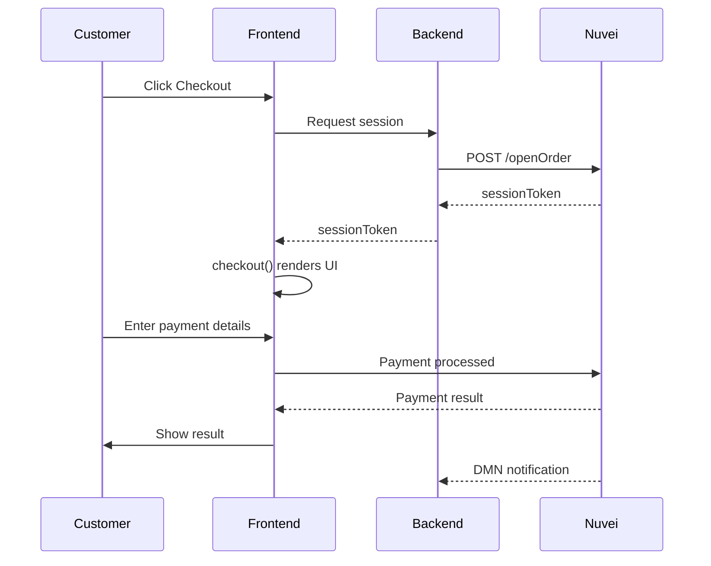

# Simply Connect

Simply Connect is a powerful, feature-rich end-to-end payment solution that embeds seamlessly into your payment page without redirects or IFrames.

<Note>
  **Best for**: E-commerce, SaaS, subscription businesses wanting embedded checkout with customization
</Note>

## Why Use Simply Connect?

<CardGroup cols={2}>
  <Card title="Out-of-the-Box" icon="box">
    Quick implementation with ready-to-use checkout
  </Card>
  <Card title="Embedded on Your Page" icon="code">
    No redirects or IFrames - hosted directly on your site
  </Card>
  <Card title="Full Customization" icon="paintbrush">
    CSS styling, locale settings, payment flow control
  </Card>
  <Card title="Zero PCI Scope" icon="shield-check">
    Nuvei handles all sensitive card data
  </Card>
</CardGroup>

## Key Features

### Out-of-the-Box Solution
- Quick to implement
- Integrates easily into your payment flow
- Embedded seamlessly into your payment page

### Hosted Directly on Your Web Page
- No redirect to a different page
- No IFrame required
- Native look and feel

### Full Customization Control
- **UI Customization** - Integrate your own CSS to match your pages
- **Locale Aware** - Set presentation language based on customer locale
- **Payment Customization** - Control which APMs to show/hide, which cards to display/block
- **Event Callbacks** - Hook into payment events for notifications and flow control

## Live Demo

<Frame caption="Simply Connect Demo - Try it live!">
  
</Frame>

<Card title="Try the Demo" icon="play" href="https://demos.nuvei.com/simplyconnectdemo/">
  Visit our live Simply Connect demo site
</Card>

## How It Works

## Integration Steps

<Steps>
  <Step title="Initialize Session (Backend)">
    Call `/openOrder` to get a `sessionToken`
  </Step>
  <Step title="Create HTML Placeholder (Frontend)">
    Add the checkout container and import `checkout.js`
  </Step>
  <Step title="Call checkout() (Frontend)">
    Invoke the `checkout()` method with your session and options
  </Step>
  <Step title="Handle Response">
    Process the result via callback and verify with DMN
  </Step>
</Steps>

## Customization Options

<AccordionGroup>
  <Accordion title="UI Customization" icon="paintbrush">
    Control text, locale options, and general look and feel:
    - Custom CSS styling
    - Color themes
    - Font customization
    - Layout adjustments
    
    [Learn more →](/integrations/simply-connect/ui-customization)
  </Accordion>
  
  <Accordion title="Payment Customization" icon="credit-card">
    Control the payment flow and methods:
    - Show/hide specific APMs
    - Block certain card types or countries
    - Set default payment method
    - Control PayPal, Google Pay, Apple Pay behavior
    
    [Learn more →](/integrations/simply-connect/payment-customization)
  </Accordion>
  
  <Accordion title="Event Callbacks" icon="bell">
    Hook into the payment process:
    - `prePayment` - Perform actions before payment (e.g., risk check)
    - `onResult` - Handle payment completion
    - `onError` - Handle errors
    - Custom event handlers
    
    [Learn more →](/integrations/simply-connect/event-callbacks)
  </Accordion>
</AccordionGroup>

## Available Methods

| Method | Description |
|--------|-------------|
| `checkout()` | Main payment method - renders full checkout UI |
| `checkout.getApms()` | Get available APMs for the session |
| `checkout.submitPayment()` | Submit payment programmatically |
| `withdrawal()` | Process customer withdrawals |

## Quick Links

<CardGroup cols={2}>
  <Card title="Quick Start" icon="rocket" href="/integrations/simply-connect/quickstart">
    Get started in 10 minutes
  </Card>
  <Card title="UI Customization" icon="paintbrush" href="/integrations/simply-connect/ui-customization">
    Style your checkout
  </Card>
  <Card title="API Reference" icon="code" href="/api-reference/simply-connect/checkout">
    Full method documentation
  </Card>
  <Card title="Examples" icon="file-code" href="/integrations/simply-connect/examples">
    JSFiddle examples
  </Card>
</CardGroup>

## When to Use Simply Connect vs Other Options

| Scenario | Recommendation |
|----------|---------------|
| Embedded checkout with customization | ✅ **Simply Connect** |
| Quick launch, minimal customization | ❌ Use Payment Page |
| Full control over every input field | ❌ Use Web SDK |
| Server-to-server only | ❌ Use REST API |

## Next Steps

<Steps>
  <Step title="Get Credentials">
    Obtain your credentials from the [Control Panel](https://sandbox.nuvei.com/settings/my_payment_settings)
  </Step>
  <Step title="Follow Quick Start">
    Complete the [Quick Start guide](/integrations/simply-connect/quickstart)
  </Step>
  <Step title="Customize">
    Apply [UI](/integrations/simply-connect/ui-customization) and [payment](/integrations/simply-connect/payment-customization) customizations
  </Step>
  <Step title="Test">
    Use sandbox test cards to verify your integration
  </Step>
</Steps>
